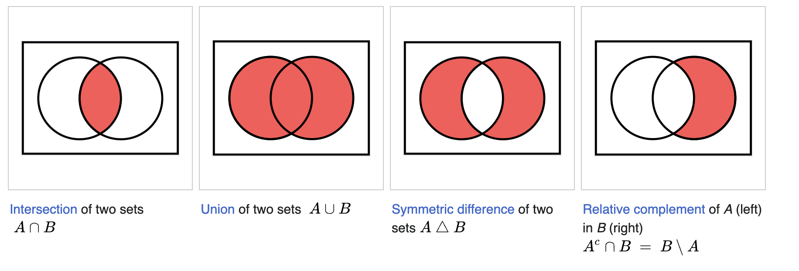
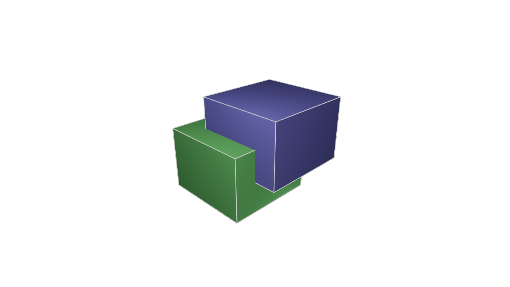
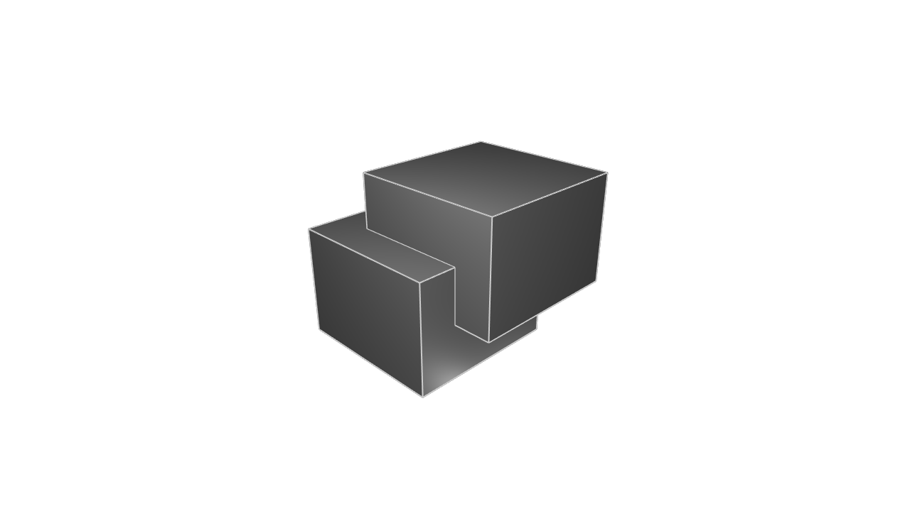
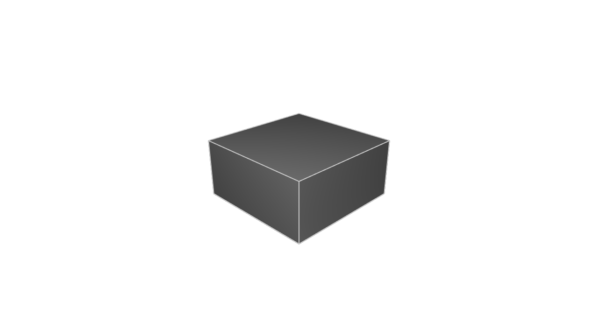
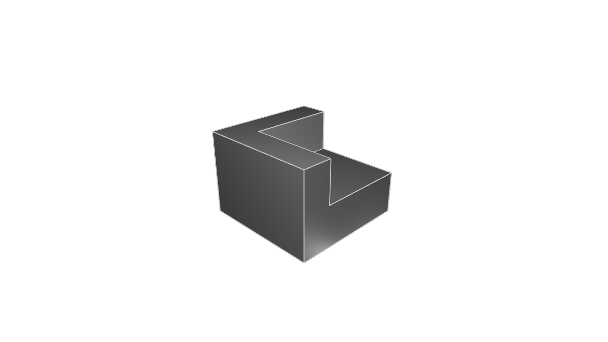

# Combining 3D solids

We've seen how to make a lot of different solids. You could transform a 2D shape into a 3D solid. From there, you can copy and transform that 3D solid by rotating, translating or rotating it. Now it's time to learn a third way to build 3D solids: by combining other 3D solids. This is sometimes called _constructive solid geometry_ and it's a very powerful tool for any serious mechanical engineering work.

## Constructive solid geometry

Remember in school, when you learned about Venn diagrams? How you can take the _union_, the _intersection_ or the _difference_ of two shapes? If you need a quick recap, here's a screenshot from [Wikipedia's article on boolean operations].



We can perform similar operations on 3D solids in KCL. Let's see how. Here's two cubes.

```kcl=two_cubes
length = 20
cubeGreen = startSketchOn(XY)
  |> polygon(radius = length, numSides = 4, center = [0, 0])
  |> extrude(length = length)
  |> appearance(color = "#229922")

cubeBlue = startSketchOn(XY)
  |> polygon(radius = length, numSides = 4, center = [0, 0])
  |> translate(x = 10, z = 10)
  |> extrude(length = length)
  |> appearance(color = "#222299")
```



That's what it looks like _before_ we apply any CSG operations. Now let's see what happens when we use KCL's [`union`], [`intersect`] and [`subtract`] functions on these. Firstly, let's do a union. This should create a new solid which combines both input solids. 

```kcl=two_cubes_union
length = 20
cubeGreen = startSketchOn(XY)
  |> polygon(radius = length, numSides = 4, center = [0, 0])
  |> extrude(length = length)
  |> appearance(color = "#229922")

cubeBlue = startSketchOn(XY)
  |> polygon(radius = length, numSides = 4, center = [0, 0])
  |> translate(x = 10, z = 10)
  |> extrude(length = length)
  |> appearance(color = "#222299")

// Boolean operations on the two cubes
both = union([cubeGreen, cubeBlue])
```



Of course, this [`union`] of our two cubes has the exact same dimensions and position as the two cubes. So it looks the exact same. What's the point of doing this? Well, for a start, we can use transforms like `appearance` or `rotate` on the single unified shape. Previously we needed to transform each part separately, which can get annoying. Now that it's a single shape, transformations will apply to the whole thing -- both the first cube's volume, and the second cube's.

**Note**: Instead of writing `union([cubeGreen, cubeBlue])` you can use the shorthand `cubeGreen + cubeBlue` or `cubeGreen | cubeBlue`. This is a nice little shorthand you can use if you want to.

Let's try an intersection. This combines both cubes, but leaves only the volume from where they overlapped.


```kcl=two_cubes_intersection
length = 20
cubeGreen = startSketchOn(XY)
  |> polygon(radius = length, numSides = 4, center = [0, 0])
  |> extrude(length = length)
  |> appearance(color = "#229922")

cubeBlue = startSketchOn(XY)
  |> polygon(radius = length, numSides = 4, center = [0, 0])
  |> translate(x = 10, z = 10)
  |> extrude(length = length)
  |> appearance(color = "#222299")

// Boolean operations on the two cubes
both = intersect([cubeGreen, cubeBlue])
```



This keeps only the small cube shape from where the previous two intersected. This is a new solid, so it can be transformed just like any other solid. 

**Note**: Instead of writing `intersect([cubeGreen, cubeBlue])` you can use the shorthand `cubeGreen & cubeBlue`. This is a nice little shorthand you can use if you want to.

Lastly, let's try a `subtract` call:

```kcl=two_cubes_subtraction
length = 20
cubeGreen = startSketchOn(XY)
  |> polygon(radius = length, numSides = 4, center = [0, 0])
  |> extrude(length = length)
  |> appearance(color = "#229922")

cubeBlue = startSketchOn(XY)
  |> polygon(radius = length, numSides = 4, center = [0, 0])
  |> translate(x = 10, z = 10)
  |> extrude(length = length)
  |> appearance(color = "#222299")

// Boolean operations on the two cubes
both = subtract(cubeGreen, tools=[cubeBlue])
```



Note that the syntax for `subtract` is a little different. The first argument is the solid which will have some volume carved out. The second argument is a list of solids to cut out. You can think of these as "tools" -- you're basically passing tools of various shapes which can carve out special volumes.

**NOTE**: Currently only one tool can be passed in, but we're nearly finished supporting multiple tools here.

[Wikipedia's article on boolean operations]: https://en.wikipedia.org/wiki/Set_(mathematics)#Basic_operations
[`intersect`]: https://zoo.dev/docs/kcl-std/intersect
[`subtract`]: https://zoo.dev/docs/kcl-std/subtract
[`union`]: https://zoo.dev/docs/kcl-std/union
