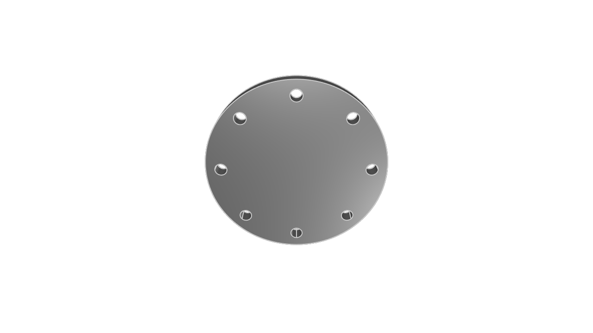

# Functions and parametric design

In mechanical engineering, _parametric design_ is a key tool that helps you avoid redundant work when you're designing the same object over and over again with slight tweaks. In software engineering, _functions_ are a key tool that help you avoid redundant workw hen yu're designing the same software over and over again with slight tweaks.

That's right -- breaking a mechanical engineering project into several key parametric designs is basically the same as breaking a software engineering project into several key functions. KCL makes parametric design easy and convenient with functions. You'll declare functions to represent parametric designs, and you'll call those functions with specific arguments to produce specific designs with the right parameters. Let's see how.

## Function declaration

We briefly looked at function declarations when we covered pattern transforms. Let's write an example function declaration and analyze its parts.

```kcl
fn add(a, b) {
  sum = a + b
  return sum
}
```

A function declaration has a few key parts. Let's look at each one, in the order they appear:

 - The `fn` keyword
 - The function's  _name_ 
 - Round parentheses `(` and `)`
 - Within those parentheses, a list of argument names
 - Curly brackets `{` and `}`
 - Within those brackets, KCL code, which may end with a `return` statement.

This function takes two arguments, `a` and `b`, adds them, and returns their sum as the function's output. When a function executes the `return` statement, it evaluates the expression after `return`, stops executing, and outputs that value. You can call our example function like this:

```kcl
sum = add(a = 1, b = 2)
```

Functions can also declare one *unlabeled* arg. If you do want to declare an unlabeled arg, it must be the first arg declared. When declaring an unlabeled arg, prefix it with `@`, like here:

```kcl
// The @ indicates an argument can be used without a label.
// Note that only the first argument can use @.
fn increment(@x) {
  return x + 1
}

fn add(@x, delta) {
  return x + delta
}

two = increment(1)
three = add(1, delta = 2)
```

## Mechanical engineering with functions

Let's use functions to build a parametric pipe flange. We can start with a specific design, with specific direct measurements. Then we'll learn how to parameterize it. Then we can easily make a lot of similar pipe flanges with different parameters.

Here's a specific model. It's got 8 unthreaded holes, each with a radius of 4, and the overall model has a radius of 60. It's 10mm thick.

```kcl=specific_flange
holes = startSketchOn(XZ)
  |> circle(radius = 4, center = [50, 0])
  |> patternCircular2d(
       center = [0, 0],
       instances = 8,
       arcDegrees = 360,
       rotateDuplicates = true,
     )

base = startSketchOn(XZ)
  |> circle(radius = 60, center = [0, 0])
  |> subtract2d(tool = holes)
  |> extrude(length = 10)
```



Its specific measurements, like number of holes, radius, thickness etc were chosen somewhat arbitrarily. What if we want to make another pipe flange in the future, with different measurements? We can turn this specific flange model into a parametric design by making it into a function. We'll define a function `pipe_flange` which takes in several parameters. Let's see:

```kcl=parametric_flange
// Define a parametric flange
fn flange(numHoles, holeRadius, radius, thickness) {
  holes = startSketchOn(XZ)
    |> circle(radius = holeRadius, center = [radius - holeEdgeGap, 0])
    |> patternCircular2d(
         center = [0, 0],
         instances = numHoles,
         arcDegrees = 360,
         rotateDuplicates = true,
       )

  return startSketchOn(XZ)
    |> circle(radius = radius, center = [0, 0])
    |> subtract2d(tool = holes)
    |> extrude(length = thickness)
}
```

We can get our original flange by calling the parametric flange with the right parameters:
```kcl
// Call our parametric flange function, passing in specific parameter values, to make a specific flange.
flange(
  numHoles = 8,
  holeRadius = 5,
  radius = 60,
  thickness = 10,
  holeEdgeGap = 10,
)
```

But we can also make a range of other flanges! Here's one:

```kcl
flange(
  numHoles = 4,
  holeRadius = 15,
  radius = 60,
  thickness = 20,
  holeEdgeGap = 20,
)
```


And let's try one more:

```kcl
flange(
  numHoles = 20,
  holeRadius = 3,
  radius = 90,
  thickness = 20,
  holeEdgeGap = 15,
)
```


Replacing specific KCL code for a specific design with a parametric function gives you the flexibility to generate a lot of very similar designs, varying their parameters by passing in different arguments to suit whatever your project's requirements are.

## Repeating geometry with functions

Functions can also be used to avoid writing the same code over and over again, in a single model. In an earlier chapter we modeled three cubes in one scene, like this:

```kcl=cube_textures
offset = 25

greyCube = startSketchOn(XY)
  |> startProfile(at = [0, 0])
  |> polygon(radius = 10, numSides = 4, center = [0, 0])
  |> extrude(length = 10)

greenCube = startSketchOn(XY)
  |> startProfile(at = [0, 0])
  |> polygon(radius = 10, numSides = 4, center = [0, offset])
  |> extrude(length = 10)
  // The appearance call lets you set a color using hexadecimal notation.
  |> appearance(color = "#00ff00")
  
greenCubeShiny = startSketchOn(XY)
  |> startProfile(at = [0, 0])
  |> polygon(radius = 10, numSides = 4, center = [0, offset * 2])
  |> extrude(length = 10)
  // You can also set the metalness and roughness, as percentages between 0 and 100.
  |> appearance(color = "#00ff00", metalness = 90, roughness = 10)
```


This code works fine, but it's got one small problem. We're repeating the code for "sketch a cube" three times. This makes it a bit annoying to read, and also, if we want to tweak the cubes (making them larger, or rotating them), we'd have to update them in three different places. We could improve this code by making a function for the cube, and calling that function three times.

```kcl
fn cube(offset) {
  return startSketchOn(XY)
    |> startProfile(at = [0, 0])
    |> polygon(radius = 10, numSides = 4, center = [0, offset])
    |> extrude(length = 10)
}

greyCube = cube(offset = 0)

greenCube = cube(offset = 25)
  |> appearance(color = "#00ff00")
  
greenCubeShiny = cube(offset = 50)
  |> appearance(color = "#00ff00", metalness = 90, roughness = 10)
```

This code produces the exact same model as the above code, but it's shorter and easier to read. It's also more maintainable! If we wanted to change the cubes to be flatter, we only have to change one part of our code, instead of changing all three.

```kcl=three_short_cubes
fn cube(offset) {
  return startSketchOn(XY)
    |> startProfile(at = [0, 0])
    |> polygon(radius = 10, numSides = 4, center = [0, offset])
    // Change the extrude length from 10 to 2, shortening the cubes.
    |> extrude(length = 2)
}

greyCube = cube(offset = 0)

greenCube = cube(offset = 25)
  |> appearance(color = "#00ff00")
  
greenCubeShiny = cube(offset = 50)
  |> appearance(color = "#00ff00", metalness = 90, roughness = 10)
```


If we hadn't made the cube into a function, we would have had to change every extrude call separately. By putting the details of "what does a cube look like" in a single function, we make our code both more readable, and easier to change in the future.

