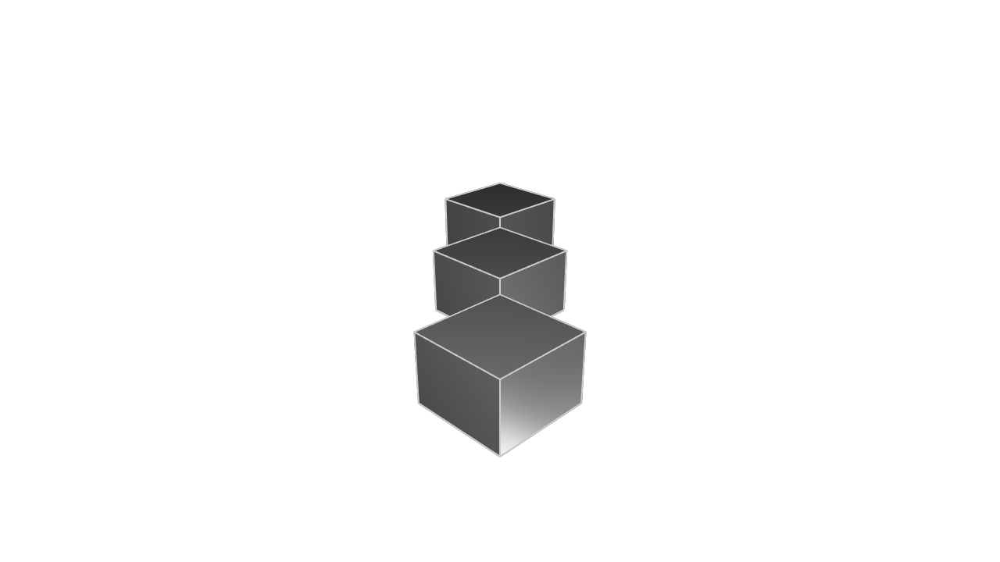
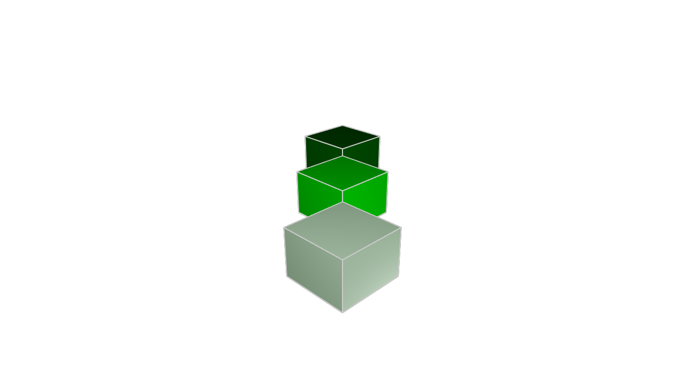

# Iterating with map and reduce

<!-- toc -->

Every programming language has a way to do _iteration_: to repeat the same task many times. Traditional programming languages like Python, JavaScript or C use loops. KCL doesn't have any loops, but we have something very similar: arrays, and two helper functions called [`map`] and [`reduce`]. Let's see how they can solve problems.

## Transforming arrays with map

The [`map`] function lets you transform an array by calling a function on every element. For example:

```kcl
inputArray = [1, 2, 3, 4]
fn squareNumber(@x) { return x * x }
outputArray = map(inputArray, f = squareNumber)
```

The [`map`] function takes an input array as its first argument, then a function (its label is abbreviated to just `f`). It calls the function on every element of the input array, and returns it. If you open the Variables pane, you'll see that outputArray is `[1, 4, 9, 16]`, just as we expected.

You can use `map` to create geometry too! For example, let's make 3 cubes, next to each other.

```kcl=three_map_cubes
fn cube(@offset) {
  return startSketchOn(XY)
    |> startProfile(at = [0, 0])
    |> polygon(radius = 10, numSides = 4, center = [0, offset])
    |> extrude(length = 10)
}

offsets = [0, 25, 50]
cubes = map(offsets, f = cube)
```



We created an array of offsets, then called the `cube` function on each offset in the array. The final result is an array of cubes. Calling the `cube` function drew the three cubes, each at their own offset.

So far so good. But this is basically just a 3D pattern. We can make this more interesting by making each cube a different color. Instead of an array of offsets, we'll store an array of offsets _and colors_. To do this, we'll make a KCL _object_. An object has multiple properties, each with its own label and value. For example:

```kcl
myObject = {
  offset = 25,
  color = "#00ff00",
}
```

This object has two fields, `offset` and `color`. You could access them by calling `myObject.offset` and `myObject.color`. Let's see how we can use this with `map`:

```kcl=three_map_cubes_color
fn cube(@params) {
  offset = params.x
  color = params.color
  return startSketchOn(XY)
    |> startProfile(at = [0, 0])
    |> polygon(radius = 10, numSides = 4, center = [0, offset])
    |> extrude(length = 10)
    |> appearance(color = color)
}

offsets = [
  { x = 0, color = "#99ff99" },  // Dark green
  { x = 25, color = "#00ff00" }, // Bright green
  { x = 50, color = "#002200" }, // Pale green
]

map(offsets, f = cube)
```



Remember, `map` takes in an array, and outputs an array. The arrays always have the same length. Item `x` in the input array will be `f(x)` in the output array, where `f` is whichever function you pass in.

### Anonymous functions

It can get annoying defining a new function every time you want to use `map`. For instance, in the earlier example where we defined a `fn squareNumber` to use in a `map` -- is that really necessary? If you have a lot of `map` calls, you'll slowly find your code becoming littered with tiny functions that you only use in a `map`.

KCL supports a nice little feature that can simplify this: _anonymous functions_. They're functions that don't have a name. You declare them where you need them, they're passed into `map`and they aren't available after. Let's have a look:

```kcl
inputArray = [1, 2, 3, 4]
outputArray = map(inputArray, f = fn (@x) { return x * x })
```

In this variation, we're passing in an _anonymous function_ as the argument `f` of `map`. Just like before, it takes a single input argument `x`, squares it, and returns it. It should produce the exact same output as the earlier example with a function named `squareNumber`.

You can choose to use either named or anonymous functions with `map`. Neither is better or worse, you can use whichever you prefer. Generally, if a function is only a single line long, and you're only going to call it once (in a `map` or something similar), then you should consider making it anonymous and passing it as an argument directly.

## Consuming arrays with reduce

The `map` function lets you iterate over an array, producing another array with the same length. But what if you don't want to get an array out? For example, what if you want to sum an array, or find the average?

The answer is: use the [`reduce`] function. This function, like `map`, takes an array and a function, then it calls the function on every element in the array. The difference is:

 - In `map`, the function argument `f` takes a single arg: the array's item being processed, often called `i`.
 - In `reduce`, the function argument `f` takes _two_ args: the array's item being processed `i` as well as a second value that _accumulates_ across the array. It's called `accum`, short for reduce.

Let's see an example:

```kcl
inputArray = [1, 2, 3, 4]
sum = reduce(inputArray, initial = 0, f = fn(@i, accum) => { return i + accum }) 
```

If you open `sum` in the Variables pane, you'll see it's 10, as we expect. How does this work? Let's break it down and see what happens in each step of the `reduce`.

 - The `reduce` starts. It sets `accum` to its initial value, which is the `initial = 0` arg. So, `accum` starts at 0.
 - Reduce starts iterating over the array.
 - The first item is `1`. Reduce calls `f`, passing `i=1` and `accum=0`. Then `f` returns `1+0`, or 1. This becomes the new value of `accum`.
 - The next item is `2`. Reduce calls `f`, passing `i=2` and `accum=1`. Then `f` returns `2+1`, or 3. This becomes the new value of `accum`.
 - The next item is `3`. Reduce calls `f`, passing `i=3` and `accum=3`. Then `f` returns `3+3`, or 6. This becomes the new value of `accum`.
 - The next item is `4`. Reduce calls `f`, passing `i=4` and `accum=6`. Then `f` returns `4+6`, or 10. This becomes the new value of `accum`.
 - There's no more array items to handle, so reduce returns the last accumulated value, 10.

That's how reduce can take a long list of items and _reduce_ it to a single item, _accumulating_ the answer as it goes through the array.

What are some other things we can do with `reduce`? We could calculate the product of an array:

```kcl
reduce(inputArray, initial = 1, f = fn(@i, accum) => { return i * accum})
```

In the next chapter we'll cover one of the most powerful uses for `reduce`: dynamically building up geometry.

[`map`]: https://zoo.dev/docs/kcl-std/map
[`reduce`]: https://zoo.dev/docs/kcl-std/reduce

