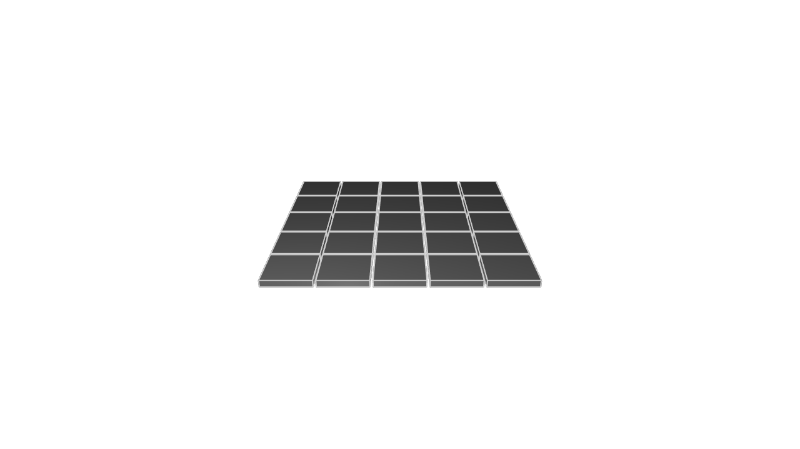

# Patterns

Real-world objects often have repeated parts. Consider a LEGO brick, which has a lot of repeated bumps on its top face. Or a table, with four repeated legs. KCL would be a very tedious language if we made you define each leg, or each LEGO bump, over and over again every time your model needed one. Luckily, there's a simple way to repeat geometry in your model. It's called a _pattern_. There are several ways to use patterns. Let's learn how they work!

## Basic patterns

Let's start simple. We can use patterns to replicate our geometry, copying it into our scene several times. Let's take this simple cylinder, and copy it 4 times.

```kcl=linear_pattern
cylinders = startSketchOn(XY)
  |> circle(radius = 4, center = [0, 0])
  |> extrude(length = 10)
  |> patternLinear3d(instances = 4, distance = 10, axis = [1, 0, 0])
```


The [`patternLinear3d`] function takes 4 args:
 - A solid to pattern (the unlabeled first arg, which is implicitly set to % and therefore gets the cylinder piped in)
 - The total number of instances you want (i.e. how many total copies of the solid there should be)
 - How far apart each instance of the pattern should be
 - The axis along which to place the copies.

In our above example, `[1, 0, 0]` is the X axis, so it places 4 instance along the X axis, each 10 units apart.

## Circular patterns

You can also use patterns to replicate something and lay them out in an arc around a point. We'll use the [`patternCircular3d`] function. Here's an example where we put 12 cubes in a circle:

```kcl=circular_cubes_false
offset = 40
cubes = startSketchOn(XZ)
  |> polygon(numSides = 4, radius = 10, center = [0, offset])
  |> extrude(length = 10)
  |> patternCircular3d(
       instances = 12,
       axis = [0, 1, 0],
       center = [0, 0, 0],
       arcDegrees = 360,
       rotateDuplicates = false,
     )
```


Here, the center of the pattern is [0, 0, 0]. We drew the first cube at the northernmost position (12 o'clock) and all the other instances were patterned around that center. Nice!

Notice that we used `rotateDuplicates = false`. As the name implies, this argument controls whether the duplicates get rotated, so that they're always facing the same way with regards to the center. If we set it to true, we get this:

```kcl=circular_cubes_true
offset = 40
cubes = startSketchOn(XZ)
  |> polygon(numSides = 4, radius = 10, center = [0, offset])
  |> extrude(length = 10)
  |> patternCircular3d(
       instances = 12,
       axis = [0, 1, 0],
       center = [0, 0, 0],
       arcDegrees = 360,
       rotateDuplicates = true,
     )
```


Of course, if we change the `arcDegrees` argument, we could pattern around only part of the circle instead. Let's do two thirds of the circle:

```kcl=circular_cubes_partway
offset = 40
cylinders = startSketchOn(XZ)
  |> polygon(numSides = 4, radius = 10, center = [0, offset])
  |> extrude(length = 10)
  |> patternCircular3d(
       instances = 12,
       axis = [0, 1, 0],
       center = [0, 0, 0],
       arcDegrees = 240,
       rotateDuplicates = true,
     )
```


You can use patterns and sketch on face together, patterning an extrusion upon some base.

```kcl=pattern_sof
base = startSketchOn(XZ)
  |> circle(radius = 50, center = [0, 0])
  |> extrude(length = 10)

offset = 30
boxes = startSketchOn(base, face = END)
  |> circle(radius = 5, center = [0, offset])
  |> extrude(length = 10)
  |> patternCircular3d(
       instances = 6,
       axis = [0, 1, 0],
       center = [0, 0, 0],
       arcDegrees = 360,
       rotateDuplicates = true,
     )
```


## Transform patterns

Circular and linear patterns cover a lot of really common use-cases for mechanical engineers. But sometimes you want to do more complicated patterns, in more complicated shapes. We can't add a dedicated pattern function for every single shape our users can think of -- that would be ridiculous. Instead, we've got a powerful, flexible interface for patterning solids in any arrangement you can think of. It's called a _transform_ pattern. They're created with the [`patternTransform`] function. It takes a familiar `instances` arg, which controls how many total copies of the shape you want. But it takes a new argument, called `transform`. This is a _custom function_. We'll dive deeper into those in the following chapters, but for now, they're basically just a way to calculate how to transform each replica in the pattern.

When might you need a pattern transform? Here's one use: to do a 2D pattern, like tiling a grid. Let's use a pattern transform to make a 5 by 5 grid.

```kcl=xform_grid
n = 5
width = 10
gap = 1.5 * width

// Transform function
fn grid(@i) {
  column = rem(i, divisor = n)
  row = floor(i / n)
  return { translate = [column * gap, row * gap, 0] }
}

startSketchOn(XY)
  |> polygon(numSides = 4, radius = width, center = [0, 0])
  |> extrude(length = 2)
  |> rotate(yaw = 45)
  |> patternTransform(instances = n * n, transform = grid)
```

We've defined a _custom function_ called `grid`. This function will get called once for every replica in the pattern, and it tells KCL how each replica should be transformed. Specifically it:

 - Takes a single argument called `i`. It's used to indicate which number replica it is. The first copy made will set `i` to 1, the second copy will set `i` to 2, etc etc. The argument `i` is prefixed with `@` to indicate it's this function's special first unlabeled arg, so if you call it, you'd call it like `grid(1)` or `grid(2)`, not `grid(i = 1)`.
 - Returns a list of different properties to transform in each replica.

In this example, we declare a function `grid` which tells `patternTransform` to translate each replica by a certain amount `column * gap` along X axis, `row * gap` along the Y axis, and to stay on the same Z axis (i.e. move exactly 0 along that axis).

The specific value of `row` and `column` changes every time the `grid` function is called, because these variables are calculated from the input argument `i`. Remember, `i` represents which number replication we're transforming. To calculate `column` and `row` we're going to use a few new KCL functions we haven't seen before.

Firstly, [`rem`]. The value `rem(i, divisor = n)` will divide i by n and return the remainder. This means that for i = 0, 1, 2, 3, 4, x will equal 0, 1, 2, 3 and 4. But when i = 5 (i.e. the fifth copy is being calculated), x will be 0. We're calling this function 25 times, and over those calls, x will step from 0 to 4, jump back down to 0, and begin stepping up again. This means x is a good way to calculate the columns, which range from column 0 to column 4 (a total of 5 columns).

The [`floor`] function takes a fractional number, and rounds it down to the nearest integer. For example, `floor(3.6)` is 3. This means it's a good way to calculate the row, because the first five times it's called, `row` will always equal 0. It'll round down `(i / n)` from 0/5, 1/5, 2/5, 3/5, 4/5 all down to 0. Then the sixth time it's called, it will receive 5/5, which is 1, and round it down to 1. These neat little mathematical tricks mean we can calculate the row and column from the repetition number `i`.

The final result speaks for itself:



We can transform each replica in other ways, too. For example, we can skip a replica altogether! Let's make a chessboard pattern, where we skip every second tile. 

```kcl=xform_chessboard
n = 5
width = 10
gap = 1.5 * width

// Transform function
fn chessboard(@i) {
  row = rem(i, divisor = n)
  column = floor(i / n)
  isEven = rem(i, divisor = 2) == 0
  return [{ translate = [row * gap, column * gap, 0], replicate = isEven }]
}

startSketchOn(XY)
  |> polygon(numSides = 4, radius = width, center = [0, 0])
  |> extrude(length = 2)
  |> rotate(yaw = 45)
  |> patternTransform(instances = n * n, transform = chessboard)
```

In this example, we use a very similar transform function. The only difference is, we're setting the `replicate` property on the final transform too. And we're setting it to the variable `isEven`. This variable is a boolean value -- it's true if `i` divided by 2 has a remainder of 0, which is the definition of an even number (it's divisible by 2). This should skip every second replication. Let's try it out!


Here's another example, with some different transform properties being set.

```kcl=cube_spiral
width = 20

fn transform(@i) {
  return {
    // Move down each time.
    translate = [0, 0, -i * width],
    // Make the cube longer, wider and flatter each time.
    scale = [
      pow(1.1, exp = i),
      pow(1.1, exp = i),
      pow(0.9, exp = i)
    ],
    // Turn by 15 degrees each time.
    rotation = { angle = 15 * i, origin = "local" }
  }
}

cube = startSketchOn(XY)
|> startProfile(at = [0, 0])
|> polygon(numSides = 4, radius = 100, center = [width, width])
|> extrude(length = width)

cube |> patternTransform(instances = 25, transform = transform)
```

In this example, we make 25 cubes, slightly transforming each one. Each cube gets **translated** (moving down along the Z axis), and **scaled** (becoming longer, wider and flatter), as well as **rotating** 15 degrees around its own center (i.e. its **local** origin). We could rotate them around the scene's center by using `origin = "global"`. Here's the result.


The transform functions we've used so far each return a single transform. But if you'd like, they can return an array of transforms. Each transform in the array will get executed in order. This is helpful for simplifying some of your math calculations. Sometimes it's easier to formulate a transformation as a rotate, then a translate, then rotating back, rather than trying to calculate the perfect translation all at once.

Pattern transforms are a very powerful tool. They're definitely one of the most complex function in KCL, but that complexity gives you a lot of flexibility. Any mathematical curve you can formulate can be used to pattern your instances, by just calculating it in a transform function. The same goes for tiling or grid arrangements. For more examples, you can read the full [`patternTransform`] docs.

## 2D patterns and holes

So far all of the patterns we've used have replicated 3D solids. But you can use patterns to replicate 2D sketches too. The [`patternLinear2d`], [`patternCircular2d`] and [`patternTransform2d`] functions work like their 3D variants, except they take 2D axes and 2D points. Here's a simple example:

```kcl=pattern2d
manyCircles = startSketchOn(XZ)
  |> circle(radius = 4, center = [50, 0])
  |> patternCircular2d(
       center = [0, 0],
       instances = 12,
       arcDegrees = 360,
       rotateDuplicates = true,
     )
```


Now, you could use these 2D patterns as the basis for 3D solids, by extruding or revolving them. You can see this by adding the line `extrude(manyCircles, length = 10)` to the end of the above KCL program. But it's not a good idea, because it produces the exact same model as you would have gotten from making a single 3D solid, then using 3D patterns on that. The only difference is, extruding a 2D pattern is much slower than patterning a 3D solid. So, can we do anything _useful_ with 2D patterns?

Yes! One important use case is putting holes into 2D sketches. We have a special [`subtract2d`] function for this. Let's take the pattern from above, and use it to cut holes into another sketch.

```kcl=subtract2d_patterns
manyCircles = startSketchOn(XZ)
  |> circle(radius = 4, center = [50, 0])
  |> patternCircular2d(
       center = [0, 0],
       instances = 12,
       arcDegrees = 360,
       rotateDuplicates = true,
     )

base = startSketchOn(XZ)
  |> circle(radius = 60, center = [0, 0])
  |> subtract2d(tool = manyCircles)
  |> extrude(length = 10)
```


This could be done with CSG, but it's faster to produce the 2D sketch you want, then do a simple extrude, rather than doing the extrude and then many CSG operations. Full 3D CSG operations are mathematically difficult to calculate compared to simple 2D operations, so if you see the chance to use a simple [`subtract2d`], you should consider it.

[`patternLinear3d`]: https://zoo.dev/docs/kcl-std/patternLinear3d
[`patternLinear2d`]: https://zoo.dev/docs/kcl-std/patternLinear2d
[`patternCircular3d`]: https://zoo.dev/docs/kcl-std/patternCircular3d
[`patternCircular2d`]: https://zoo.dev/docs/kcl-std/patternCircular2d
[`patternTransform`]: https://zoo.dev/docs/kcl-std/patternTransform
[`patternTransform2d`]: https://zoo.dev/docs/kcl-std/patternTransform2d
[`rem`]: https://zoo.dev/docs/kcl-std/functions/std-math-rem
[`floor`]: https://zoo.dev/docs/kcl-std/functions/std-math-floor
[`subtract2d`]: https://zoo.dev/docs/kcl-std/subtract2d
