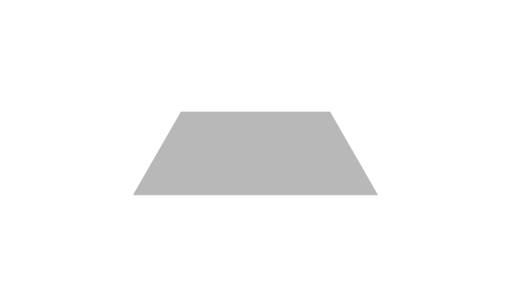
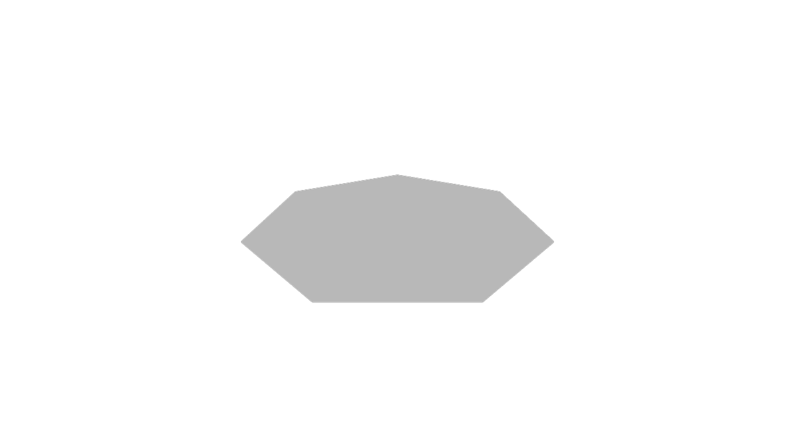
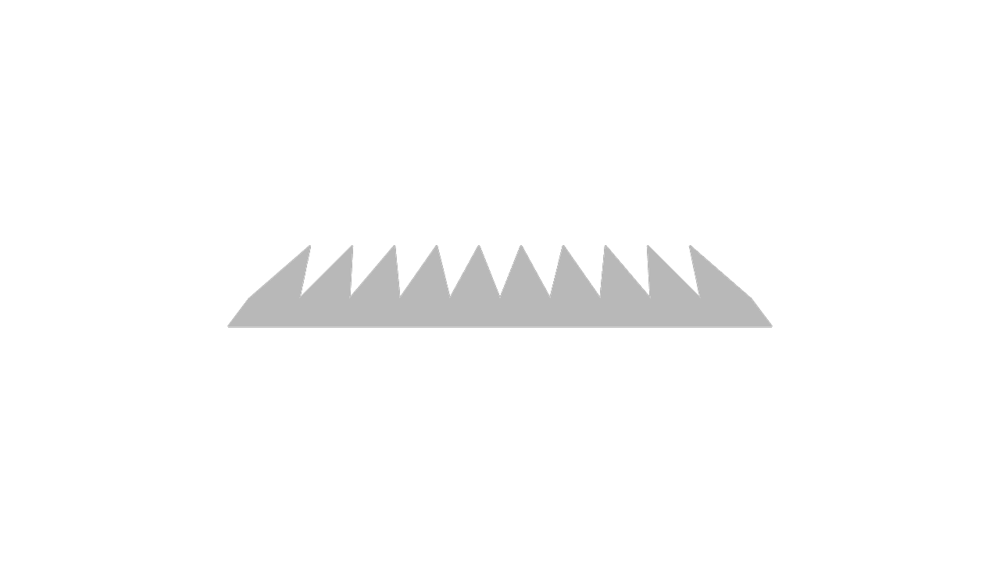

# Reduce and geometry

<!-- toc -->

The `reduce` function lets us iterate over an array, consuming its contents and _reducing_ them down to one single item. Reduce is a very powerful, flexible tool. It can be complex too, but that complexity lets us do some very interesting things.

For example: how would you write a KCL function that produces an n-sided polygon? This is an ambitious project, so let's start with something simpler, and build back up to an n-sided polygon.


## Sketching a square with reduce

Can we use `reduce` to make a `square` function, first? Once we've done that, we can make a parametric `sketchPolygon` function that works like `square` when the number of sides is 4, but can just as easily produce hexagons, octagons, triangles, etc.

```kcl=reduce_square
fn square(sideLength) {
  emptySketch = startSketchOn(XY)
    |> startProfile(at = [0, 0])
  angle = 90
  fn addOneSide(@, accum) {
    return angledLine(accum, angle = i * angle, length = sideLength)
  }
  return reduce([1..4], initial = emptySketch, f = addOneSide)
    |> close()
}

square(sideLength = 10)
```

What's going on here? Let's break it down. We declare `fn square` which takes one argument, the `sideLength`. We create an initial empty sketch (at [0, 0] on the XY plane), and declare that the angle is 90.

Next, we declare a `fn addOneSide`. It takes in two arguments: `i`, which represents the index of which side we're currently adding, and `accum`, which is the sketch we're adding it to. This function adds one angled line to the sketch. The line's side is whatever side length was given, and its angle is 90 times `i`. So, the first line will have an angle of 90, the second 180, the third 270, and the last 360.

Then we call `reduce`, passing in the array [1, 2, 3, 4], setting the initial accumulator value to the empty sketch we started above, and calling `addOneSide` every time the reduce handles an array item. When reduce runs, it:

 - Starts `accum` as the empty sketch
 - Handles the first item, `i = 1`, calls `addOneSide`, which takes the previous accumulated sketch (currently empty) and adds an angled line at 90 degrees. This becomes the next accumulated sketch.
 - Handles the second item, `i = 2`, calls `addOneSide`, which takes the previous accumulated sketch (with a single line) and adds an angled line at 180 degrees. This becomes the next accumulated sketch.
 - For `i = 3`, it takes the accumulated sketch with two lines, and adds a third line, similar to the previous step.
 - For `i = 4`, it takes the accumulated sketch with three lines, and adds a fourth line, similar to the previous step.

Thus it builds up a square.



## Sketching a parametric polygon with reduce

OK! We've seen how to use `reduce` to add lines to an empty sketch. We're ready to make our polygon function. Although, KCL already has a `polygon` function in the standard library. So, to avoid clashing with the existing name, we'll call ours `sketchPolygon`.

We can start with our `square` function and generalize it. First, we'll add an argument for the number of lines.

```kcl
fn sketchPolygon(@numLines, sideLength) {
}
```

We can use the same initial empty sketch. We'll have to change `angle`, because it won't be 90 anymore. The angle now depends on how many edges the shape has:

```kcl
angle = 360 / numLines
```

And lastly, our `reduce` call will need to take an array of numbers from 1 to `numLines`, not 1 to 4. So we'll use `[1..numLines]` as the first argument to `reduce`.

Let's put all that together:

```kcl=reduce_polygon
fn sketchPolygon(@numLines, sideLength) {
  initial = startSketchOn(XY)
    |> startProfile(at = [0, 0])
  angle = 360 / numLines
  fn addOneSide(@i, accum) {
    return angledLine(accum, angle = i * angle, length = sideLength)
  }
  finished = reduce([1..numLines], initial = initial, f = addOneSide)
  return finished |> close()
}

sketchPolygon(7, sideLength = 10)
```



Reduce can be a very powerful tool for repeating paths in a sketch. We hope to simplify this in the future. It's easy to dynamically repeat 2D shapes or 3D solids with `pattern2D` and `pattern3D`, so we hope to add a `pattern1D` eventually, so that these complicated reduces won't be necessary. Until then, reduce can be a good way to implement tricky functions like `sketchPolygon`.

## Repeating geometry with reduce

Let's look at another way to use reduce. Say you're modeling a comb, with a parametric number of teeth. We can use `reduce` to solve this again:

```kcl=reduce_comb
fn comb(teeth, sideLength) {
  toothAngle = 80
  handleHeight = 4
  initial = startSketchOn(XY)
    |> startProfile(at = [0, 0])

  // Sketches a single comb tooth
  fn addTooth(@i, accum) {
    // Line going up
    return angledLine(accum, angle = toothAngle, length = sideLength)
      // Line going down
      |> angledLine(angle = -toothAngle, length = sideLength)
  }
  allTeeth = reduce([1..teeth], initial = initial, f = addTooth)
  finalComb = allTeeth
    // Add the handle: a line down, across, and back up to the start.
    |> yLine(length = -handleHeight)
    |> xLine(endAbsolute = 0)
    |> yLine(endAbsolute = 0)
    |> close()
  return finalComb
}

comb(teeth = 10, sideLength = 10)
```

We write a function `addTooth` which adds a tooth (going up, then back down) to a sketch. Using `reduce`, we can call that function `teeth` times. Each time, the new tooth gets appended to the end of the sketch path. Once we've drawn all the teeth, we draw a simple handle leading back to the start.



To wrap up, [`reduce`] is a powerful way to make parametric designs, repeating geometric features as many times as you need. You can design parametric polygons with a variable number of sides, or repeat geometry linearly (like we did for our comb). You can even make parametric gears, take a look at the [KCL samples] for examples.

[`map`]: https://zoo.dev/docs/kcl-std/map
[`reduce`]: https://zoo.dev/docs/kcl-std/reduce
[KCL samples]: https://zoo.dev/docs/kcl-samples/gear
