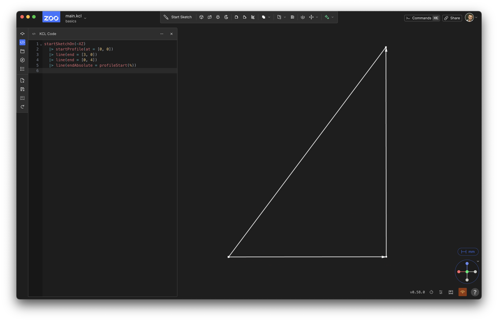

# Sketching 2D shapes

<!-- toc -->

Let's use KCL to sketch some basic 2D shapes. **Sketching** is a core workflow for mechanical engineers, designers, and hobbyists. The basic steps of sketching are:

1. Choose a plane to sketch on
2. Start sketching at a certain point
3. Draw a line from the current point to somewhere
4. Add new lines, joining on from the previous lines
5. Eventually, one line loops back to the starting point.
6. Close the sketch, creating a 2D shape.

You can do each of these steps in KCL. Let's see how!

## Your first triangle

Let's sketch a really simple triangle. We'll sketch a right-angled triangle, with side lengths 3 and 4.

Just copy this code into the KCL editor:


```kcl
startSketchOn(XY)
  |> startProfile(at = [0, 0])
  |> line(end = [3, 0])
  |> line(end = [0, 4])
  |> line(endAbsolute = [0, 0])
  |> close()
```

Your screen should look something like this:


Congratulations, you've sketched your first triangle! Rendering your first triangle is a [big deal in graphics programming](https://rampantgames.com/blog/?p=7745), and sketching your first triangle is a big deal in KCL. 

Let's break this code down line-by-line and see how it corresponds to each step of sketching from above. Note that each step in creating this triangle uses the pipeline syntax `|>`. This means every function call is being piped into the next function call. 

### 1: Choose a plane

In KCL, there's six basic built-in planes you can use: XY, YZ, XZ, and negative versions of each (-XY, -YZ and -XZ). You can use one of these standard planes, or define your own (we'll get to that later). Those six standard planes can be used just like normal variables you define, except they're pre-defined by KCL in its standard library. You can pass them into functions, like the [`startSketchOn`] function. So, line 1, `startSketchOn(XY)` is where you choose a plane, and start sketching on it.

`startSketchOn` takes one argument, the plane to sketch on. It's the special unlabeled first parameter. We'll go over some other planes you can sketch on in the chapter about [sketch on face].

### 2: Start sketching

Sketches contain profiles -- basically, a sequence of lines, laid out top-to-tail (i.e. one line starts where the previous line ends). We have to start the profile somewhere, so we use `startProfile(at = [0, 0])`. The [`startProfileAt`] takes two parameters:

1. The sketch we're adding a profile with. This is one of those special unlabeled first parameters, so we don't need a label. We're setting it to the sketch from `startSketchOn(XY)`, which is being piped in via the `|>`. If you don't set this first parameter, it defaults to `%`, i.e. the previous pipeline expression. And that's exactly what we want! So we're leaving it unset.
2. The `at` parameter indicates where the profile starts. For this example, we'll start at the origin of the XY plane, i.e. the point `[0, 0]`.

### 3: Add paths

A profile is a sequence of paths. A path is some sort of curve between two points, possibly straight lines, circular arcs, parabolae, or something else. For this triangle, we're adding 3 paths, which are all straight lines. The [`line`] call says to draw a line starting at the previous end point. Currently, this is `[0, 0]` from the `startProfileAt` call. So this line starts at `[0, 0]`. Where does it end? Well, the `line` call says that `end = [3, 0]`, which means "extend this line 3 units along the X axis, and 0 units along the Y axis". This is a _relative_ distance, because it's telling you how far to move from the previous point. So, this line goes from `[0, 0]` to `[3, 0]`.

### 4: Add more lines, joining on from previous lines.

The next call is `line(end = [0, 4])`. It draws a line from the previous line's end (`[3, 0]`), extending a distance of 0 along X and 4 along Y. So it goes from `[3, 0]` to `[3, 4]`. 

### 5: Join back to the start

Our third line heads back to the start of the profile, i.e. `[0, 0]`. We do this by calling `line(endAbsolute = [0, 0])`. Note that this uses `endAbsolute =`, not `end =` like the previous lines. The `end =` arguments were _relative_ distances: they said how far away the new point is, along both X and Y axes, from the previous point. This one is different: this is an _absolute_ point, not a _relative_ distance. The array `[0, 0]` isn't saying to move 0 along X and 0 along Y. It's saying, draw a line that ends at the specific point `[0, 0]`, i.e. the origin of the plane.

Because this is the same point that our profile starts at, this line has looped our profile back to its start.

If we stopped our program here, you could see all three lines:



Note that the _relative_ lines (i.e. the first two line calls, with `end =`) have arrows showing where they're going. This last line, which ends at an _absolute_ point, does not.

### 6: Close the sketch

The last function being called is [`close`]. It takes one argument, the sketch to close. As in the previous functions, it's an unlabeled first parameter, so you could write `close(%)`, but `close()` will do the exact same thing.

Once we add the `close()` call, the rendering changes from just 3 lines (like in the second image in this page) to a filled-in shape (like in the first image on this page).

## Enhancements

This code totally achieved our goal: it sketches a right-angled triangle with sides of length 3 and 4. Mission accomplished.

Of course, in programming, there's usually several different ways to achieve a goal. KCL is no different! Let's look at some different ways we could have sketched this shape.

### Closing shapes

One important principle in programming is "don't repeat yourself" (DRY). Look back at this code: it uses the point `[0, 0]` twice. Once when we start the sketch, and once when we close the sketch. There's nothing necessarily wrong with this, but if you want to change the triangle later, you'll have to change this in two different places. And if you make a typo in one of the places, the model will break, because the sketch will be starting and finishing at a different point. This program doesn't have a bug currently, but by repeating this value twice, we introduce a _potential_ bug in the future. I'd call this program _brittle_ -- it's not broken, but it could break in the future. If we could define the point `[0, 0]` just once, the program would be more resilient, i.e. less likely to break if you change something in the future.

Here's a few ways to make this code less repetitive, less brittle, and DRY-er.

Firstly, you could replace [0, 0] with a variable like `start`, and use it in both places.


```kcl
start = [0, 0]
startSketchOn(XY)
  |> startProfile(at = start)
  |> line(end = [3, 0])
  |> line(end = [0, 4])
  |> line(endAbsolute = start)
  |> close()
```

Next, we could use a helper function [`profileStart`] instead.

```kcl
startSketchOn(XY)
  |> startProfile(at = [0, 0])
  |> line(end = [3, 0])
  |> line(end = [0, 4])
  |> line(endAbsolute = profileStart())
  |> close()
```

The `profileStart` function takes in the current profile, and returns its start value. It takes a single unlabeled parameter, which we're setting to % (the left-hand side of the |>). Like always, if the special unlabeled argument is set to %, you can just omit the %, because that's the default.

### X and Y lines

The first line of our triangle is parallel to the X axis, and the second line is parallel to the Y axis. This means we could simplify our code somewhat by using the [`xLine`] and [`yLine`] functions:

```kcl
startSketchOn(XY)
  |> startProfile(at = [0, 0])
  |> xLine(length = 3)
  |> yLine(length = 4)
  |> line(endAbsolute = profileStart())
  |> close()
```

`xLine` takes an unlabeled first parameter for the sketch (which, as before, we're setting to % and can therefore omit) and then a `length` parameter, which tells KCL to draw a flat line, parallel to the X axis, with the given length. Basically,`xLine(length = n)` is a neater way to write a horizontal line like `line(end = [n, 0])`. You can use whichever one you prefer. The `yLine` function works the same way, but for vertical lines.

These examples use _relative_ xLine and yLine -- i.e. lines that end a certain _distance away from the previous point_. If you want to instead draw a line to a specific point along the X axis (like `x = 3`), you could use `xLine(endAbsolute = 3)`.


## Conclusion

We've written our first triangle. We learned:

 - Sketches are on some plane, and KCL includes standard planes XY, YZ and XZ (and their negative versions, which point the third axis in the opposite direction).
 - Sketches contain profiles, which are made of sequential paths. In our example, there's one profile, a triangle, made of three paths (3 straight lines).
 - Lines start at the end of the previous point (the first line starts at the `startProfile(at=)` point)
 - Lines can end either a certain distance away along X and Y (a _relative_ end), or at a particular point along the plane (an _absolute_ end)
 - The `close` function turns a sequence of paths that form a loop into a single 2D shape.

[`close`]: https://zoo.dev/docs/kcl/close
[`line`]: https://zoo.dev/docs/kcl/line
[`profileStart`]: https://zoo.dev/docs/kcl/profileStart
[`startProfileAt`]: https://zoo.dev/docs/kcl/startProfileAt
[`startSketchOn`]: https://zoo.dev/docs/kcl/startSketchOn
[`xLine`]: https://zoo.dev/docs/kcl/xLine
[`yLine`]: https://zoo.dev/docs/kcl/yLine
[sketch on face]: /sketch_on_face.html
