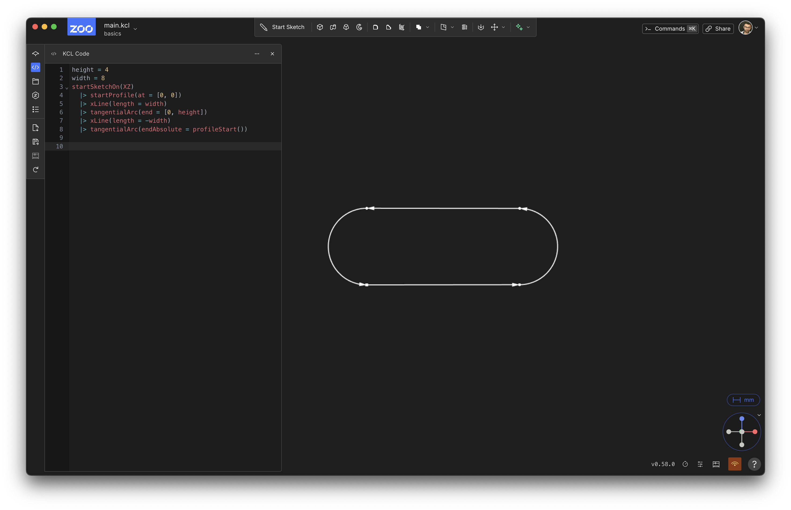
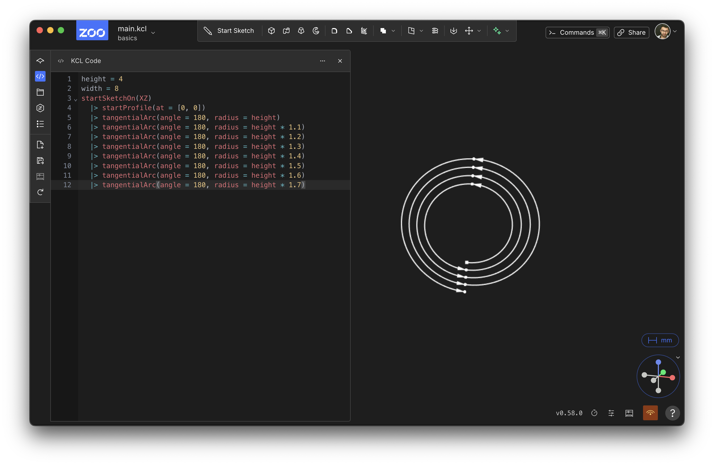
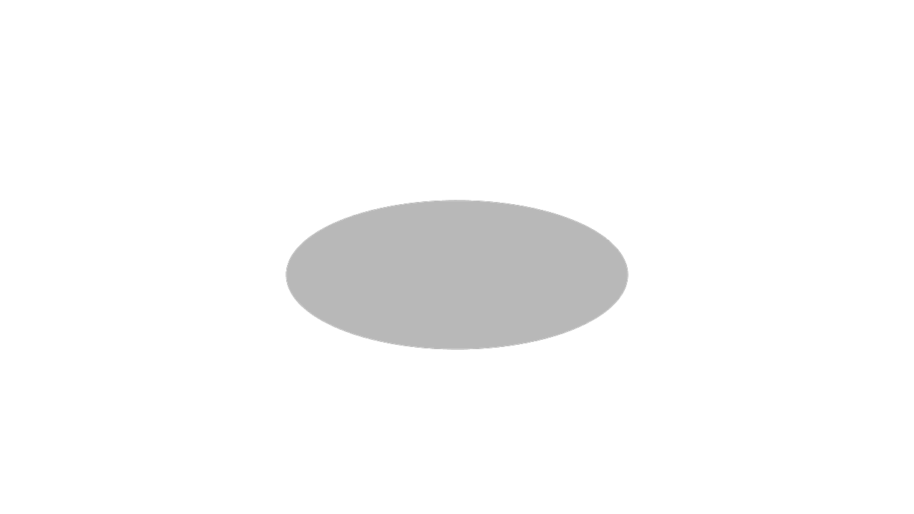

# Sketching curved lines

<!-- toc -->

In the previous chapter, we sketched a basic triangle. In this chapter, we'll look at some more interesting kinds of sketches you can do, using more interesting kinds of paths.

## Pills

Let's sketch a pill shape, like a rectangle but with rounded edges. We can use tangential arcs for this. The [`tangentialArc`] function sketch a curved line -- specifically, an arc, or a subset of a circle -- starting from the previous line's end. It draws it at a smooth angle from the previous line, i.e. _tangent_ to the previous line.


```kcl
height = 4
width = 8
startSketchOn(XZ)
  |> startProfile(at = [0, 0])
  |> xLine(length = width)
  |> tangentialArc(end = [0, height])
  |> xLine(length = -width)
  |> tangentialArc(endAbsolute = profileStart())
```

It should look like this:



Let's analyze this! It looks very similar to the triangle we sketched previously, but we're using `tangentialArc`. You can see it takes a relative `end`, i.e. an X distance and Y distance to move from the current point. It draws a nice smooth arc there.

We wrote this arc using `end`, i.e. an X and Y distance. But we could have defined this arc differently, using a `radius` and `angle` instead. You can replace the `tangentialArc(end = [0, height])` with `tangentialArc(angle = 180, radius = height)` instead, and it should draw the same thing. 

The second `tangentialArc` call takes an absolute point. We tell it to draw an arc from the current point to the start of the profile. This should remind you of how straight lines can use either `end` (relative) or `endAbsolute`.

## Spirals

We can use tangential arcs to make a spiral too.


```kcl
startSketchOn(XZ)
  |> startProfile(at = [0, 0])
  |> tangentialArc(angle = 180, radius = height)
  |> tangentialArc(angle = 180, radius = height * 1.1)
  |> tangentialArc(angle = 180, radius = height * 1.2)
  |> tangentialArc(angle = 180, radius = height * 1.3)
  |> tangentialArc(angle = 180, radius = height * 1.4)
  |> tangentialArc(angle = 180, radius = height * 1.5)
  |> tangentialArc(angle = 180, radius = height * 1.6)
  |> tangentialArc(angle = 180, radius = height * 1.7)
```

It should look like this:



This works because each tangentialArc is drawing half a circle, away from the previous arc, and the circle is getting slightly larger each time.

## Circles

And lastly, let's look at the humble circle.

```kcl=basic_circle
startSketchOn(XY)
  |> circle(center = [0, 0], radius = 10)
```



The [`circle`] call takes `center` and `radius` arguments. Note that `circle` closes itself without any need for a `close()` call. That's because a circle is inherently closed -- it always starts and ends its own profile.

[`tangentialArc`]: <https://zoo.dev/docs/kcl/tangentialArc>
[`circle`]: <https://zoo.dev/docs/kcl-std/functions/std-sketch-circle>
