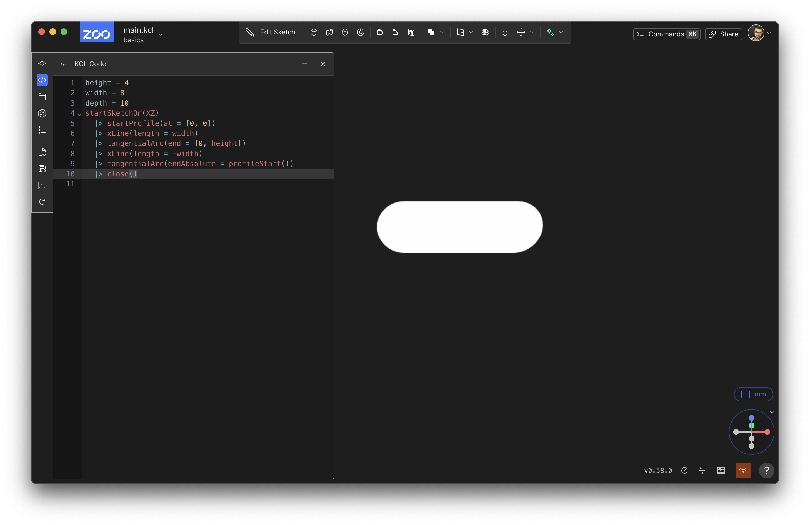
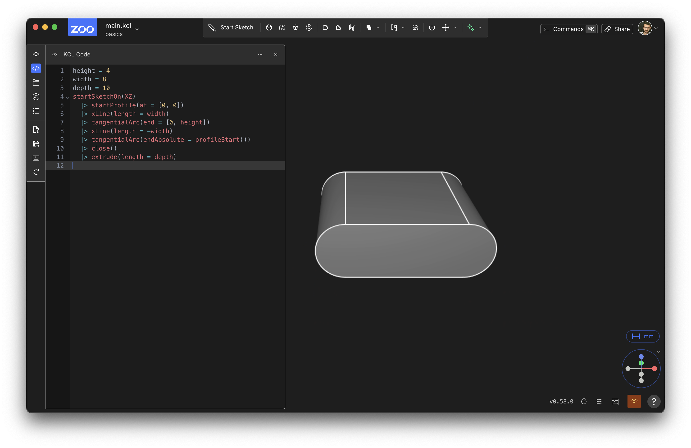
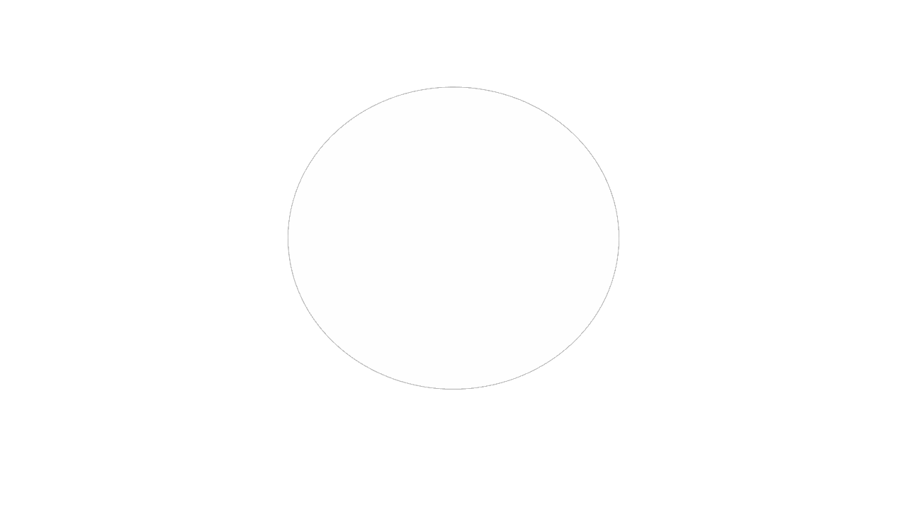
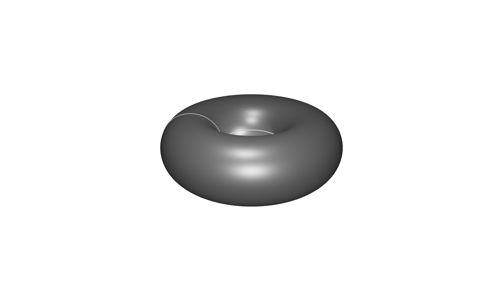
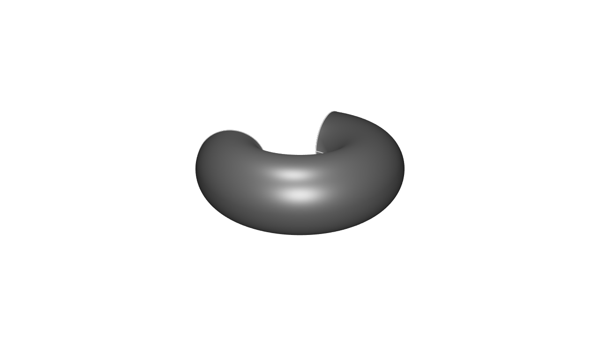

# Modeling 3D shapes

Previous chapters covered designing 2D shapes. Now it's time to design 3D shapes!

3D shapes are usually made by adding depth to a 2D shape. There are two common ways engineers do this: by extruding or revolving 2D shapes into 3D. Let's examine each of them.

## Extruding

Extruding basically takes a 2D shape and pulls it up, stretching it upwards into the third dimension. Let's start with our existing 2D pill shape from the previous chapter:

```kcl
height = 4
width = 8
startSketchOn(XZ)
  |> startProfile(at = [0, 0])
  |> xLine(length = width)
  |> tangentialArc(end = [0, height])
  |> xLine(length = -width)
  |> tangentialArc(endAbsolute = profileStart())
  |> close()
```
It should look like this:



Now we're going to extrude it up into the third axis, making a 3D solid.

```kcl
height = 4
width = 8
depth = 10 // Add this line 
startSketchOn(XZ)
  |> startProfile(at = [0, 0])
  |> xLine(length = width)
  |> tangentialArc(end = [0, height])
  |> xLine(length = -width)
  |> tangentialArc(endAbsolute = profileStart())
  |> close()
  // Add this line!
  // This line transforms the 2D sketch into a 3D solid.
  |> extrude(length = depth)
```

You should see something like this:



The [`extrude`] function takes a distance, which is how far along the third axis to extrude. Every plane has a _normal_, or an axis which is _tangent_ to the plane. For the plane XZ, this is the Y axis. This normal, or tangent, or axis perpendicular to the plane, is the direction that extrudes go along.


## Revolving

Revolves are the other common way to make a 3D shape. Let's start with a 2D shape, like a basic circle.


```kcl=circle
startSketchOn(XZ)
  |> circle(center = [-200, 0], radius = 100)
```



The [`revolve`] function takes a shape and revolves it, dragging it around an axis. Let's revolve it around the Y axis (which is perpendicular to XZ, the plane we're sketching on), to make a donut shape.

```kcl=donut
startSketchOn(XZ)
  |> circle(center = [-200, 0], radius = 100)
  |> revolve(axis = Y)
```



There's an optional argument called `angle`. In the above example, we didn't provide it, so it defaulted to 360 degrees. But we can set it to 240 degrees, and get two thirds of a donut:

```kcl=donut240
startSketchOn(XZ)
  |> circle(center = [-200, 0], radius = 100)
  |> revolve(axis = Y, angle = 240)
```



[`extrude`]: https://zoo.dev/docs/kcl/extrude
[`revolve`]: https://zoo.dev/docs/kcl/revolve
