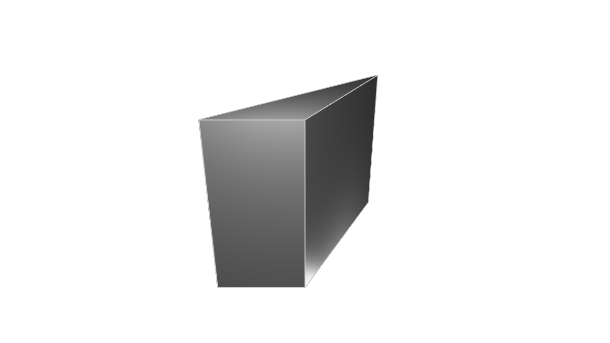
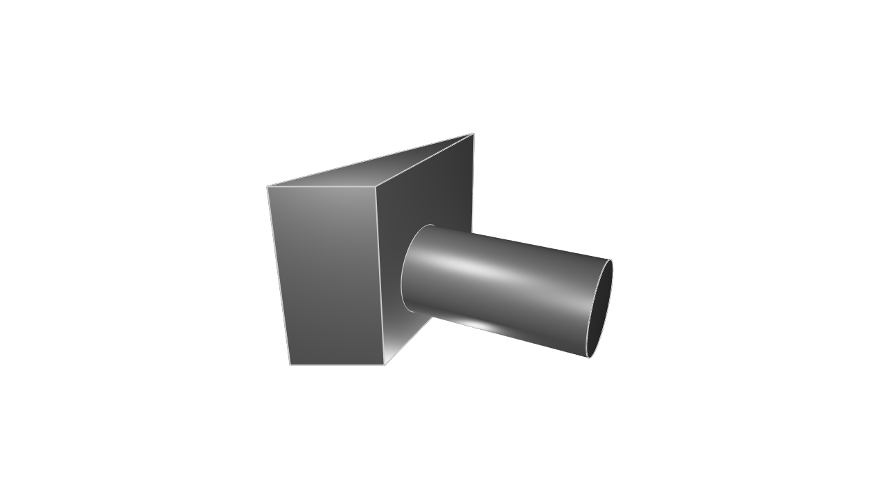
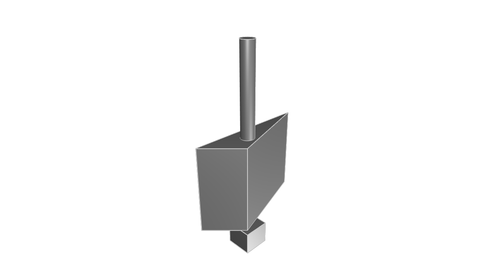
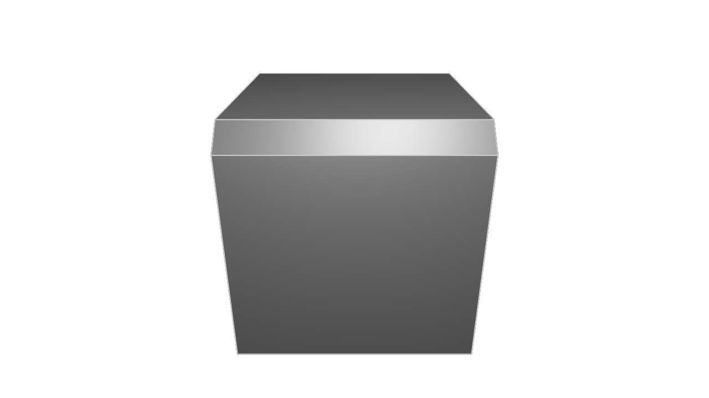
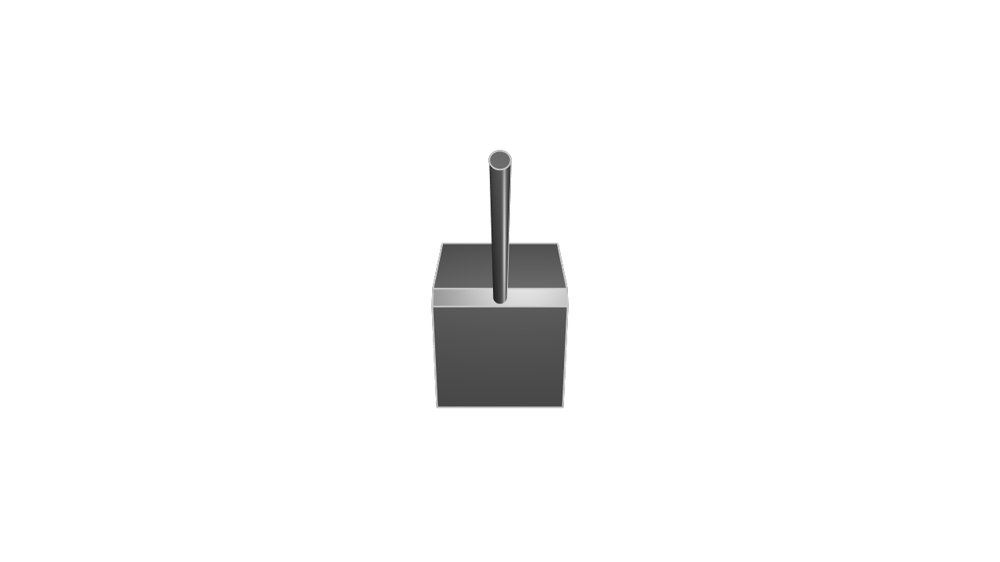
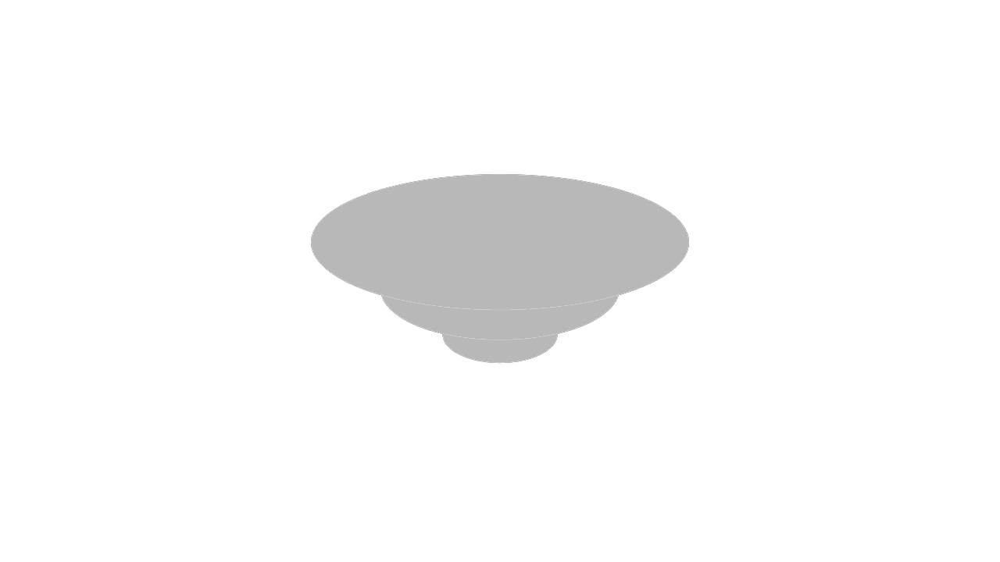
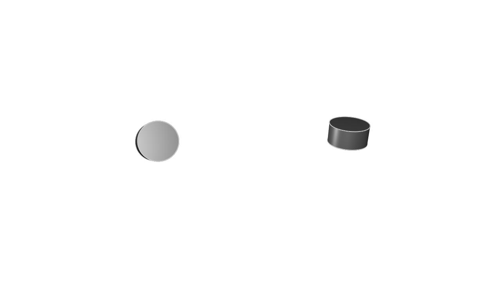

# Sketch on face

<!-- toc -->

In the previous chapter, we looked at how KCL lets you tag edges. Tags let you query your edges (to find their length, or angle with the previous edge), or apply an edge cut (like a fillet or chamfer). But you can tag more than just edges! In this chapter, we'll learn how to tag faces, and how that lets you build more complicated 3D models.

## Side faces

Let's start with a simple example. First, we'll sketch and extrude a triangle. We'll tag its second edge as `b`.

```kcl=triangle_for_sketching
length = 20
triangle = startSketchOn(XY)
  |> startProfile(at = [-length, -length])
  |> line(end = [length, 0])
  |> line(end = [length, length * 2], tag = $b)
  |> line(endAbsolute = profileStart())
  |> close()
  |> extrude(length = 40)
```



When our triangle is extruded, its 3 edges create 3 new side faces, one for each original edge. I like to imagine extrusion like an invisible hand grabbing the flat sketch and pulling it upwards into the third dimension, slowly stretching each edge until they expand to become faces. So, each new side face corresponds to an existing edge. And crucially, the faces share a tag with their parent edge. This means the face which grew out of the edge tagged `b` also has the tag `b`. We can use this to reference this face in our 3D model.

Now, if we want to start a new sketch _on that face_, we can do so!

```kcl=parse
sketch001 = startSketchOn(triangle, face = b)
```

Note that we previously passed a _plane_ (like XY or YZ) into `startSketchOn`. But now, we're passing a solid (our extruded triangle) instead. The solid has five faces (three side faces, a bottom, and a top), so we tell `startSketchOn` which face in particular we want to sketch on. The face is tagged `b` (because it was created from an edge which was tagged `b`), so we just pass that in too. Now we can start sketching on this face, and even extrude that sketch too.


```kcl=triangle_with_cylinder_sketched
length = 20
triangle = startSketchOn(XY)
  |> startProfile(at = [-length, -length])
  |> line(end = [length, 0])
  |> line(end = [length, length * 2], tag = $b)
  |> line(endAbsolute = profileStart())
  |> close()
  |> extrude(length = 40)

cylinder = startSketchOn(triangle, face = b)
  |> circle(radius = 10, center = [0, 15])
  |> extrude(length = 40)
```



Great! We extruded a solid (the triangle), and could sketch on one of its faces, even extruding that sketch.

**Note**: When you sketch on a face, the sketch uses the _global coordinate system_. This means when you use 2D points in your sketches, they're relative to the overall global scene, and _not_ the face you're sketching on.

 Sketching on faces is a really common pattern when designing real-world objects. A LEGO brick is a good example -- first you'd sketch the rectangular brick, then you'd sketch on its top face, adding the little bumps on top. But wait a second. How would we tell `startSketchOn` to sketch on the top face of the brick? That face isn't created from any particular edge. So we can't tag its `line` call and then reuse that tag for the face. What should we do?

## Standard faces

There's a simple solution to sketching on the top face. KCL has some built-in identifiers for the top and bottom face, [`START`] and [`END`]. We prefer the terms "start" and "end" to "top" and "bottom" because the latter depend on your camera angle, so they can be ambiguous. "Start" always refers to the original face from your 2D sketch. "End" always refers to the new face created at the end of the extrusion. Let's use them!

```kcl=triangle_top_and_bottom_sketches
length = 20
triangle = startSketchOn(XY)
  |> startProfile(at = [-length, -length])
  |> line(end = [length, 0])
  |> line(end = [length, length * 2])
  |> line(endAbsolute = profileStart())
  |> close()
  |> extrude(length = 40)

cylinder = startSketchOn(triangle, face = END)
  |> circle(radius = 3, center = [0, -10])
  |> extrude(length = 40)

box = startSketchOn(triangle, face = START)
  |> polygon(radius = 8, numSides = 4, center = [0, -15])
  |> extrude(length = 10)
```



Great! These built-in face identifiers are always available on solids. We've learned how to sketch on the top, bottom and side faces. That covers all possible faces, right? Right? Not exactly! There's one more kind of face we haven't talked about yet. 

## Sketch on chamfer

When you [`chamfer`] an edge, it creates a new face, which can also be sketched on! Consider this chamfered cube from the previous chapter:

```kcl=chamfered_cube
length = 20
cube = startSketchOn(XY)
  |> startProfile(at = [-length, -length])
  |> line(end = [length, 0], tag = $a)
  |> line(end = [0, length], tag = $b)
  |> line(end = [-length, 0], tag = $c)
  |> line(end = [0, -length], tag = $d)
  |> close()
  |> extrude(length = length)
  |> chamfer(
       length = 2,
       tags = [
         getOppositeEdge(a),
       ],
     )
```



The chamfer produced a new face, and we can sketch on it too. Firstly, we add a tag to the [`chamfer`] call, and then we can sketch on it like any other tagged face.

```kcl=sketch_on_chamfered_cube
length = 20
cube = startSketchOn(XY)
  |> startProfile(at = [-length, -length])
  |> line(end = [length, 0], tag = $a)
  |> line(end = [0, length], tag = $b)
  |> line(end = [-length, 0], tag = $c)
  |> line(end = [0, -length], tag = $d)
  |> close()
  |> extrude(length = length)
  |> chamfer(
       length = 2,
       tags = [
         getOppositeEdge(a),
       ],
       tag = $chamferedFace
     )

startSketchOn(cube, face = chamferedFace)
  |> circle(radius = 1, center = [-length/2, 0])
  |> extrude(length = 40)
```



So far, we've sketched on standard planes (like XY), on tagged faces, and on standard faces like END. There's one more place you can start sketching on: a custom plane. Let's learn how.

## Defining new planes

When you call `startSketchOn(XY)`, you're passing a _plane_ as the first argument. XY is a standard, built-in plane (remember, there are six -- XY, YZ, XZ, -XY, -YZ and -XZ). But you can easily define your own planes too! There's two ways:

### Offset planes

You can use the [`offsetPlane`] function to copy any other plane, but moved some direction up or down the third axis. For example, let's draw a small circle on XY, a medium circle on a plane 10 units above it, and a big circle 20 units above it.

```kcl=three_offset_planes
r = 10

startSketchOn(XY)
  |> circle(center = [0, 0], radius = r)
  
startSketchOn(offsetPlane(XY, offset = 10))
  |> circle(center = [0, 0], radius = 2 * r)
  
startSketchOn(offsetPlane(XY, offset = 20))
  |> circle(center = [0, 0], radius = 3 * r)
```



Offset planes are a quick and easy way to create new planes by using some other plane as a template. But what if you want to create a plane that actually points in a different direction, i.e. has different axes? What if you wanted to create a plane that was pointing at an unusual angle from the global X Y and Z axes? Let's try it.

### Custom planes

You can define your own plane with your own axes like this:

```kcl
customPlane = {
  origin = { x = 0, y = 1, z = 0},
  xAxis = { x = 1, y = 0, z = 0 },
  yAxis = { x = 0, y = 0, z = 1 },
}
```

Note the custom plane has a few properties:

 - An origin, which is a 3D point in space, using the global coordinate system (i.e. it's relative to the overall scene)
 - X and Y axes, which are defined as vectors

The plane's Z axis is the cross product of its X and Y axes. It's uniquely determined, so you don't need to specify it.

Now let's use this custom plane in a sketch. We'll build two identical cylinders, but one is on the standard XY plane, and one is on the custom plane we defined above.

```kcl=custom_plane
r = 10
startSketchOn(XY)
  |> circle(center = [100, 0], radius = r)
  |> extrude(length = 10)

customPlane = {
  origin = {
    x = 0,
    y = 0,
    z = 0
  },
  xAxis = { x = 1, y = 0.5, z = 0 },
  yAxis = { x = 0, y = 0.5, z = 1 }
}

startSketchOn(customPlane)
  |> circle(center = [0, 0], radius = r)
  |> extrude(length = 10)
```



Great! Custom planes give you a lot of power and flexibility. You can draw sketches in any orientation now. But they can be a bit verbose and complicated to define, so you should use [`offsetPlane`] if you've already defined a plane on the same X and Y axis. You can even use `offsetPlane` to offset a custom plane, like this:

```kcl
// Make a custom plane.
customPlane = {
  origin = { x = 0, y = 1, z = 0},
  xAxis = { x = 1, y = 0, z = 0 },
  yAxis = { x = 0, y = 0, z = 1 },
}
// Now offset it 20 up its normal axis.
newPlane = offsetPlane(customPlane, offset = 20)
```

Now we've learned how to sketch on all sorts of things:

 - Standard planes like XY or -XZ
 - Tagged faces of existing solids
 - Top or bottom faces of solids, using [`START`] and [`END`]
 - Chamfered faces cut out of solids, by tagging the [`chamfer`] call
 - Custom planes (truly custom, or just offset from an existing plane)

This gives you a lot of flexibility in building your solids. Now it's time to learn what else we can do with these solids. The next chapter will teach you how to combine and transform them!

[`END`]: <https://zoo.dev/docs/kcl-std/consts/std-END>
[`START`]: <https://zoo.dev/docs/kcl-std/consts/std-START>
[`chamfer`]: https://zoo.dev/docs/kcl-std/functions/std-solid-chamfer
[`offsetPlane`]: <https://zoo.dev/docs/kcl-std/functions/std-offsetPlane>
