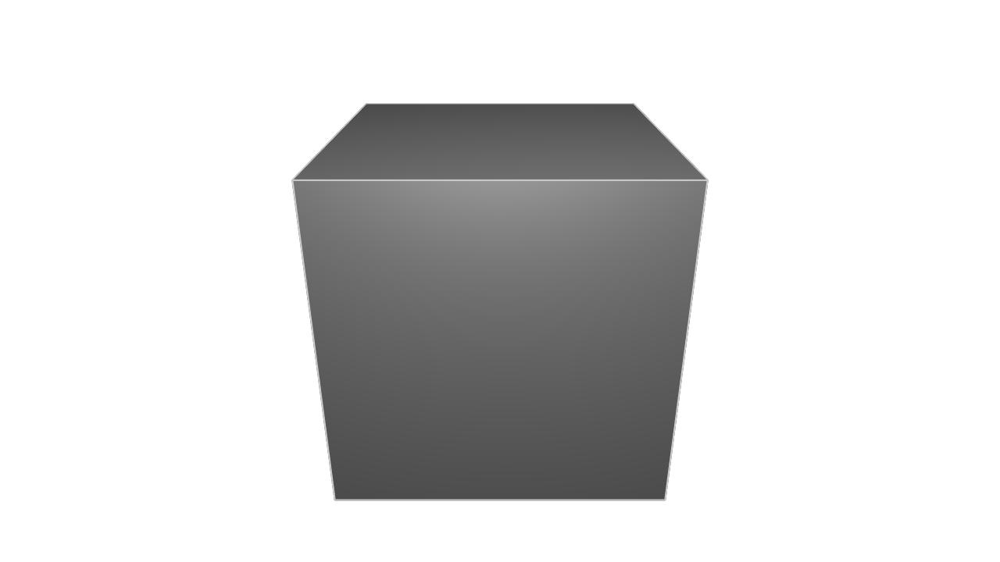
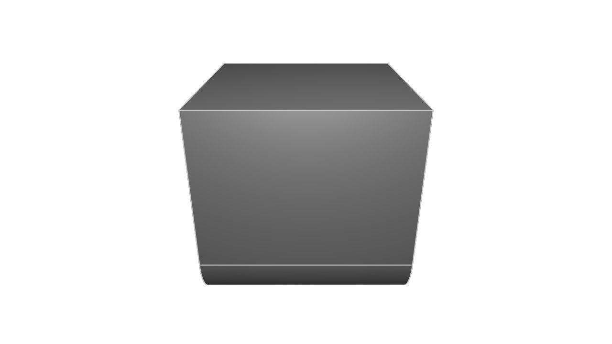
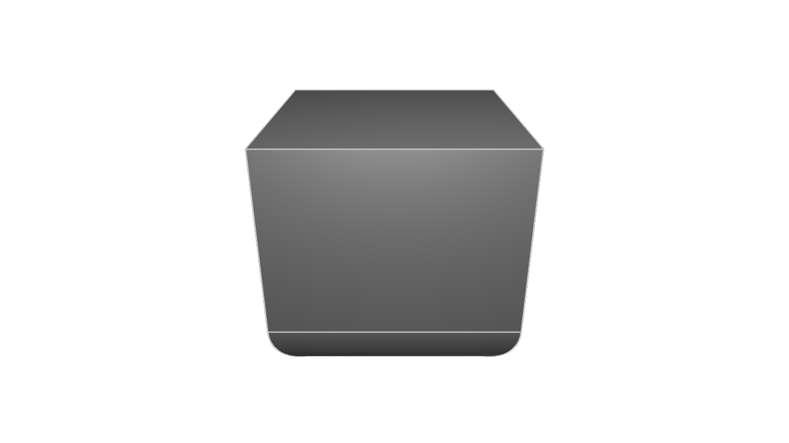
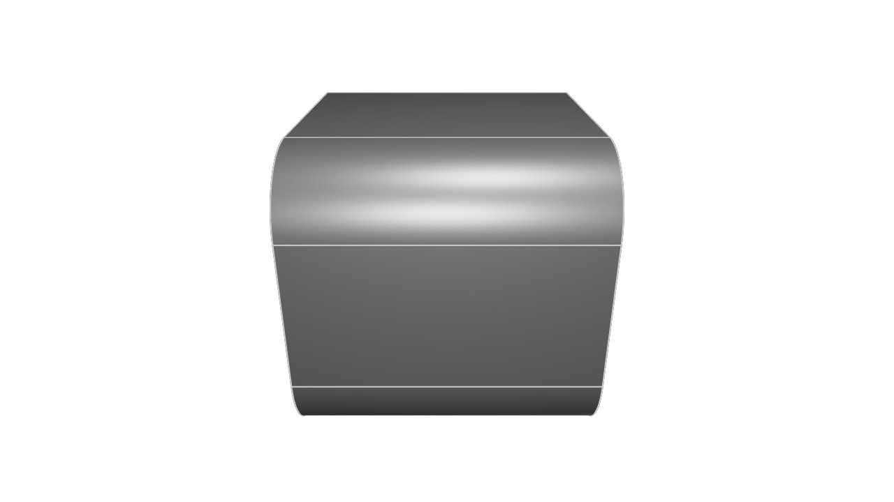
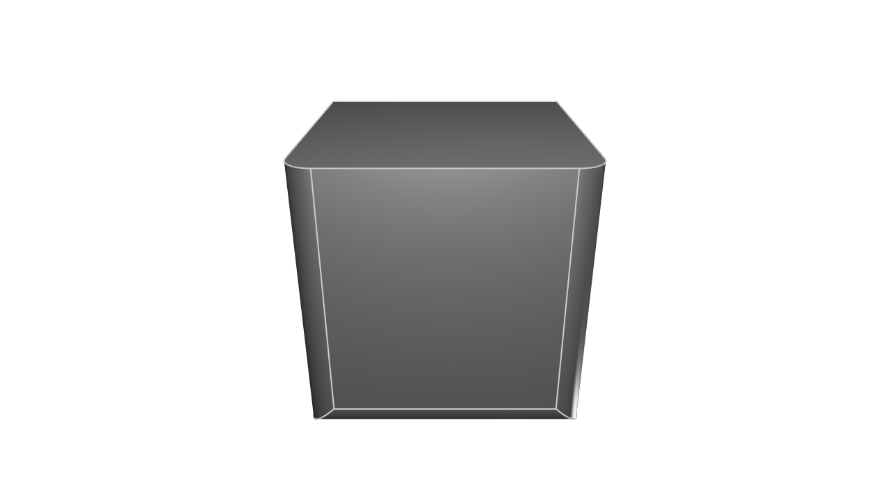
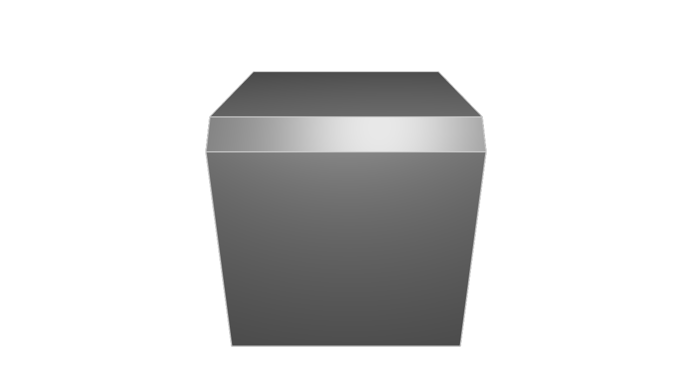

# Tags, Fillets and Chamfers

<!-- toc -->

## Motivation: Applying a fillet

When you manufacture a part, you often want to smooth off its sharp edges, so they're rounded and won't accidentally cut someone who holds it.
Let's say we're modeling a cube, like this:

```kcl=cube_no_fillets
length = 20
cube = startSketchOn(XY)
  |> startProfile(at = [-length, -length])
  |> line(end = [length, 0])
  |> line(end = [0, length])
  |> line(end = [-length, 0])
  |> line(end = [0, -length])
  |> close()
  |> extrude(length = length)
```

It produces a cube like this:



What if we want to fillet one of its sides? Let's start simple and refer to one of the four bottom edges. Those edges were made by the four `line` calls. How can we refer back to them? Usually, to use some data in an operation, we just put that data into a variable, and pass it into a function. That won't work here, because the data is in a pipeline. So what do we do?

## Tagging edges

Simple: we _tag_ the line. A _tag_ is a reference to some data. Let's declare our first tag. We'll modify the above program by adding a tag to one of the lines, like this:

```kcl
length = 20
cube = startSketchOn(XY)
  |> startProfile(at = [-length, -length])
  |> line(end = [length, 0], tag = $side)     // <- Add the `tag` argument here!
  |> line(end = [0, length])
  |> line(end = [-length, 0])
  |> line(end = [0, -length])
  |> close()
  |> extrude(length = length)
```

You declare a tag with a dollar sign, followed by its name, like `$side`. This is a new data type, called a TagDeclarator. TagDeclarators can be passed around just like any other kind of data (number, string, etc). Tagging a line is very similar to declaring a variable. Both tags and variables store data, which can be referenced later. Many KCL functions have an optional `tag` argument, including all the path-creating functions we've seen, like `line`, `tangentialArc`, `xLine`, etc.

Let's use this tag to make a fillet. Add the line `|> fillet(radius = 5, tags = [side])` to the end of the previous program:

```kcl=cube_one_fillet
length = 20
cube = startSketchOn(XY)
  |> startProfile(at = [-length, -length])
  |> line(end = [length, 0], tag = $side)
  |> line(end = [0, length])
  |> line(end = [-length, 0])
  |> line(end = [0, -length])
  |> close()
  |> extrude(length = length)
  |> fillet(radius = 5, tags = [side])
```

The [`fillet`] function accepts an argument `tags`, which expects an array of one or more tags. Note that we passed in `side`, not `$side`. The latter would be declaring a new tag, but we actually want to _reference_ an _existing_ tag. So we didn't use the `$`.

That program should produce a cube with one filleted edge, like this:



Nice! We could tag and fillet all four sides if we wanted to:

```kcl=cube_four_fillets
length = 20
cube = startSketchOn(XY)
  |> startProfile(at = [-length, -length])
  |> line(end = [length, 0], tag = $a)
  |> line(end = [0, length], tag = $b)
  |> line(end = [-length, 0], tag = $c)
  |> line(end = [0, -length], tag = $d)
  |> close()
  |> extrude(length = length)
  |> fillet(radius = 5, tags = [a, c, b, d])
```



## Relationships between edges

We've seen how to tag edges, and reference those tags later to alter edges. What about edges we don't create directly? For example, we've already filleted the four bottom edges, but how do we fillet the top four edges? We aren't creating them via `line` calls. They're created by the CAD engine in the `extrude` call. If we didn't explicitly create them with a sketch function, how do we tag them? Here's the secret --- you don't. KCL has a few helpful functions to access edges that you didn't create directly. Because we tagged the bottom edges, we can use helper functions like [`getOppositeEdge`] to reference the top edges, like this:


```kcl=cube_two_opposite_fillets
length = 20
cube = startSketchOn(XY)
  |> startProfile(at = [-length, -length])
  |> line(end = [length, 0], tag = $side)
  |> line(end = [0, length])
  |> line(end = [-length, 0])
  |> line(end = [0, -length])
  |> close()
  |> extrude(length = length)
  |> fillet(radius = 5, tags = [side, getOppositeEdge(side)])
```



We can fillet all four top edges by tagging all four bottom edges, and then using [`getOppositeEdge`] on each:

```kcl=cube_eight_fillets
length = 20
cube = startSketchOn(XY)
  |> startProfile(at = [-length, -length])
  |> line(end = [length, 0], tag = $a)
  |> line(end = [0, length], tag = $b)
  |> line(end = [-length, 0], tag = $c)
  |> line(end = [0, -length], tag = $d)
  |> close()
  |> extrude(length = length)
  |> fillet(radius = 5, tags = [a, c, b, d, getOppositeEdge(a), getOppositeEdge(c), getOppositeEdge(b), getOppositeEdge(d)])
```


So, we've filleted the bottom horizontal edges, and the top horizontal edges. What about the vertical side edges, which connect the top and bottom face? We can use [`getNextAdjacentEdge`] and [`getPreviousAdjacentEdge`] to reference them:

```kcl=cube_next_prev_fillets
length = 20
cube = startSketchOn(XY)
  |> startProfile(at = [-length, -length])
  |> line(end = [length, 0], tag = $a)
  |> line(end = [0, length], tag = $b)
  |> line(end = [-length, 0], tag = $c)
  |> line(end = [0, -length], tag = $d)
  |> close()
  |> extrude(length = length)
  |> fillet(
       radius = 2,
       tags = [
         a,
         getNextAdjacentEdge(a),
         getPreviousAdjacentEdge(a)
       ],
     )
```



Here, we filleted the bottom side `a` just like we did before. But we've also filleted the sides adjacent to it. We can use a similar trick to fillet all four vertical side edges:


```kcl=cube_next_prev_fillets_all_sides
length = 20
cube = startSketchOn(XY)
  |> startProfile(at = [-length, -length])
  |> line(end = [length, 0], tag = $a)
  |> line(end = [0, length], tag = $b)
  |> line(end = [-length, 0], tag = $c)
  |> line(end = [0, -length], tag = $d)
  |> close()
  |> extrude(length = length)
  |> fillet(
       radius = 2,
       tags = [
         getNextAdjacentEdge(a),
         getPreviousAdjacentEdge(a),
         getNextAdjacentEdge(c),
         getPreviousAdjacentEdge(c),
       ],
     )
```


## Chamfers

A [`chamfer`] is just like a fillet, except that fillets smooth away an edge to make it round, but chamfers just make a single cut across an edge. Here's an example of the difference. Compare this chamfered cube with the filleted cubes above:

```kcl=chamfered_cube
length = 20
cube = startSketchOn(XY)
  |> startProfile(at = [-length, -length])
  |> line(end = [length, 0], tag = $a)
  |> line(end = [0, length], tag = $b)
  |> line(end = [-length, 0], tag = $c)
  |> line(end = [0, -length], tag = $d)
  |> close()
  |> extrude(length = length)
  |> chamfer(
       length = 2,
       tags = [
         getOppositeEdge(a),
       ],
     )
```



So we've learned to use tags to reference the lines we create, then use helper functions like [`getOppositeEdge`] to reference other geometry elsewhere in the model. But tags aren't just used for altering edges. They provide a valuable way to query and measure your models. Let's see how.

## Measuring with tags

Let's say you've got a triangle, like this:

```kcl
length = 20
startSketchOn(XY)
  |> startProfile(at = [-length, -length])
  |> line(end = [length, 0])
  |> line(end = [length, length * 2])
  |> line(endAbsolute = profileStart())
```

Let's ask a simple question. How long is each side of the triangle?

It sounds simple, but to actually calculate it, you'd have to break out a pencil and paper, then do some trigonometry. The problem is, the length doesn't appear anywhere in the `line` call. The lines are defined by their start and end points, and the length is an implicit property of those. Defining lines as a start and end is helpful, but it means important properties, like length, can't be read from our source code.

However, tags give us a simple way to refer to each line, and then query them for properties like length with the [`segLen`] function. Let's update our program:

```kcl
length = 20
startSketchOn(XY)
  |> startProfile(at = [-length, -length])
  |> line(end = [length, 0], tag = $a)
  |> line(end = [length, length * 2], tag = $b)
  |> line(endAbsolute = profileStart(), tag = $c)

lenA = segLen(a)
lenB = segLen(b)
lenC = segLen(c)
```

Now you can open up the Variables pane and look at the `lenA`, `lenB` and `lenC` variables to find each side's length. That's pretty useful! And if you want to use those lengths elsewhere in your code, you can! You could start drawing lines where the end is `[lenA, 0]` for example, or plug those lengths into other calculations. 

KCL has several other helper functions, like [`segAng`], which helps you find the angle between two lines. Let's measure the angles in a right-angle triangle:

```kcl
startSketchOn(XY)
  |> startProfile(at = [0, 0])
  |> xLine(length = 20)
  |> yLine(length = 10, tag = $b)
  |> line(endAbsolute = profileStart(), tag = $c)

angleB = segAng(b)
angleC = segAng(c)
```

You can open up the Variables panel and view the relevant angles! There are other helpers too, like [`segStart`] and [`segEnd`] to find a line's start and end, respectively. Take a look at the KCL standard library docs to find them all.


KCL's tagging system is simple, but powerful. It lets you build up a model (like a cube) from a simple flat shape (your square) and a transformation (like extrusion). Although the transformations create a lot of geometry (for instance, this single extrude call creates 8 edges and five faces), you don't need verbose, complicated labels for all of these features. Instead, you can tag the geometry you've explicitly created, and use simple functions like [`getOppositeEdge`] to reference related geometry. This is much easier than trying to label every edge and face in a model. In the next chapter, we'll explore more interesting uses of tags, like starting new sketches from existing 3D models.

[`chamfer`]: https://zoo.dev/docs/kcl-std/functions/std-solid-chamfer
[`fillet`]: https://zoo.dev/docs/kcl-std/functions/std-solid-fillet
[`getNextAdjacentEdge`]: https://zoo.dev/docs/kcl-std/getNextAdjacentEdge
[`getOppositeEdge`]: https://zoo.dev/docs/kcl-std/getOppositeEdge
[`getPreviousAdjacentEdge`]: https://zoo.dev/docs/kcl-std/getPreviousAdjacentEdge
[`segAng`]: https://zoo.dev/docs/kcl-std/segAng
[`segEnd`]: https://zoo.dev/docs/kcl-std/segEnd
[`segLen`]: https://zoo.dev/docs/kcl-std/segLen
[`segStart`]: https://zoo.dev/docs/kcl-std/segStart
