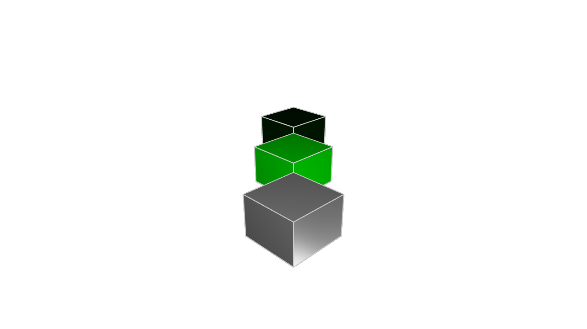
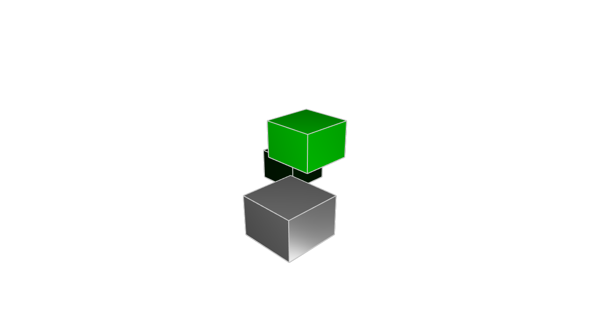
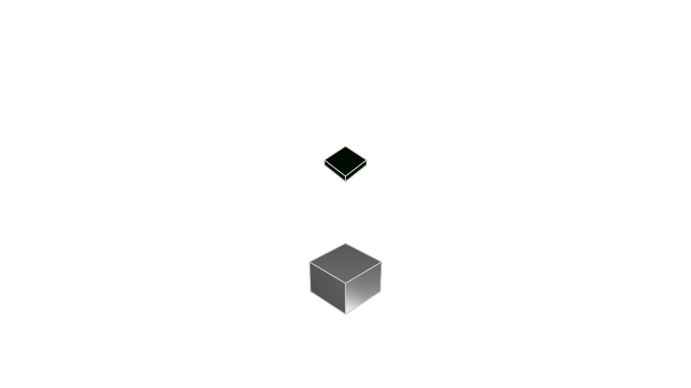
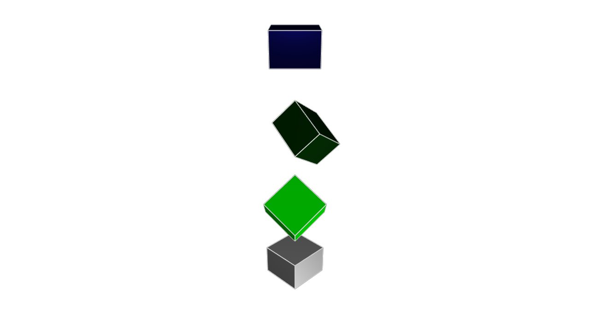
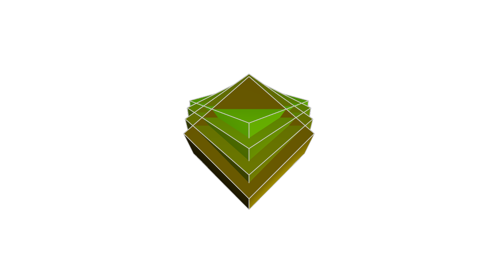

# Transforming 3D solids

We've covered many different ways to create 3D solids from 2D sketches, but what can we do with our solids afterwards? In this chapter we'll cover how to combine them via union, intersection and subtraction. This is sometimes called _constructive solid geometry_. We'll also look at how to scale, rotate or translate them. But before we get to that, let's start with something a little fun:

## Colour

So far, all our models have used the standard shiny grey metal appearance. But you can customize this! Let's change the texture. We'll make three cubes: one with the normal color, one green, and one a shiny metallic green.

```kcl=cube_textures
offset = 25

greyCube = startSketchOn(XY)
  |> startProfile(at = [0, 0])
  |> polygon(radius = 10, numSides = 4, center = [0, 0])
  |> extrude(length = 10)

greenCube = startSketchOn(XY)
  |> startProfile(at = [0, 0])
  |> polygon(radius = 10, numSides = 4, center = [0, offset])
  |> extrude(length = 10)
  // The appearance call lets you set a color using hexadecimal notation.
  |> appearance(color = "#00ff00")
  
greenCubeShiny = startSketchOn(XY)
  |> startProfile(at = [0, 0])
  |> polygon(radius = 10, numSides = 4, center = [0, offset * 2])
  |> extrude(length = 10)
  // You can also set the metalness and roughness, as percentages between 0 and 100.
  |> appearance(color = "#00ff00", metalness = 90, roughness = 10)
```



The [`appearance`] call takes in three arguments, each of which is optional. You can provide:

 - A `color` as a hexadecimal number like `#0044ff`. The first two digits represent red, the next two green, and the last two blue. You can use an [online color picker] to play with the format. 
 - A `metalness` percentage, which is a number between 0 and 100.
 - A `roughness` percentage, which is a number between 0 and 100.

This is helpful for making your different solids stand out from each other. We'll be using the `appearance` call in our examples to help make it clear which KCL snippets correspond to which objects in the rendered images.

## Translation

We can transform solids, keeping them _basically_ the same -- the same number of sides, edges, and faces -- but changing some of their other properties.

Firstly, we can [`translate`] them (shifting them around in their coordinate system), like this:

```kcl=translate_cubes
offset = 25

greyCube = startSketchOn(XY)
  |> startProfile(at = [0, 0])
  |> polygon(radius = 10, numSides = 4, center = [0, 0])
  |> extrude(length = 10)

brightGreenCube = startSketchOn(XY)
  |> startProfile(at = [0, 0])
  |> polygon(radius = 10, numSides = 4, center = [0, offset])
  |> extrude(length = 10)
  // Shift the shape's position along X, Y and Z.
  |> translate(x = 4, y = -4, z = 10)
  |> appearance(color = "#00ff00")
  
greenCube = startSketchOn(XY)
  |> startProfile(at = [0, 0])
  |> polygon(radius = 10, numSides = 4, center = [0, offset * 2])
  |> extrude(length = 10)
  // The translation axes are optional.
  // If you don't set X or Y, its X and Y position will remain the same.
  |> translate(z = -10)
  |> appearance(color = "#00ff00", metalness = 90, roughness = 10)
```



The [`translate`] call takes three arguments, `x`, `y` and `z`. Each of them is optional. If you provide one, it'll shift the solid along that axis. If you don't provide an axis, it'll remain unchanged.

## Scale

Next, we can [`scale`] them, making them bigger or smaller.

```kcl=scaled_cubes
offset = 25

greyCube = startSketchOn(XY)
  |> startProfile(at = [0, 0])
  |> polygon(radius = 10, numSides = 4, center = [0, 0])
  |> extrude(length = 10)

brightGreenCube = startSketchOn(XY)
  |> startProfile(at = [0, 0])
  |> polygon(radius = 10, numSides = 4, center = [0, offset])
  |> extrude(length = 10)
  // Scale all three axes, shrinking the cube
  |> scale(x = 0.5, y = 0.5, z = 0.5)
  |> appearance(color = "#00ff00")
  
greenCube = startSketchOn(XY)
  |> startProfile(at = [0, 0])
  |> polygon(radius = 10, numSides = 4, center = [0, offset * 2])
  |> extrude(length = 10)
  // Expand the cube along one axis, shrink it across another, and leave
  // the third axis unchanged.
  |> scale(z = 0.25, y = 2)
  |> appearance(color = "#00ff00", metalness = 90, roughness = 10)
```



The [`scale`] call works similarly. You provide one or more axes -- if you don't provide an axis, it's left unchanged. Numbers less than 1 will shrink the solid (e.g. 0.25 means 1/4th its original size). Numbers larger than 1 will expand the solid (e.g. 4 means 4 times its original size).

## Rotation

Lastly, we can rotate them. The [`rotate`] call is similar to translate and rotate: it takes a number of properties -- different ways to rotate -- all of which are optional, and if you don't provide one, it stays unchanged. These properties are roll, pitch and yaw.

**Roll**: Imagine spinning a pencil on its tip - that's a roll movement.
**Pitch**: Think of a seesaw motion, where the object tilts up or down along its side axis.
**Yaw**: Like turning your head left or right, this is a rotation around the vertical axis

Let's see an example:

```kcl=rotated_cubes
offset = 25

greyCube = startSketchOn(XY)
  |> startProfile(at = [0, 0])
  |> polygon(radius = 10, numSides = 4, center = [0, 0])
  |> extrude(length = 10)

brightGreenCube = startSketchOn(XY)
  |> startProfile(at = [0, 0])
  |> polygon(radius = 10, numSides = 4, center = [0, 0])
  |> extrude(length = 10)
  |> translate(z = offset)
  |> rotate(roll= 45)
  |> appearance(color = "#00ff00")
  
greenCube = startSketchOn(XY)
  |> startProfile(at = [0, 0])
  |> polygon(radius = 10, numSides = 4, center = [0, 0])
  |> extrude(length = 10)
  |> translate(z = 2 * offset)
  |> rotate(pitch = 45)
  |> appearance(color = "#00ff00", metalness = 90, roughness = 10)

blueCube = startSketchOn(XY)
  |> startProfile(at = [0, 0])
  |> polygon(radius = 10, numSides = 4, center = [0, 0])
  |> extrude(length = 10)
  |> translate(z = 3 * offset)
  |> rotate(yaw = 45)
  |> appearance(color = "#0000ff", metalness = 90, roughness = 10)
```



Note that these rotations are all around their own center (not the center of the plane).

Roll, pitch and yaw are one valid way to represent a rotation, but there are other ways too. You could also choose an axis, and rotate around that axis. For example, let's put 4 cubes at the same point, and then rotate them each a little bit around the axis.

```kcl=rotated_cubes_axis
angle = 15

greyCube = startSketchOn(XY)
  |> startProfile(at = [0, 0])
  |> polygon(radius = 10, numSides = 4, center = [0, 0])
  |> extrude(length = 10)
    |> appearance(color = "#33ff00")

green1 = startSketchOn(XY)
  |> startProfile(at = [0, 0])
  |> polygon(radius = 10, numSides = 4, center = [0, 0])
  |> extrude(length = 10)
  |> rotate(axis = [1, 0, 0], angle = angle)
  |> appearance(color = "#337700")

green2 = startSketchOn(XY)
  |> startProfile(at = [0, 0])
  |> polygon(radius = 10, numSides = 4, center = [0, 0])
  |> extrude(length = 10)
  |> rotate(axis = [1, 0, 0], angle = angle * 2)
  |> appearance(color = "#334400")

green3 = startSketchOn(XY)
  |> startProfile(at = [0, 0])
  |> polygon(radius = 10, numSides = 4, center = [0, 0])
  |> extrude(length = 10)
  |> rotate(axis = [1, 0, 0], angle = angle * 3)
  |> appearance(color = "#332200")
```



## Using transformations

You can combine multiple transformations, for example a translate and scale: `|> translate(x = 10) |> scale (y = 20)`. This can really simplify your mechanical engineering. For example, if you need to produce two cubes, rotated at different angles, which of these approaches sounds easier?

1. Make one cube using `polygon` with 4 sides, and then design the other cube from scratch using `line` calls that join the 4 rotated points
2. Make one cube using `polygon`, and then make a second cube by copying the first cube and adding a `rotation`call

These transformations make your job easier by letting you reuse work from previous designs. Once you know how to sketch a cube, you don't need to recalculate your cube every time it needs to grow, rotate or get moved over. You can just use our simple transformation functions. Recalculating a cube each time is annoying, but possible. For more complicated geometry, with weird curves and many edges, redoing all your calculations to handle different scales and rotations can be _very_ difficult and waste a lot of time! So don't recalculate them. Just reuse your work and transform it.

[`appearance`]: https://zoo.dev/docs/kcl-std/appearance
[`translate`]: https://zoo.dev/docs/kcl-std/translate
[`scale`]: https://zoo.dev/docs/kcl-std/scale
[`rotate`]: https://zoo.dev/docs/kcl-std/rotate
[online color picker]: https://g.co/kgs/wVN95r4
