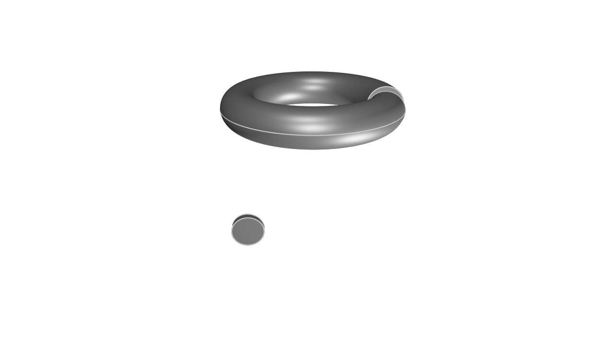

# Units of measurement

KCL tracks the units that each distance uses. This can help you accurately translate your engineering requirements or formula into KCL, without pulling out a calculator to convert between inches and centimeters.

For example, you can put a unit like `20cm` or `20in` as the length of a line. Here's three different lines of length 20 centimeters, inches and millimeters.

```kcl=lines_units
startSketchOn(XY)
  |> startProfile(at = [0, -100])
  |> xLine(length = 20mm)

startSketchOn(XY)
  |> startProfile(at = [0, 0])
  |> xLine(length = 20cm)

startSketchOn(XY)
  |> startProfile(at = [0, 100])
  |> xLine(length = 20in)
```


Other suffixes include metres (`m`), feet (`ft`) and yards (`yd`).

You can also set the units for angle measurements. Here's two toruses, one of which revolves 6 degrees (very little) and the other, 6 radians (almost a full revolution).


```kcl=donut_angle_units
// Revolve 6 degrees
startSketchOn(XZ)
  |> circle(center = [-200, -200], radius = 50)
  |> revolve(axis = Y, angle = 6deg)

// Revolve 6 radians
startSketchOn(XZ)
  |> circle(center = [200, 200], radius = 50)
  |> revolve(axis = Y, angle = 6rad)
```


