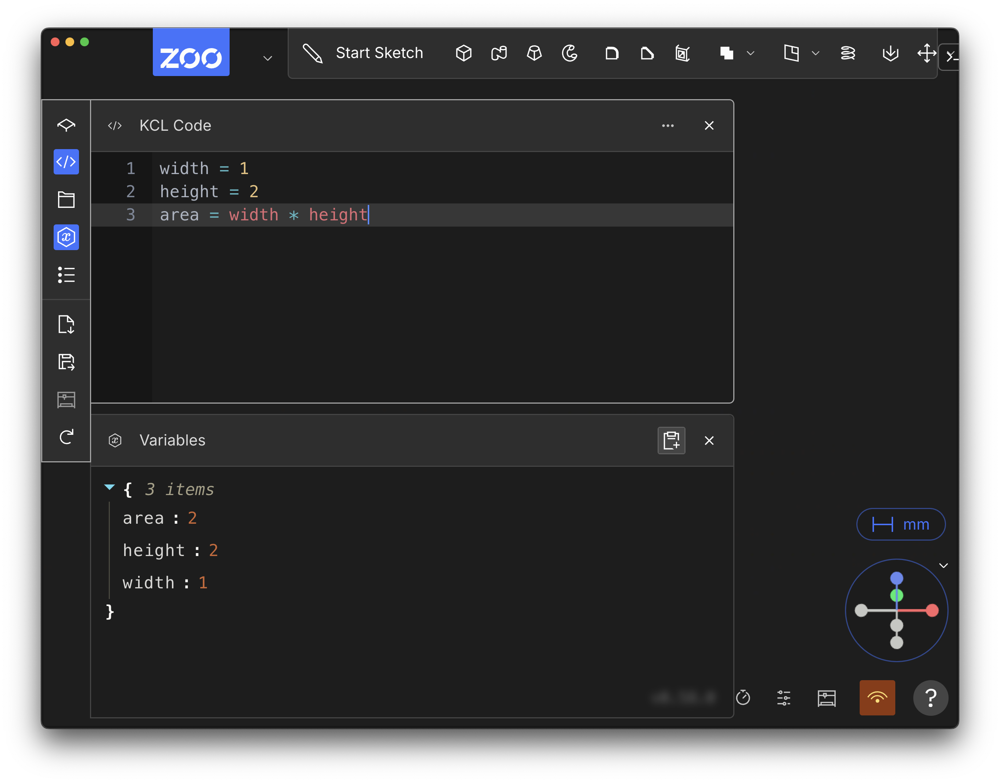

## Variables
<!-- toc -->

Let's get comfortable with basic KCL first, before we start designing parts. Don't worry, we'll get to real mechanical engineering very soon. For now, let's start with some math.

Here's a simple KCL program. Open up the Zoo Design Studio, make a new project, then open the KCL code panel (on the left). Enter this text in:

```kcl
width = 1
height = 2
area = width * height
```

This simple program declares three _variables_. Variables are little bits of data you can define or calculate. Here we define `width` and `height` and assign their value immediately. We write their value right in there, as `width = 1` and `height = 2`. You can see that a variable declaration has the variable's _name_ (e.g. `width`), then an equals sign (=) and then its value (e.g. 1).

The `area` variable is very similarly, except instead of defining the exact number, we define it as a calculation. We define it as `width * height`. We could have defined `area` as just `area = 2`, but this way, anyone else who reads the code can understand _why_ the area is 2 -- it's because we're calculating some rectangular area with a width and height.

In this simple case, we can calculate the area in our head. It's going to be 2. But what if you're calculating something more complex? Well, take a look at the Variables panel (on the left).



This panel shows every variable and its value. You can look up the value of `area` here. It's 2, just like we expected. For this simple example it's not necessary to look it up, but for more complicated cases it can be very helpful! This way, you can do all your engineering calculations in KCL. You can treat it like a really advanced calculator, where big equations can be broken into smaller named variables, and their value can be inspected independently.

Note that once you declare a variable, you cannot redeclare it, or change its value.

## Basic data types

All the variables in the previous section stored numbers. But KCL can store other types of data too. Let's see some examples. These aren't all the types of data KCL can store, but it's a good starting point. We'll learn more data types later in this book as we get into more specialized features for designing parts.

### Number

You just saw how basic numbers work in the example above. Numbers can also be fractional or negative.

#### Examples

 - `width = 1`
 - `diameter = 1.5`
 - `offset = -2.3`

### Booleans

A boolean value is either true, or false. That's it! Just those two choices. Booleans are useful for changing details of KCL functions, like changing whether a semicircle is drawing clockwise or not.

#### Examples

 - `clockwise = false`
 - `isConstructionGeometry = true`

### String

A _string_ stores text. "String" is the software-engineering term for text. We probably should have called this just "Text" in KCL, but oh well. You can think of it as "stringing" several letters together to make words. They're not currently used very often in KCL, except to set colours (with the hexadecimal colour codes you might see in Photoshop, Figma or Canva). In the future, you'll be able to use strings to embed text into your models (e.g. for engraving text into your objects).

#### Examples

 - `textToEngrave = "My Phone"`
 - `red = "#FF0000"`

## Collection types

All the previous data types stored basically one piece of data. It might be a number, or text, or a true/false value, but it's basically a single piece of data. KCL variables can also store multiple pieces of data, kept together under a single variable name. Let's see some examples.

### Arrays

An array is a list of data, like the four numbers `[1, 2, 3, 4]` or these three colours `["#ff0000", "#cccc00", "#44ff00"]`. These arrays contain other data. We say that arrays contain _items_. The two previous example arrays had 4 items and 3 items respectively. Sometimes the items of an array are called their _elements_. The terms "elements" and "items" are synonyms, you can use them interchangeably. 

To access the items in an array, you use square brackets and the number item you want. For example, `myArray[0]` will get the first item from the array, `myArray[1]` will get the second, and so on. Yes, that's right, the first item is item 0, not item 1! This might be strange for new programmers, but it's how almost every programming language works, so we felt it was important to stick with that convention, so that your KCL code works like similar code in Python, JavaScript, C or other languages.

If you try to access an item beyond what the array contains -- for example, the fifth element of `[1, 2]` -- you'll get an error and the KCL program will stop.

#### Examples

 - `colors = ["#ff0000", "#cccc00", "#44ff00"]`
 - `red = colors[0]`
 - `sizes = [33.5, 31.5, 30]`
 - `smallest = sizes[2]`
 - `arrayOfArrays = [[1, 2, 3], [1, 4, 6]]`

### Points

To properly dimension and sketch out your designs, you'll frequently need to select specific points on a plane. In KCL, points can be stored in variables and used just like any other data type. We actually store points as arrays. An array with 2 elements Arrays are really important in KCL, because we use them to represent 2D points on a plane (e.g. the origin `[0, 0]`) or 3D points in space.

#### Examples
 - `origin = [0, 0]`
 - `myPoint = [4, 0, 0]`
 - `myPointX = myPoint[0]`
 - `myPointY = myPoint[1]`
 - `myPointZ = myPoint[2]`

### Objects

Sometimes, you need to store several pieces of related data together. KCL has _objects_ which contain several _fields_. Fields have a key, which is always text (a string), and a value, which can be any kind of KCL value. Even another object!

#### Examples
 - `sphere = { radius = 4, center = [0, 0, 3.2] }`
 - `wires = { positive = [1, 2], negative = [3, 4], resistance = 0.3 }`
 - `components = { name = "Flange", holes = { inner = [[0, 0], [1, 0]], outer = [[4, 4]] } }`
