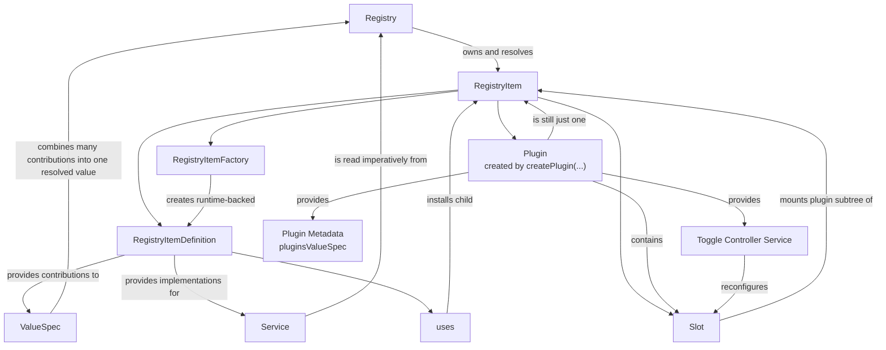

# `@kittycad/registry`

Reactive registry framework for Zoo Design Studio.

This package provides:

- registry value specs for declarative composition
- services for imperative capabilities
- runtime registry items for long-lived state
- slots for runtime reconfiguration
- plugins as the installable developer-facing unit

## Mental Model

- `Registry` owns the active graph and resolves value specs and services.
- `ValueSpec` is a typed registry point that combines many contributions into one value.
- `Service` is a typed capability object that registry items can read from the registry.
- `RegistryItemDefinition` is the declarative unit that contributes value specs, services, and child registry items through `uses`.
- `RegistryItemFactory` creates runtime-backed registry items with stable state.
- `Slot` is a replaceable subtree that can be reconfigured at runtime.
- `createPlugin(...)` packages metadata, a slot, and a toggle controller into one installable registry node.

## Concept Map

The most important distinction is:

- a `registry item` is any node in the runtime graph
- a `plugin` is one particular kind of registry node meant to be installed, listed in UI, and toggled at runtime



Read the diagram from top to bottom:

- `Registry` owns a graph of `RegistryItem`s.
- `RegistryItemDefinition`, `RegistryItemFactory`, `Slot`, and `Plugin` are all ways to participate in that graph.
- Plain registry items usually contribute `ValueSpec`s and `Service`s directly.
- A plugin wraps normal registry item content in extra structure: metadata for discovery, a slot for runtime enable/disable, and a toggle controller service.
- So a plugin is not separate from the registry system. It is a higher-level, developer-facing packaging pattern built out of normal registry primitives.

## Package Layout

- [`src/index.ts`](./src/index.ts): public entrypoint
- [`src/examples/app.ts`](./src/examples/app.ts): tutorial-style example container
- `src/*.test.ts`: unit tests
- `src/*.spec.tsx`: integration/component tests

## Import Policy

This package lives under `packages/`, so relative imports are allowed within the package.
App code outside the package should import it by package name:

```ts
import { Registry, appendValueSpec } from '@kittycad/registry'
```

## Notes

- The example app is documentation, not production app wiring.
- The package currently relies on the repo root toolchain and dependency installation.
