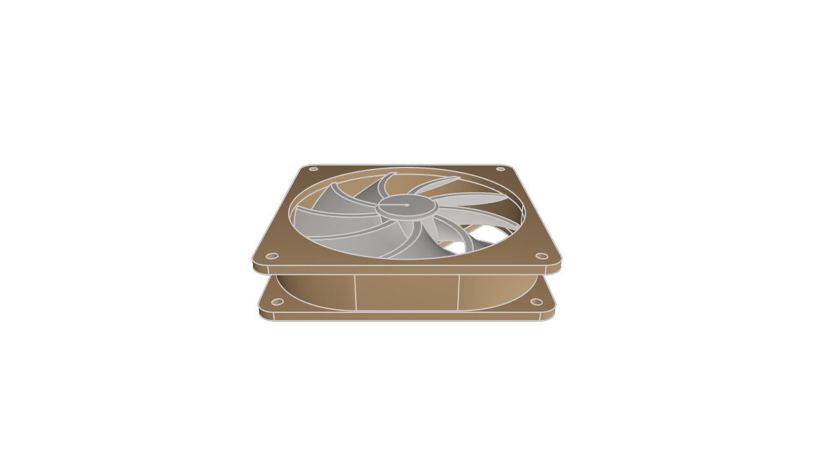
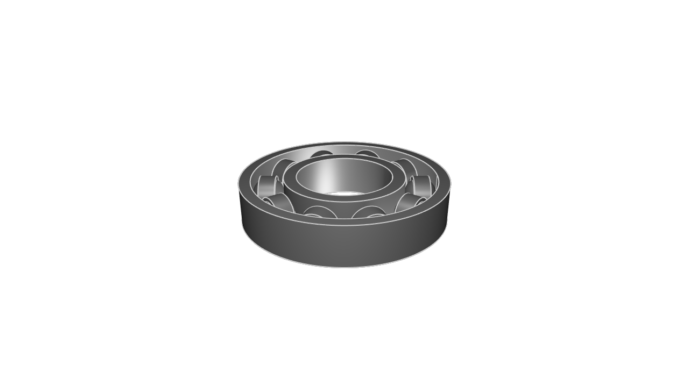
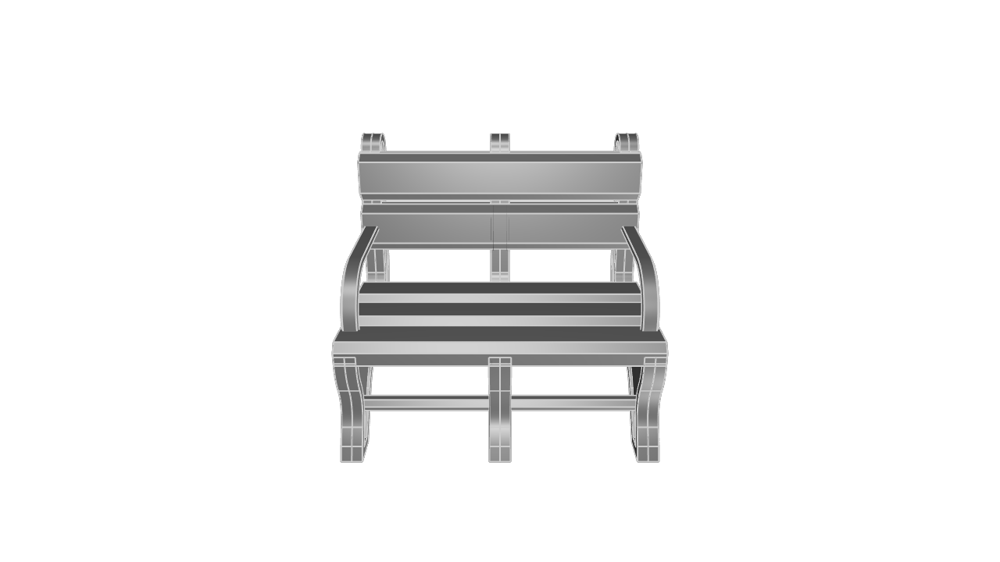
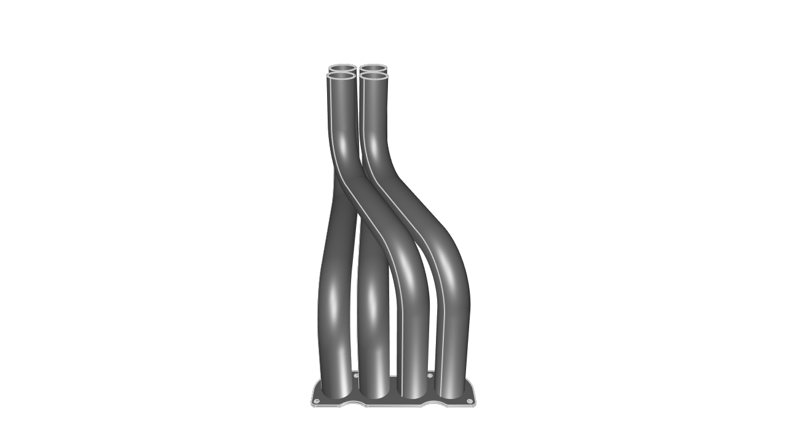
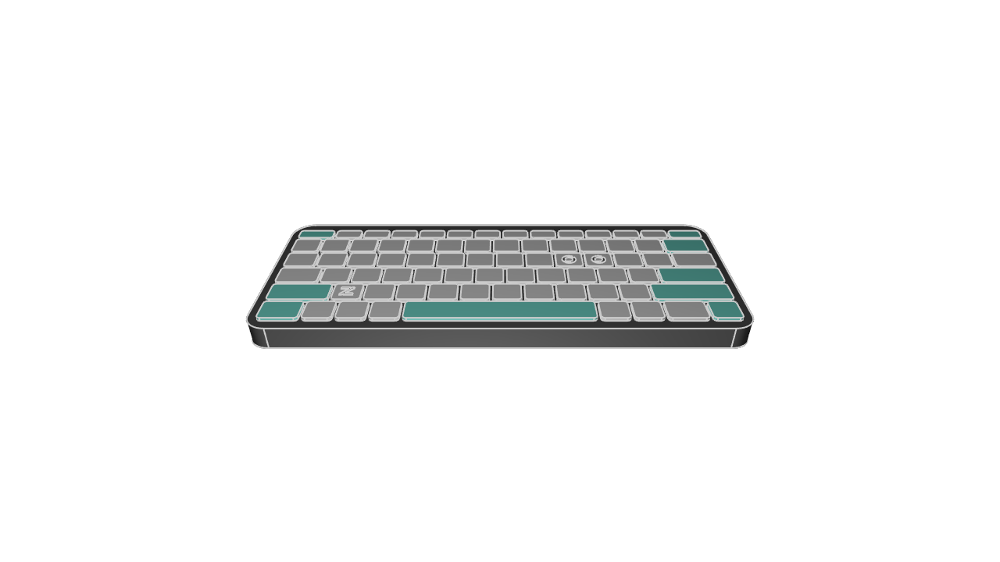
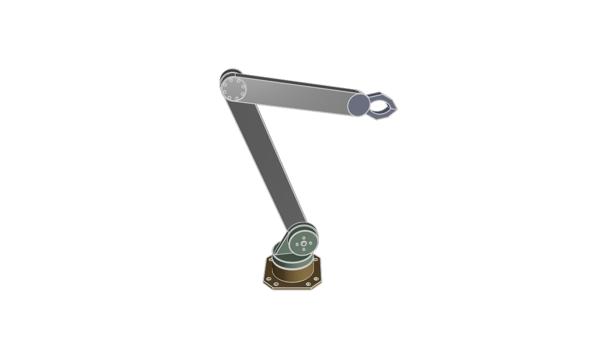

# kcl-samples

KittyCAD Language (KCL) is our language for defining geometry and working with our Geometry Engine efficiently.

This repository includes a mixture of simple and complex models demonstrating the features and syntax of KCL.

The samples can be browsed in our documentation at <https://zoo.dev/docs/kcl-samples>.

## Guidelines for adding samples

KCL samples conform to a set of style guidelines to ensure consistency and readability.

1. **File Naming:** Name your KCL files descriptively and concisely, using hyphens to separate words (e.g., flange.kcl, ball-bearing.kcl).

2. **File Header:** Include a title comment at the top of each file, followed by a brief description explaining what the model is and its typical use cases.

3. **Inline Comments:** Use inline comments to explain non-obvious parts of the code. Each major section should have a comment describing its purpose.

4. **Constants:** Define constants at the beginning of your KCL files for any values that might change or need to be reused (e.g., dimensions, angles).

## Snapshot and export

When you submit a PR to add or modify KCL samples, images will be generated and added to the repository automatically.

---
#### [80-20-rail](80-20-rail/main.kcl) ([screenshot](screenshots/80-20-rail.png))

#### [axial-fan](axial-fan/main.kcl) ([screenshot](screenshots/axial-fan.png))

#### [ball-bearing](ball-bearing/main.kcl) ([screenshot](screenshots/ball-bearing.png))

#### [bench](bench/main.kcl) ([screenshot](screenshots/bench.png))

#### [bottle](bottle/main.kcl) ([screenshot](screenshots/bottle.png))

#### [bracket](bracket/main.kcl) ([screenshot](screenshots/bracket.png))

#### [car-wheel-assembly](car-wheel-assembly/main.kcl) ([screenshot](screenshots/car-wheel-assembly.png))

#### [color-cube](color-cube/main.kcl) ([screenshot](screenshots/color-cube.png))

#### [cycloidal-gear](cycloidal-gear/main.kcl) ([screenshot](screenshots/cycloidal-gear.png))

#### [dodecahedron](dodecahedron/main.kcl) ([screenshot](screenshots/dodecahedron.png))

#### [enclosure](enclosure/main.kcl) ([screenshot](screenshots/enclosure.png))

#### [exhaust-manifold](exhaust-manifold/main.kcl) ([screenshot](screenshots/exhaust-manifold.png))

#### [flange](flange/main.kcl) ([screenshot](screenshots/flange.png))

#### [focusrite-scarlett-mounting-bracket](focusrite-scarlett-mounting-bracket/main.kcl) ([screenshot](screenshots/focusrite-scarlett-mounting-bracket.png))

#### [food-service-spatula](food-service-spatula/main.kcl) ([screenshot](screenshots/food-service-spatula.png))

#### [french-press](french-press/main.kcl) ([screenshot](screenshots/french-press.png))

#### [gear](gear/main.kcl) ([screenshot](screenshots/gear.png))

#### [gear-rack](gear-rack/main.kcl) ([screenshot](screenshots/gear-rack.png))

#### [gridfinity-baseplate](gridfinity-baseplate/main.kcl) ([screenshot](screenshots/gridfinity-baseplate.png))

#### [gridfinity-baseplate-magnets](gridfinity-baseplate-magnets/main.kcl) ([screenshot](screenshots/gridfinity-baseplate-magnets.png))

#### [gridfinity-bins](gridfinity-bins/main.kcl) ([screenshot](screenshots/gridfinity-bins.png))

#### [gridfinity-bins-stacking-lip](gridfinity-bins-stacking-lip/main.kcl) ([screenshot](screenshots/gridfinity-bins-stacking-lip.png))

#### [hex-nut](hex-nut/main.kcl) ([screenshot](screenshots/hex-nut.png))

#### [i-beam](i-beam/main.kcl) ([screenshot](screenshots/i-beam.png))

#### [keyboard](keyboard/main.kcl) ([screenshot](screenshots/keyboard.png))

#### [kitt](kitt/main.kcl) ([screenshot](screenshots/kitt.png))

#### [lego](lego/main.kcl) ([screenshot](screenshots/lego.png))

#### [makeup-mirror](makeup-mirror/main.kcl) ([screenshot](screenshots/makeup-mirror.png))

#### [mounting-plate](mounting-plate/main.kcl) ([screenshot](screenshots/mounting-plate.png))

#### [multi-axis-robot](multi-axis-robot/main.kcl) ([screenshot](screenshots/multi-axis-robot.png))

#### [parametric-bearing-pillow-block](parametric-bearing-pillow-block/main.kcl) ([screenshot](screenshots/parametric-bearing-pillow-block.png))

#### [pipe](pipe/main.kcl) ([screenshot](screenshots/pipe.png))

#### [pipe-flange-assembly](pipe-flange-assembly/main.kcl) ([screenshot](screenshots/pipe-flange-assembly.png))

#### [pipe-with-bend](pipe-with-bend/main.kcl) ([screenshot](screenshots/pipe-with-bend.png))

#### [poopy-shoe](poopy-shoe/main.kcl) ([screenshot](screenshots/poopy-shoe.png))

#### [router-template-cross-bar](router-template-cross-bar/main.kcl) ([screenshot](screenshots/router-template-cross-bar.png))

#### [router-template-slate](router-template-slate/main.kcl) ([screenshot](screenshots/router-template-slate.png))

#### [sheet-metal-bracket](sheet-metal-bracket/main.kcl) ([screenshot](screenshots/sheet-metal-bracket.png))

#### [socket-head-cap-screw](socket-head-cap-screw/main.kcl) ([screenshot](screenshots/socket-head-cap-screw.png))

#### [utility-sink](utility-sink/main.kcl) ([screenshot](screenshots/utility-sink.png))

#### [walkie-talkie](walkie-talkie/main.kcl) ([screenshot](screenshots/walkie-talkie.png))

#### [washer](washer/main.kcl) ([screenshot](screenshots/washer.png))

