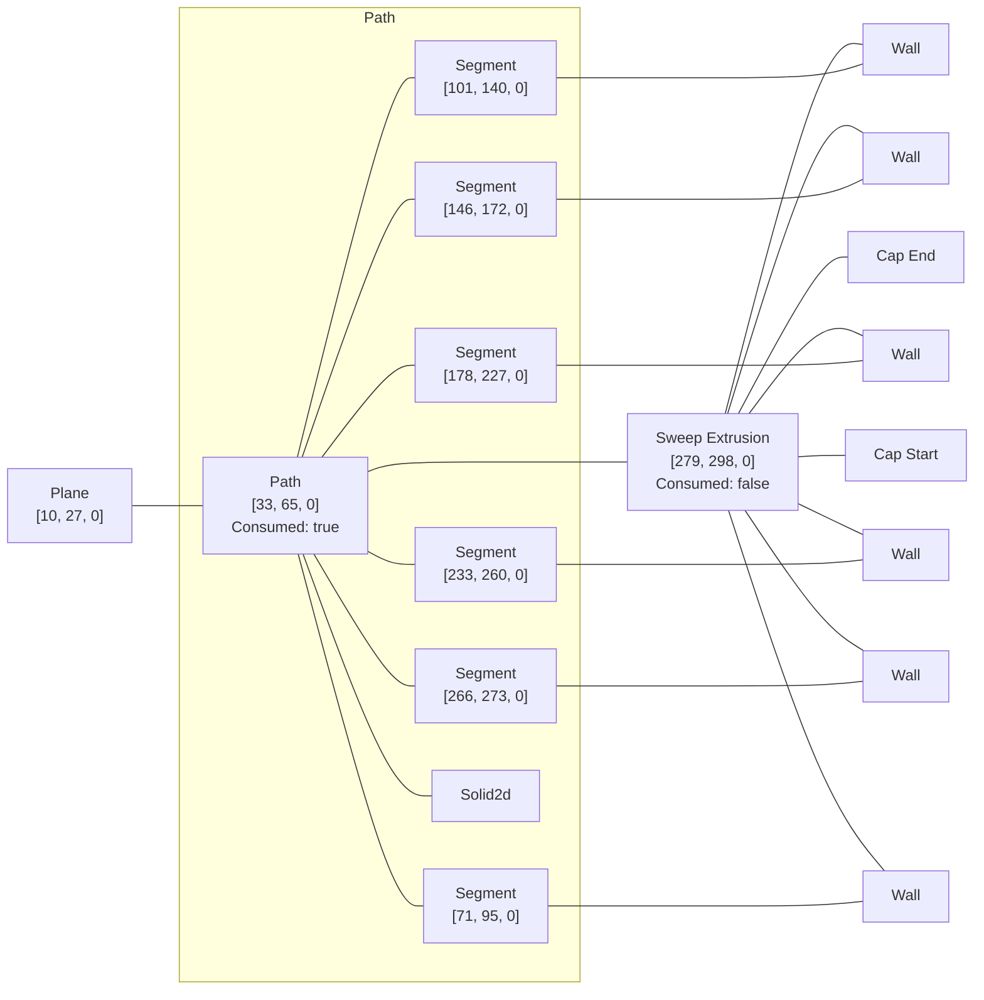

```mermaid
flowchart LR
  subgraph path3 [Path]
    3["Path<br>[33, 65, 0]<br>Consumed: true"]
      %% [ProgramBodyItem { index: 0 }, VariableDeclarationDeclaration, VariableDeclarationInit, PipeBodyItem { index: 1 }]
    5["Segment<br>[101, 140, 0]"]
      %% [ProgramBodyItem { index: 0 }, VariableDeclarationDeclaration, VariableDeclarationInit, PipeBodyItem { index: 3 }]
    6["Segment<br>[146, 172, 0]"]
      %% [ProgramBodyItem { index: 0 }, VariableDeclarationDeclaration, VariableDeclarationInit, PipeBodyItem { index: 4 }]
    7["Segment<br>[178, 227, 0]"]
      %% [ProgramBodyItem { index: 0 }, VariableDeclarationDeclaration, VariableDeclarationInit, PipeBodyItem { index: 5 }]
    8["Segment<br>[233, 260, 0]"]
      %% [ProgramBodyItem { index: 0 }, VariableDeclarationDeclaration, VariableDeclarationInit, PipeBodyItem { index: 6 }]
    9["Segment<br>[266, 273, 0]"]
      %% [ProgramBodyItem { index: 0 }, VariableDeclarationDeclaration, VariableDeclarationInit, PipeBodyItem { index: 7 }]
    10["Segment<br>[71, 95, 0]"]
      %% [ProgramBodyItem { index: 0 }, VariableDeclarationDeclaration, VariableDeclarationInit, PipeBodyItem { index: 2 }]
    11[Solid2d]
  end
  1["Cap End"]
    %% face_code_ref=Missing NodePath
  2["Cap Start"]
    %% face_code_ref=Missing NodePath
  4["Plane<br>[10, 27, 0]"]
    %% [ProgramBodyItem { index: 0 }, VariableDeclarationDeclaration, VariableDeclarationInit, PipeBodyItem { index: 0 }]
  12["Sweep Extrusion<br>[279, 298, 0]<br>Consumed: false"]
    %% [ProgramBodyItem { index: 0 }, VariableDeclarationDeclaration, VariableDeclarationInit, PipeBodyItem { index: 8 }]
  13[Wall]
    %% face_code_ref=Missing NodePath
  14[Wall]
    %% face_code_ref=Missing NodePath
  15[Wall]
    %% face_code_ref=Missing NodePath
  16[Wall]
    %% face_code_ref=Missing NodePath
  17[Wall]
    %% face_code_ref=Missing NodePath
  18[Wall]
    %% face_code_ref=Missing NodePath
  12 --- 1
  12 --- 2
  4 --- 3
  3 --- 5
  3 --- 6
  3 --- 7
  3 --- 8
  3 --- 9
  3 --- 10
  3 --- 11
  3 ---- 12
  5 --- 13
  6 --- 14
  7 --- 15
  8 --- 16
  9 --- 17
  10 --- 18
  12 --- 13
  12 --- 14
  12 --- 15
  12 --- 16
  12 --- 17
  12 --- 18
```
