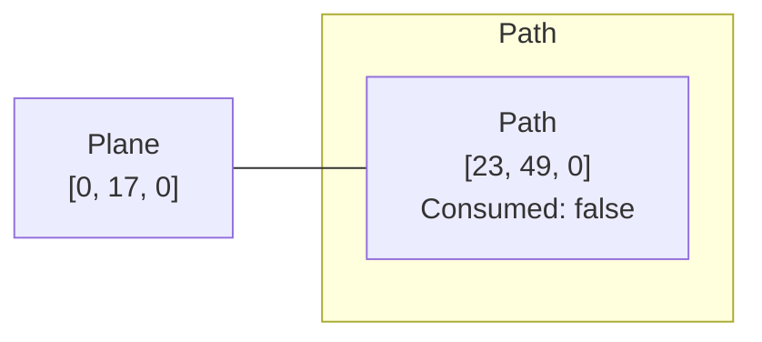

```mermaid
flowchart LR
  subgraph path2 [Path]
    2["Path<br>[23, 49, 0]<br>Consumed: false"]
      %% [ProgramBodyItem { index: 0 }, ExpressionStatementExpr, PipeBodyItem { index: 1 }]
  end
  1["Plane<br>[0, 17, 0]"]
    %% [ProgramBodyItem { index: 0 }, ExpressionStatementExpr, PipeBodyItem { index: 0 }]
  1 --- 2
```
