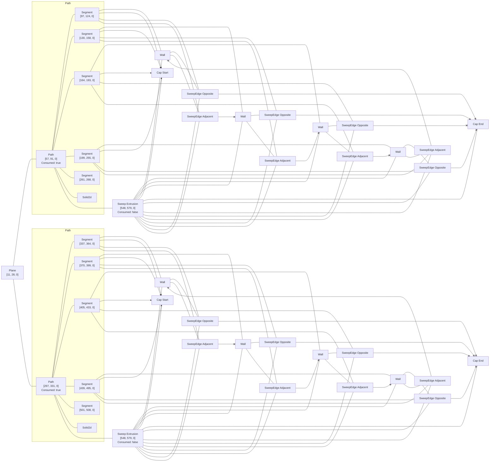

```mermaid
flowchart LR
  subgraph path2 [Path]
    2["Path<br>[57, 91, 0]<br>Consumed: true"]
      %% [ProgramBodyItem { index: 1 }, VariableDeclarationDeclaration, VariableDeclarationInit, PipeBodyItem { index: 1 }]
    3["Segment<br>[97, 124, 0]"]
      %% [ProgramBodyItem { index: 1 }, VariableDeclarationDeclaration, VariableDeclarationInit, PipeBodyItem { index: 2 }]
    4["Segment<br>[130, 158, 0]"]
      %% [ProgramBodyItem { index: 1 }, VariableDeclarationDeclaration, VariableDeclarationInit, PipeBodyItem { index: 3 }]
    5["Segment<br>[164, 193, 0]"]
      %% [ProgramBodyItem { index: 1 }, VariableDeclarationDeclaration, VariableDeclarationInit, PipeBodyItem { index: 4 }]
    6["Segment<br>[199, 255, 0]"]
      %% [ProgramBodyItem { index: 1 }, VariableDeclarationDeclaration, VariableDeclarationInit, PipeBodyItem { index: 5 }]
    7["Segment<br>[261, 268, 0]"]
      %% [ProgramBodyItem { index: 1 }, VariableDeclarationDeclaration, VariableDeclarationInit, PipeBodyItem { index: 6 }]
    8[Solid2d]
  end
  subgraph path9 [Path]
    9["Path<br>[297, 331, 0]<br>Consumed: true"]
      %% [ProgramBodyItem { index: 2 }, VariableDeclarationDeclaration, VariableDeclarationInit, PipeBodyItem { index: 1 }]
    10["Segment<br>[337, 364, 0]"]
      %% [ProgramBodyItem { index: 2 }, VariableDeclarationDeclaration, VariableDeclarationInit, PipeBodyItem { index: 2 }]
    11["Segment<br>[370, 399, 0]"]
      %% [ProgramBodyItem { index: 2 }, VariableDeclarationDeclaration, VariableDeclarationInit, PipeBodyItem { index: 3 }]
    12["Segment<br>[405, 433, 0]"]
      %% [ProgramBodyItem { index: 2 }, VariableDeclarationDeclaration, VariableDeclarationInit, PipeBodyItem { index: 4 }]
    13["Segment<br>[439, 495, 0]"]
      %% [ProgramBodyItem { index: 2 }, VariableDeclarationDeclaration, VariableDeclarationInit, PipeBodyItem { index: 5 }]
    14["Segment<br>[501, 508, 0]"]
      %% [ProgramBodyItem { index: 2 }, VariableDeclarationDeclaration, VariableDeclarationInit, PipeBodyItem { index: 6 }]
    15[Solid2d]
  end
  1["Plane<br>[11, 28, 0]"]
    %% [ProgramBodyItem { index: 0 }, VariableDeclarationDeclaration, VariableDeclarationInit]
  16["Sweep Extrusion<br>[548, 579, 0]<br>Consumed: false"]
    %% [ProgramBodyItem { index: 4 }, ExpressionStatementExpr]
  17[Wall]
    %% face_code_ref=Missing NodePath
  18[Wall]
    %% face_code_ref=Missing NodePath
  19[Wall]
    %% face_code_ref=Missing NodePath
  20[Wall]
    %% face_code_ref=Missing NodePath
  21["Cap Start"]
    %% face_code_ref=Missing NodePath
  22["Cap End"]
    %% face_code_ref=Missing NodePath
  23["SweepEdge Opposite"]
  24["SweepEdge Adjacent"]
  25["SweepEdge Opposite"]
  26["SweepEdge Adjacent"]
  27["SweepEdge Opposite"]
  28["SweepEdge Adjacent"]
  29["SweepEdge Opposite"]
  30["SweepEdge Adjacent"]
  31["Sweep Extrusion<br>[548, 579, 0]<br>Consumed: false"]
    %% [ProgramBodyItem { index: 4 }, ExpressionStatementExpr]
  32[Wall]
    %% face_code_ref=Missing NodePath
  33[Wall]
    %% face_code_ref=Missing NodePath
  34[Wall]
    %% face_code_ref=Missing NodePath
  35[Wall]
    %% face_code_ref=Missing NodePath
  36["Cap Start"]
    %% face_code_ref=Missing NodePath
  37["Cap End"]
    %% face_code_ref=Missing NodePath
  38["SweepEdge Opposite"]
  39["SweepEdge Adjacent"]
  40["SweepEdge Opposite"]
  41["SweepEdge Adjacent"]
  42["SweepEdge Opposite"]
  43["SweepEdge Adjacent"]
  44["SweepEdge Opposite"]
  45["SweepEdge Adjacent"]
  1 --- 2
  1 --- 9
  2 --- 3
  2 --- 4
  2 --- 5
  2 --- 6
  2 --- 7
  2 --- 8
  2 ---- 16
  3 --- 20
  3 x--> 21
  3 --- 29
  3 --- 30
  4 --- 19
  4 x--> 21
  4 --- 27
  4 --- 28
  5 --- 18
  5 x--> 21
  5 --- 25
  5 --- 26
  6 --- 17
  6 x--> 21
  6 --- 23
  6 --- 24
  9 --- 10
  9 --- 11
  9 --- 12
  9 --- 13
  9 --- 14
  9 --- 15
  9 ---- 31
  10 --- 35
  10 x--> 36
  10 --- 44
  10 --- 45
  11 --- 34
  11 x--> 36
  11 --- 42
  11 --- 43
  12 --- 33
  12 x--> 36
  12 --- 40
  12 --- 41
  13 --- 32
  13 x--> 36
  13 --- 38
  13 --- 39
  16 --- 17
  16 --- 18
  16 --- 19
  16 --- 20
  16 --- 21
  16 --- 22
  16 --- 23
  16 --- 24
  16 --- 25
  16 --- 26
  16 --- 27
  16 --- 28
  16 --- 29
  16 --- 30
  17 --- 23
  17 --- 24
  26 <--x 17
  18 --- 25
  18 --- 26
  28 <--x 18
  19 --- 27
  19 --- 28
  30 <--x 19
  24 <--x 20
  20 --- 29
  20 --- 30
  23 <--x 22
  25 <--x 22
  27 <--x 22
  29 <--x 22
  31 --- 32
  31 --- 33
  31 --- 34
  31 --- 35
  31 --- 36
  31 --- 37
  31 --- 38
  31 --- 39
  31 --- 40
  31 --- 41
  31 --- 42
  31 --- 43
  31 --- 44
  31 --- 45
  32 --- 38
  32 --- 39
  41 <--x 32
  33 --- 40
  33 --- 41
  43 <--x 33
  34 --- 42
  34 --- 43
  45 <--x 34
  39 <--x 35
  35 --- 44
  35 --- 45
  38 <--x 37
  40 <--x 37
  42 <--x 37
  44 <--x 37
```
