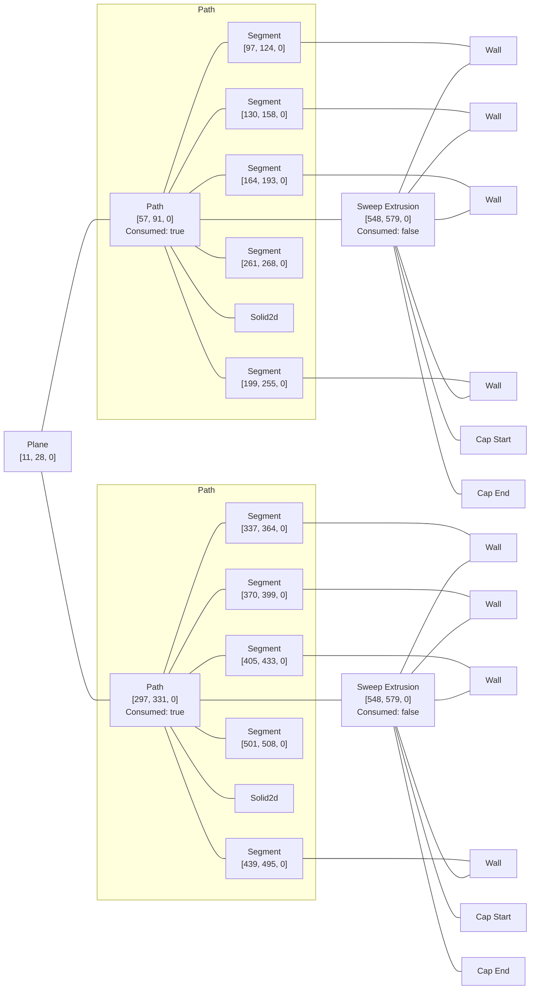

```mermaid
flowchart LR
  subgraph path2 [Path]
    2["Path<br>[57, 91, 0]<br>Consumed: true"]
      %% [ProgramBodyItem { index: 1 }, VariableDeclarationDeclaration, VariableDeclarationInit, PipeBodyItem { index: 1 }]
    3["Segment<br>[97, 124, 0]"]
      %% [ProgramBodyItem { index: 1 }, VariableDeclarationDeclaration, VariableDeclarationInit, PipeBodyItem { index: 2 }]
    4["Segment<br>[130, 158, 0]"]
      %% [ProgramBodyItem { index: 1 }, VariableDeclarationDeclaration, VariableDeclarationInit, PipeBodyItem { index: 3 }]
    5["Segment<br>[164, 193, 0]"]
      %% [ProgramBodyItem { index: 1 }, VariableDeclarationDeclaration, VariableDeclarationInit, PipeBodyItem { index: 4 }]
    6["Segment<br>[199, 255, 0]"]
      %% [ProgramBodyItem { index: 1 }, VariableDeclarationDeclaration, VariableDeclarationInit, PipeBodyItem { index: 5 }]
    7["Segment<br>[261, 268, 0]"]
      %% [ProgramBodyItem { index: 1 }, VariableDeclarationDeclaration, VariableDeclarationInit, PipeBodyItem { index: 6 }]
    8[Solid2d]
  end
  subgraph path9 [Path]
    9["Path<br>[297, 331, 0]<br>Consumed: true"]
      %% [ProgramBodyItem { index: 2 }, VariableDeclarationDeclaration, VariableDeclarationInit, PipeBodyItem { index: 1 }]
    10["Segment<br>[337, 364, 0]"]
      %% [ProgramBodyItem { index: 2 }, VariableDeclarationDeclaration, VariableDeclarationInit, PipeBodyItem { index: 2 }]
    11["Segment<br>[370, 399, 0]"]
      %% [ProgramBodyItem { index: 2 }, VariableDeclarationDeclaration, VariableDeclarationInit, PipeBodyItem { index: 3 }]
    12["Segment<br>[405, 433, 0]"]
      %% [ProgramBodyItem { index: 2 }, VariableDeclarationDeclaration, VariableDeclarationInit, PipeBodyItem { index: 4 }]
    13["Segment<br>[439, 495, 0]"]
      %% [ProgramBodyItem { index: 2 }, VariableDeclarationDeclaration, VariableDeclarationInit, PipeBodyItem { index: 5 }]
    14["Segment<br>[501, 508, 0]"]
      %% [ProgramBodyItem { index: 2 }, VariableDeclarationDeclaration, VariableDeclarationInit, PipeBodyItem { index: 6 }]
    15[Solid2d]
  end
  1["Plane<br>[11, 28, 0]"]
    %% [ProgramBodyItem { index: 0 }, VariableDeclarationDeclaration, VariableDeclarationInit]
  16["Sweep Extrusion<br>[548, 579, 0]<br>Consumed: false"]
    %% [ProgramBodyItem { index: 4 }, ExpressionStatementExpr]
  17[Wall]
    %% face_code_ref=Missing NodePath
  18[Wall]
    %% face_code_ref=Missing NodePath
  19[Wall]
    %% face_code_ref=Missing NodePath
  20[Wall]
    %% face_code_ref=Missing NodePath
  21["Cap Start"]
    %% face_code_ref=Missing NodePath
  22["Cap End"]
    %% face_code_ref=Missing NodePath
  23["Sweep Extrusion<br>[548, 579, 0]<br>Consumed: false"]
    %% [ProgramBodyItem { index: 4 }, ExpressionStatementExpr]
  24[Wall]
    %% face_code_ref=Missing NodePath
  25[Wall]
    %% face_code_ref=Missing NodePath
  26[Wall]
    %% face_code_ref=Missing NodePath
  27[Wall]
    %% face_code_ref=Missing NodePath
  28["Cap Start"]
    %% face_code_ref=Missing NodePath
  29["Cap End"]
    %% face_code_ref=Missing NodePath
  1 --- 2
  1 --- 9
  2 --- 3
  2 --- 4
  2 --- 5
  2 --- 6
  2 --- 7
  2 --- 8
  2 ---- 16
  3 --- 20
  4 --- 19
  5 --- 18
  6 --- 17
  9 --- 10
  9 --- 11
  9 --- 12
  9 --- 13
  9 --- 14
  9 --- 15
  9 ---- 23
  10 --- 27
  11 --- 26
  12 --- 25
  13 --- 24
  16 --- 17
  16 --- 18
  16 --- 19
  16 --- 20
  16 --- 21
  16 --- 22
  23 --- 24
  23 --- 25
  23 --- 26
  23 --- 27
  23 --- 28
  23 --- 29
```
