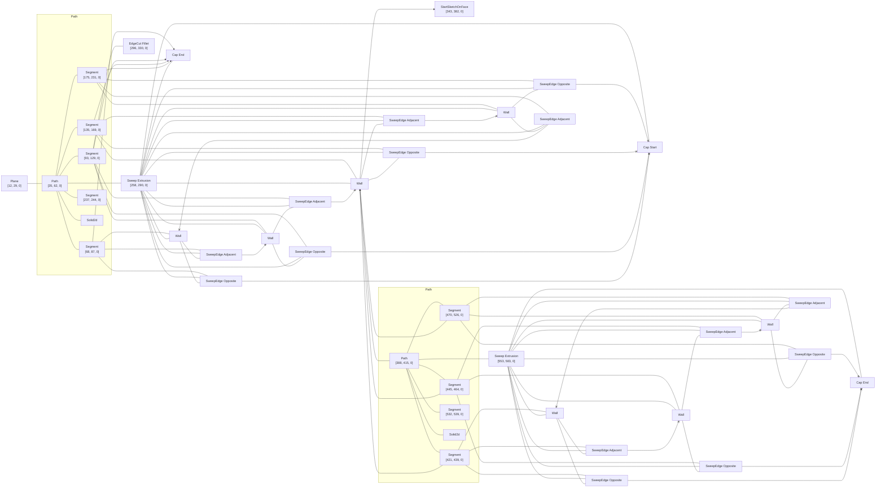

```mermaid
flowchart LR
  subgraph path3 [Path]
    3["Path<br>[35, 62, 0]"]
      %% [ProgramBodyItem { index: 0 }, VariableDeclarationDeclaration, VariableDeclarationInit, PipeBodyItem { index: 1 }]
    5["Segment<br>[68, 87, 0]"]
      %% [ProgramBodyItem { index: 0 }, VariableDeclarationDeclaration, VariableDeclarationInit, PipeBodyItem { index: 2 }]
    6["Segment<br>[93, 129, 0]"]
      %% [ProgramBodyItem { index: 0 }, VariableDeclarationDeclaration, VariableDeclarationInit, PipeBodyItem { index: 3 }]
    7["Segment<br>[135, 169, 0]"]
      %% [ProgramBodyItem { index: 0 }, VariableDeclarationDeclaration, VariableDeclarationInit, PipeBodyItem { index: 4 }]
    8["Segment<br>[175, 231, 0]"]
      %% [ProgramBodyItem { index: 0 }, VariableDeclarationDeclaration, VariableDeclarationInit, PipeBodyItem { index: 5 }]
    9["Segment<br>[237, 244, 0]"]
      %% [ProgramBodyItem { index: 0 }, VariableDeclarationDeclaration, VariableDeclarationInit, PipeBodyItem { index: 6 }]
    15[Solid2d]
  end
  subgraph path4 [Path]
    4["Path<br>[388, 415, 0]"]
      %% [ProgramBodyItem { index: 2 }, VariableDeclarationDeclaration, VariableDeclarationInit, PipeBodyItem { index: 1 }]
    10["Segment<br>[421, 439, 0]"]
      %% [ProgramBodyItem { index: 2 }, VariableDeclarationDeclaration, VariableDeclarationInit, PipeBodyItem { index: 2 }]
    11["Segment<br>[445, 464, 0]"]
      %% [ProgramBodyItem { index: 2 }, VariableDeclarationDeclaration, VariableDeclarationInit, PipeBodyItem { index: 3 }]
    12["Segment<br>[470, 526, 0]"]
      %% [ProgramBodyItem { index: 2 }, VariableDeclarationDeclaration, VariableDeclarationInit, PipeBodyItem { index: 4 }]
    13["Segment<br>[532, 539, 0]"]
      %% [ProgramBodyItem { index: 2 }, VariableDeclarationDeclaration, VariableDeclarationInit, PipeBodyItem { index: 5 }]
    14[Solid2d]
  end
  1["Plane<br>[12, 29, 0]"]
    %% [ProgramBodyItem { index: 0 }, VariableDeclarationDeclaration, VariableDeclarationInit, PipeBodyItem { index: 0 }]
  2["StartSketchOnFace<br>[343, 382, 0]"]
    %% [ProgramBodyItem { index: 2 }, VariableDeclarationDeclaration, VariableDeclarationInit, PipeBodyItem { index: 0 }]
  16["Sweep Extrusion<br>[258, 290, 0]"]
    %% [ProgramBodyItem { index: 1 }, VariableDeclarationDeclaration, VariableDeclarationInit, PipeBodyItem { index: 0 }]
  17["Sweep Extrusion<br>[553, 583, 0]"]
    %% [ProgramBodyItem { index: 3 }, VariableDeclarationDeclaration, VariableDeclarationInit]
  18[Wall]
    %% face_code_ref=Missing NodePath
  19[Wall]
    %% face_code_ref=Missing NodePath
  20[Wall]
    %% face_code_ref=Missing NodePath
  21[Wall]
    %% face_code_ref=[ProgramBodyItem { index: 2 }, VariableDeclarationDeclaration, VariableDeclarationInit, PipeBodyItem { index: 0 }]
  22[Wall]
    %% face_code_ref=Missing NodePath
  23[Wall]
    %% face_code_ref=Missing NodePath
  24[Wall]
    %% face_code_ref=Missing NodePath
  25["Cap Start"]
    %% face_code_ref=Missing NodePath
  26["Cap End"]
    %% face_code_ref=Missing NodePath
  27["Cap End"]
    %% face_code_ref=Missing NodePath
  28["SweepEdge Opposite"]
  29["SweepEdge Opposite"]
  30["SweepEdge Opposite"]
  31["SweepEdge Opposite"]
  32["SweepEdge Opposite"]
  33["SweepEdge Opposite"]
  34["SweepEdge Opposite"]
  35["SweepEdge Adjacent"]
  36["SweepEdge Adjacent"]
  37["SweepEdge Adjacent"]
  38["SweepEdge Adjacent"]
  39["SweepEdge Adjacent"]
  40["SweepEdge Adjacent"]
  41["SweepEdge Adjacent"]
  42["EdgeCut Fillet<br>[296, 330, 0]"]
    %% [ProgramBodyItem { index: 1 }, VariableDeclarationDeclaration, VariableDeclarationInit, PipeBodyItem { index: 1 }]
  1 --- 3
  21 x--> 2
  3 --- 5
  3 --- 6
  3 --- 7
  3 --- 8
  3 --- 9
  3 --- 15
  3 ---- 16
  4 --- 10
  4 --- 11
  4 --- 12
  4 --- 13
  4 --- 14
  4 ---- 17
  21 --- 4
  5 --- 20
  5 x--> 26
  5 --- 31
  5 --- 38
  6 --- 18
  6 x--> 26
  6 --- 30
  6 --- 37
  6 --- 42
  7 --- 21
  7 x--> 26
  7 --- 29
  7 --- 36
  8 --- 19
  8 x--> 26
  8 --- 28
  8 --- 35
  10 x--> 21
  10 --- 24
  10 --- 34
  10 --- 41
  11 x--> 21
  11 --- 22
  11 --- 33
  11 --- 40
  12 x--> 21
  12 --- 23
  12 --- 32
  12 --- 39
  16 --- 18
  16 --- 19
  16 --- 20
  16 --- 21
  16 --- 25
  16 --- 26
  16 --- 28
  16 --- 29
  16 --- 30
  16 --- 31
  16 --- 35
  16 --- 36
  16 --- 37
  16 --- 38
  17 --- 22
  17 --- 23
  17 --- 24
  17 --- 27
  17 --- 32
  17 --- 33
  17 --- 34
  17 --- 39
  17 --- 40
  17 --- 41
  18 --- 30
  18 --- 37
  38 <--x 18
  19 --- 28
  19 --- 35
  36 <--x 19
  20 --- 31
  35 <--x 20
  20 --- 38
  21 --- 29
  21 --- 36
  37 <--x 21
  22 --- 33
  22 --- 40
  41 <--x 22
  23 --- 32
  23 --- 39
  40 <--x 23
  24 --- 34
  39 <--x 24
  24 --- 41
  28 <--x 25
  29 <--x 25
  30 <--x 25
  31 <--x 25
  32 <--x 27
  33 <--x 27
  34 <--x 27
```
