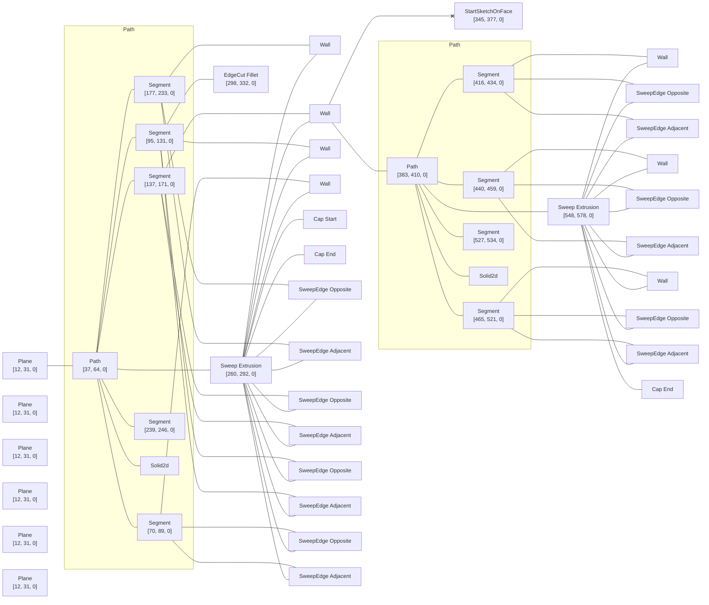

```mermaid
flowchart LR
  subgraph path7 [Path]
    7["Path<br>[37, 64, 0]"]
    8["Segment<br>[70, 89, 0]"]
    9["Segment<br>[95, 131, 0]"]
    10["Segment<br>[137, 171, 0]"]
    11["Segment<br>[177, 233, 0]"]
    12["Segment<br>[239, 246, 0]"]
    13[Solid2d]
  end
  subgraph path30 [Path]
    30["Path<br>[383, 410, 0]"]
    31["Segment<br>[416, 434, 0]"]
    32["Segment<br>[440, 459, 0]"]
    33["Segment<br>[465, 521, 0]"]
    34["Segment<br>[527, 534, 0]"]
    35[Solid2d]
  end
  1["Plane<br>[12, 31, 0]"]
  2["Plane<br>[12, 31, 0]"]
  3["Plane<br>[12, 31, 0]"]
  4["Plane<br>[12, 31, 0]"]
  5["Plane<br>[12, 31, 0]"]
  6["Plane<br>[12, 31, 0]"]
  14["Sweep Extrusion<br>[260, 292, 0]"]
  15[Wall]
  16[Wall]
  17[Wall]
  18[Wall]
  19["Cap Start"]
  20["Cap End"]
  21["SweepEdge Opposite"]
  22["SweepEdge Adjacent"]
  23["SweepEdge Opposite"]
  24["SweepEdge Adjacent"]
  25["SweepEdge Opposite"]
  26["SweepEdge Adjacent"]
  27["SweepEdge Opposite"]
  28["SweepEdge Adjacent"]
  29["EdgeCut Fillet<br>[298, 332, 0]"]
  36["Sweep Extrusion<br>[548, 578, 0]"]
  37[Wall]
  38[Wall]
  39[Wall]
  40["Cap End"]
  41["SweepEdge Opposite"]
  42["SweepEdge Adjacent"]
  43["SweepEdge Opposite"]
  44["SweepEdge Adjacent"]
  45["SweepEdge Opposite"]
  46["SweepEdge Adjacent"]
  47["StartSketchOnFace<br>[345, 377, 0]"]
  1 --- 7
  7 --- 8
  7 --- 9
  7 --- 10
  7 --- 11
  7 --- 12
  7 ---- 14
  7 --- 13
  8 --- 18
  8 --- 27
  8 --- 28
  9 --- 17
  9 --- 25
  9 --- 26
  9 --- 29
  10 --- 16
  10 --- 23
  10 --- 24
  11 --- 15
  11 --- 21
  11 --- 22
  14 --- 15
  14 --- 16
  14 --- 17
  14 --- 18
  14 --- 19
  14 --- 20
  14 --- 21
  14 --- 22
  14 --- 23
  14 --- 24
  14 --- 25
  14 --- 26
  14 --- 27
  14 --- 28
  16 --- 30
  30 --- 31
  30 --- 32
  30 --- 33
  30 --- 34
  30 ---- 36
  30 --- 35
  31 --- 39
  31 --- 45
  31 --- 46
  32 --- 38
  32 --- 43
  32 --- 44
  33 --- 37
  33 --- 41
  33 --- 42
  36 --- 37
  36 --- 38
  36 --- 39
  36 --- 40
  36 --- 41
  36 --- 42
  36 --- 43
  36 --- 44
  36 --- 45
  36 --- 46
  16 <--x 47
```
