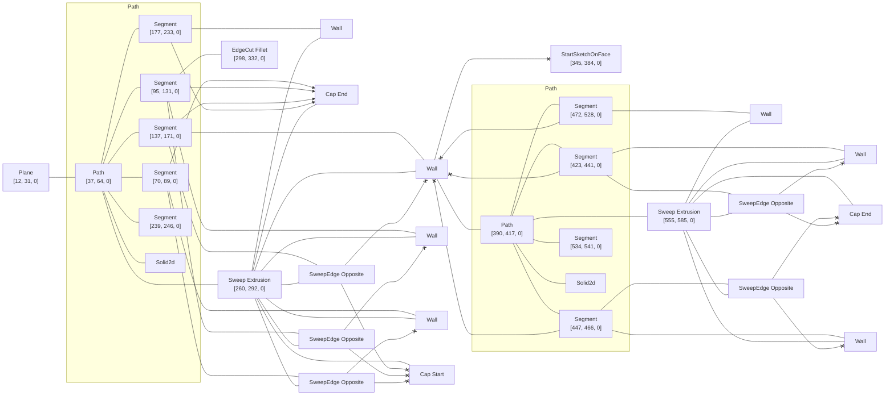

```mermaid
flowchart LR
  subgraph path2 [Path]
    2["Path<br>[37, 64, 0]"]
    3["Segment<br>[70, 89, 0]"]
    4["Segment<br>[95, 131, 0]"]
    5["Segment<br>[137, 171, 0]"]
    6["Segment<br>[177, 233, 0]"]
    7["Segment<br>[239, 246, 0]"]
    8[Solid2d]
  end
  subgraph path20 [Path]
    20["Path<br>[390, 417, 0]"]
    21["Segment<br>[423, 441, 0]"]
    22["Segment<br>[447, 466, 0]"]
    23["Segment<br>[472, 528, 0]"]
    24["Segment<br>[534, 541, 0]"]
    25[Solid2d]
  end
  1["Plane<br>[12, 31, 0]"]
  9["Sweep Extrusion<br>[260, 292, 0]"]
  10[Wall]
  11[Wall]
  12[Wall]
  13[Wall]
  14["Cap Start"]
  15["Cap End"]
  16["SweepEdge Opposite"]
  17["SweepEdge Opposite"]
  18["SweepEdge Opposite"]
  19["EdgeCut Fillet<br>[298, 332, 0]"]
  26["Sweep Extrusion<br>[555, 585, 0]"]
  27[Wall]
  28[Wall]
  29[Wall]
  30["Cap End"]
  31["SweepEdge Opposite"]
  32["SweepEdge Opposite"]
  33["StartSketchOnFace<br>[345, 384, 0]"]
  1 --- 2
  2 --- 3
  2 --- 4
  2 --- 5
  2 --- 6
  2 --- 7
  2 ---- 9
  2 --- 8
  3 --- 13
  3 --- 18
  3 x--> 15
  4 --- 12
  4 --- 17
  4 --- 19
  4 x--> 15
  5 --- 11
  5 --- 16
  5 x--> 15
  6 --- 10
  6 x--> 15
  9 --- 10
  9 --- 11
  9 --- 12
  9 --- 13
  9 --- 14
  9 --- 15
  9 --- 16
  9 --- 17
  9 --- 18
  11 --- 20
  16 <--x 11
  16 <--x 14
  17 <--x 12
  17 <--x 14
  18 <--x 13
  18 <--x 14
  20 --- 21
  20 --- 22
  20 --- 23
  20 --- 24
  20 ---- 26
  20 --- 25
  21 --- 29
  21 --- 32
  21 <--x 11
  22 --- 28
  22 --- 31
  22 <--x 11
  23 --- 27
  23 <--x 11
  26 --- 27
  26 --- 28
  26 --- 29
  26 --- 30
  26 --- 31
  26 --- 32
  31 <--x 28
  31 <--x 30
  32 <--x 29
  32 <--x 30
  11 <--x 33
```
