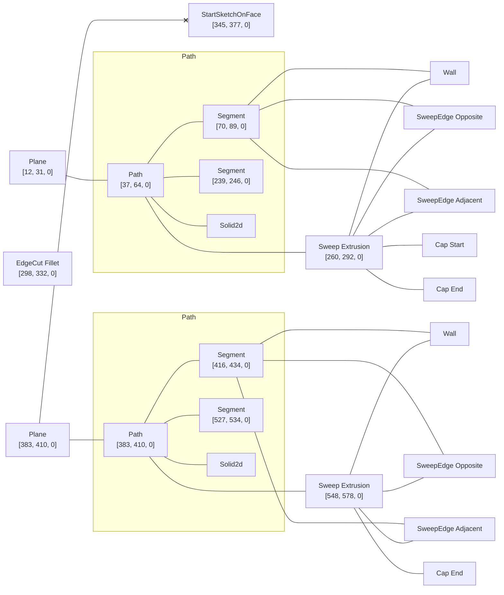

```mermaid
flowchart LR
  subgraph path2 [Path]
    2["Path<br>[37, 64, 0]"]
    3["Segment<br>[70, 89, 0]"]
    4["Segment<br>[239, 246, 0]"]
    5[Solid2d]
  end
  subgraph path14 [Path]
    14["Path<br>[383, 410, 0]"]
    15["Segment<br>[416, 434, 0]"]
    16["Segment<br>[527, 534, 0]"]
    17[Solid2d]
  end
  1["Plane<br>[12, 31, 0]"]
  6["Sweep Extrusion<br>[260, 292, 0]"]
  7[Wall]
  8["Cap Start"]
  9["Cap End"]
  10["SweepEdge Opposite"]
  11["SweepEdge Adjacent"]
  12["EdgeCut Fillet<br>[298, 332, 0]"]
  13["Plane<br>[383, 410, 0]"]
  18["Sweep Extrusion<br>[548, 578, 0]"]
  19[Wall]
  20["Cap End"]
  21["SweepEdge Opposite"]
  22["SweepEdge Adjacent"]
  23["StartSketchOnFace<br>[345, 377, 0]"]
  1 --- 2
  2 --- 3
  2 --- 4
  2 ---- 6
  2 --- 5
  3 --- 7
  3 --- 10
  3 --- 11
  6 --- 7
  6 --- 8
  6 --- 9
  6 --- 10
  6 --- 11
  13 --- 14
  14 --- 15
  14 --- 16
  14 ---- 18
  14 --- 17
  15 --- 19
  15 --- 21
  15 --- 22
  18 --- 19
  18 --- 20
  18 --- 21
  18 --- 22
  13 <--x 23
```
