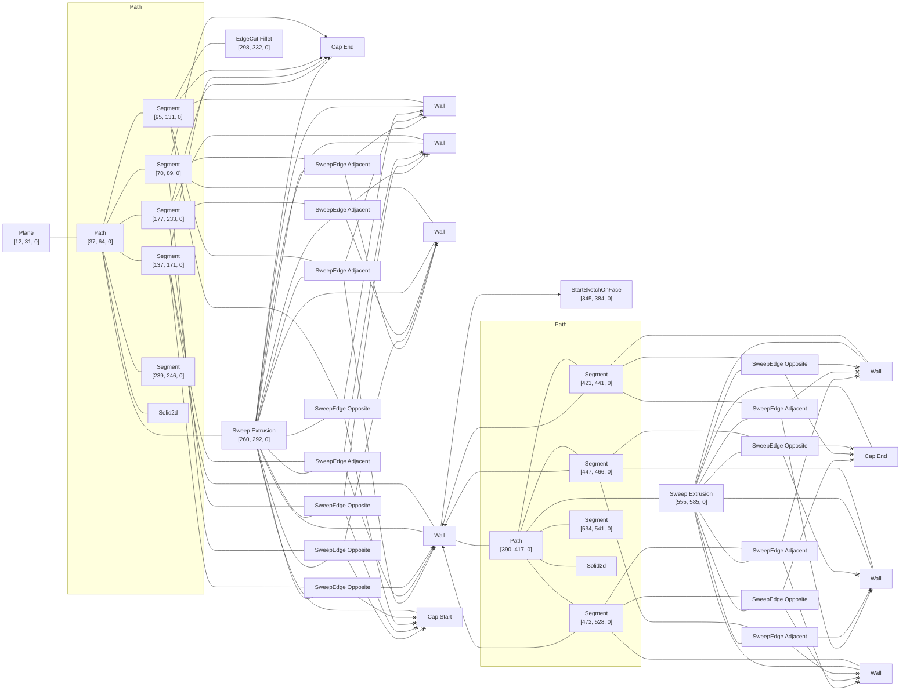

```mermaid
flowchart LR
  subgraph path3 [Path]
    3["Path<br>[37, 64, 0]"]
    5["Segment<br>[70, 89, 0]"]
    6["Segment<br>[95, 131, 0]"]
    7["Segment<br>[137, 171, 0]"]
    8["Segment<br>[177, 233, 0]"]
    9["Segment<br>[239, 246, 0]"]
    15[Solid2d]
  end
  subgraph path4 [Path]
    4["Path<br>[390, 417, 0]"]
    10["Segment<br>[423, 441, 0]"]
    11["Segment<br>[447, 466, 0]"]
    12["Segment<br>[472, 528, 0]"]
    13["Segment<br>[534, 541, 0]"]
    14[Solid2d]
  end
  1["Plane<br>[12, 31, 0]"]
  2["StartSketchOnFace<br>[345, 384, 0]"]
  16["Sweep Extrusion<br>[260, 292, 0]"]
  17["Sweep Extrusion<br>[555, 585, 0]"]
  18[Wall]
  19[Wall]
  20[Wall]
  21[Wall]
  22[Wall]
  23[Wall]
  24[Wall]
  25["Cap Start"]
  26["Cap End"]
  27["Cap End"]
  28["SweepEdge Opposite"]
  29["SweepEdge Adjacent"]
  30["SweepEdge Opposite"]
  31["SweepEdge Adjacent"]
  32["SweepEdge Opposite"]
  33["SweepEdge Adjacent"]
  34["SweepEdge Opposite"]
  35["SweepEdge Adjacent"]
  36["SweepEdge Opposite"]
  37["SweepEdge Adjacent"]
  38["SweepEdge Opposite"]
  39["SweepEdge Adjacent"]
  40["SweepEdge Opposite"]
  41["SweepEdge Adjacent"]
  42["EdgeCut Fillet<br>[298, 332, 0]"]
  1 --- 3
  21 x--> 2
  3 --- 5
  3 --- 6
  3 --- 7
  3 --- 8
  3 --- 9
  3 --- 15
  3 ---- 16
  4 --- 10
  4 --- 11
  4 --- 12
  4 --- 13
  4 --- 14
  4 ---- 17
  21 --- 4
  5 --- 20
  5 x--> 26
  5 --- 34
  5 --- 35
  6 --- 18
  6 x--> 26
  6 --- 30
  6 --- 31
  6 --- 42
  7 --- 21
  7 x--> 26
  7 --- 28
  7 --- 29
  8 --- 19
  8 x--> 26
  8 --- 32
  8 --- 33
  10 x--> 21
  10 --- 23
  10 --- 38
  10 --- 39
  11 x--> 21
  11 --- 22
  11 --- 36
  11 --- 37
  12 x--> 21
  12 --- 24
  12 --- 40
  12 --- 41
  16 --- 18
  16 --- 19
  16 --- 20
  16 --- 21
  16 --- 25
  16 --- 26
  16 --- 28
  16 --- 29
  16 --- 30
  16 --- 31
  16 --- 32
  16 --- 33
  16 --- 34
  16 --- 35
  17 --- 22
  17 --- 23
  17 --- 24
  17 --- 27
  17 --- 36
  17 --- 37
  17 --- 38
  17 --- 39
  17 --- 40
  17 --- 41
  30 <--x 18
  31 <--x 18
  35 <--x 18
  29 <--x 19
  32 <--x 19
  33 <--x 19
  33 <--x 20
  34 <--x 20
  35 <--x 20
  28 <--x 21
  29 <--x 21
  31 <--x 21
  36 <--x 22
  37 <--x 22
  39 <--x 22
  38 <--x 23
  39 <--x 23
  41 <--x 23
  37 <--x 24
  40 <--x 24
  41 <--x 24
  28 <--x 25
  30 <--x 25
  32 <--x 25
  34 <--x 25
  36 <--x 27
  38 <--x 27
  40 <--x 27
```
