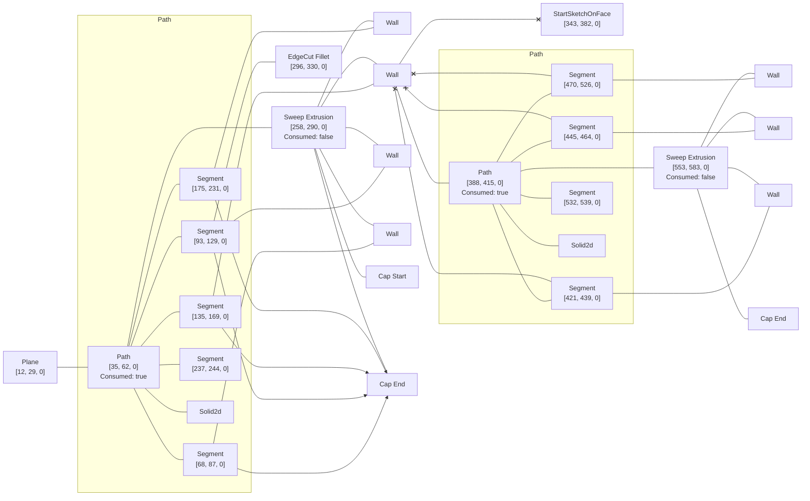

```mermaid
flowchart LR
  subgraph path2 [Path]
    2["Path<br>[35, 62, 0]<br>Consumed: true"]
      %% [ProgramBodyItem { index: 0 }, VariableDeclarationDeclaration, VariableDeclarationInit, PipeBodyItem { index: 1 }]
    3["Segment<br>[68, 87, 0]"]
      %% [ProgramBodyItem { index: 0 }, VariableDeclarationDeclaration, VariableDeclarationInit, PipeBodyItem { index: 2 }]
    4["Segment<br>[93, 129, 0]"]
      %% [ProgramBodyItem { index: 0 }, VariableDeclarationDeclaration, VariableDeclarationInit, PipeBodyItem { index: 3 }]
    5["Segment<br>[135, 169, 0]"]
      %% [ProgramBodyItem { index: 0 }, VariableDeclarationDeclaration, VariableDeclarationInit, PipeBodyItem { index: 4 }]
    6["Segment<br>[175, 231, 0]"]
      %% [ProgramBodyItem { index: 0 }, VariableDeclarationDeclaration, VariableDeclarationInit, PipeBodyItem { index: 5 }]
    7["Segment<br>[237, 244, 0]"]
      %% [ProgramBodyItem { index: 0 }, VariableDeclarationDeclaration, VariableDeclarationInit, PipeBodyItem { index: 6 }]
    8[Solid2d]
  end
  subgraph path17 [Path]
    17["Path<br>[388, 415, 0]<br>Consumed: true"]
      %% [ProgramBodyItem { index: 2 }, VariableDeclarationDeclaration, VariableDeclarationInit, PipeBodyItem { index: 1 }]
    18["Segment<br>[421, 439, 0]"]
      %% [ProgramBodyItem { index: 2 }, VariableDeclarationDeclaration, VariableDeclarationInit, PipeBodyItem { index: 2 }]
    19["Segment<br>[445, 464, 0]"]
      %% [ProgramBodyItem { index: 2 }, VariableDeclarationDeclaration, VariableDeclarationInit, PipeBodyItem { index: 3 }]
    20["Segment<br>[470, 526, 0]"]
      %% [ProgramBodyItem { index: 2 }, VariableDeclarationDeclaration, VariableDeclarationInit, PipeBodyItem { index: 4 }]
    21["Segment<br>[532, 539, 0]"]
      %% [ProgramBodyItem { index: 2 }, VariableDeclarationDeclaration, VariableDeclarationInit, PipeBodyItem { index: 5 }]
    22[Solid2d]
  end
  1["Plane<br>[12, 29, 0]"]
    %% [ProgramBodyItem { index: 0 }, VariableDeclarationDeclaration, VariableDeclarationInit, PipeBodyItem { index: 0 }]
  9["Sweep Extrusion<br>[258, 290, 0]<br>Consumed: false"]
    %% [ProgramBodyItem { index: 1 }, VariableDeclarationDeclaration, VariableDeclarationInit, PipeBodyItem { index: 0 }]
  10[Wall]
    %% face_code_ref=Missing NodePath
  11[Wall]
    %% face_code_ref=[ProgramBodyItem { index: 2 }, VariableDeclarationDeclaration, VariableDeclarationInit, PipeBodyItem { index: 0 }]
  12[Wall]
    %% face_code_ref=Missing NodePath
  13[Wall]
    %% face_code_ref=Missing NodePath
  14["Cap Start"]
    %% face_code_ref=Missing NodePath
  15["Cap End"]
    %% face_code_ref=Missing NodePath
  16["EdgeCut Fillet<br>[296, 330, 0]"]
    %% [ProgramBodyItem { index: 1 }, VariableDeclarationDeclaration, VariableDeclarationInit, PipeBodyItem { index: 1 }]
  23["Sweep Extrusion<br>[553, 583, 0]<br>Consumed: false"]
    %% [ProgramBodyItem { index: 3 }, VariableDeclarationDeclaration, VariableDeclarationInit]
  24[Wall]
    %% face_code_ref=Missing NodePath
  25[Wall]
    %% face_code_ref=Missing NodePath
  26[Wall]
    %% face_code_ref=Missing NodePath
  27["Cap End"]
    %% face_code_ref=Missing NodePath
  28["StartSketchOnFace<br>[343, 382, 0]"]
    %% [ProgramBodyItem { index: 2 }, VariableDeclarationDeclaration, VariableDeclarationInit, PipeBodyItem { index: 0 }]
  1 --- 2
  2 --- 3
  2 --- 4
  2 --- 5
  2 --- 6
  2 --- 7
  2 --- 8
  2 ---- 9
  3 --- 13
  3 x--> 15
  4 --- 12
  4 x--> 15
  4 --- 16
  5 --- 11
  5 x--> 15
  6 --- 10
  6 x--> 15
  9 --- 10
  9 --- 11
  9 --- 12
  9 --- 13
  9 --- 14
  9 --- 15
  11 --- 17
  18 <--x 11
  19 <--x 11
  20 <--x 11
  11 <--x 28
  17 --- 18
  17 --- 19
  17 --- 20
  17 --- 21
  17 --- 22
  17 ---- 23
  18 --- 26
  19 --- 25
  20 --- 24
  23 --- 24
  23 --- 25
  23 --- 26
  23 --- 27
```
