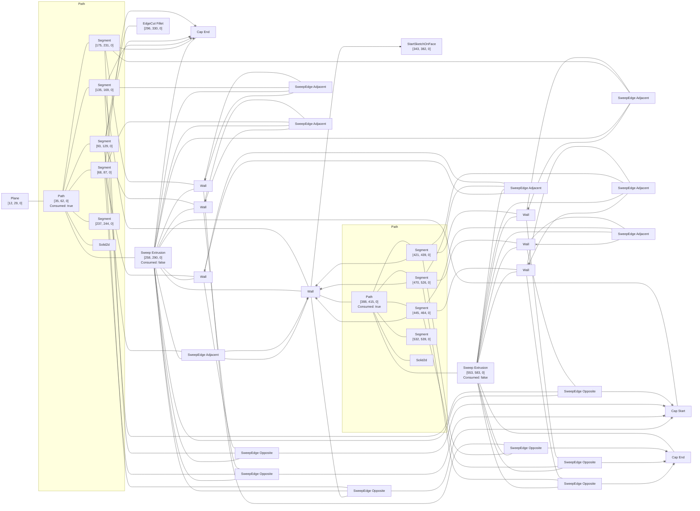

```mermaid
flowchart LR
  subgraph path11 [Path]
    11["Path<br>[35, 62, 0]<br>Consumed: true"]
      %% [ProgramBodyItem { index: 0 }, VariableDeclarationDeclaration, VariableDeclarationInit, PipeBodyItem { index: 1 }]
    12["Segment<br>[68, 87, 0]"]
      %% [ProgramBodyItem { index: 0 }, VariableDeclarationDeclaration, VariableDeclarationInit, PipeBodyItem { index: 2 }]
    13["Segment<br>[93, 129, 0]"]
      %% [ProgramBodyItem { index: 0 }, VariableDeclarationDeclaration, VariableDeclarationInit, PipeBodyItem { index: 3 }]
    14["Segment<br>[135, 169, 0]"]
      %% [ProgramBodyItem { index: 0 }, VariableDeclarationDeclaration, VariableDeclarationInit, PipeBodyItem { index: 4 }]
    15["Segment<br>[175, 231, 0]"]
      %% [ProgramBodyItem { index: 0 }, VariableDeclarationDeclaration, VariableDeclarationInit, PipeBodyItem { index: 5 }]
    16["Segment<br>[237, 244, 0]"]
      %% [ProgramBodyItem { index: 0 }, VariableDeclarationDeclaration, VariableDeclarationInit, PipeBodyItem { index: 6 }]
    27[Solid2d]
  end
  subgraph path21 [Path]
    21["Path<br>[388, 415, 0]<br>Consumed: true"]
      %% [ProgramBodyItem { index: 2 }, VariableDeclarationDeclaration, VariableDeclarationInit, PipeBodyItem { index: 1 }]
    22["Segment<br>[421, 439, 0]"]
      %% [ProgramBodyItem { index: 2 }, VariableDeclarationDeclaration, VariableDeclarationInit, PipeBodyItem { index: 2 }]
    23["Segment<br>[445, 464, 0]"]
      %% [ProgramBodyItem { index: 2 }, VariableDeclarationDeclaration, VariableDeclarationInit, PipeBodyItem { index: 3 }]
    24["Segment<br>[470, 526, 0]"]
      %% [ProgramBodyItem { index: 2 }, VariableDeclarationDeclaration, VariableDeclarationInit, PipeBodyItem { index: 4 }]
    25["Segment<br>[532, 539, 0]"]
      %% [ProgramBodyItem { index: 2 }, VariableDeclarationDeclaration, VariableDeclarationInit, PipeBodyItem { index: 5 }]
    28[Solid2d]
  end
  1["Cap End"]
    %% face_code_ref=Missing NodePath
  2["Cap End"]
    %% face_code_ref=Missing NodePath
  3["Cap Start"]
    %% face_code_ref=Missing NodePath
  4[Wall]
    %% face_code_ref=Missing NodePath
  5[Wall]
    %% face_code_ref=Missing NodePath
  6[Wall]
    %% face_code_ref=Missing NodePath
  7[Wall]
    %% face_code_ref=Missing NodePath
  8[Wall]
    %% face_code_ref=Missing NodePath
  9[Wall]
    %% face_code_ref=Missing NodePath
  10["Plane<br>[12, 29, 0]"]
    %% [ProgramBodyItem { index: 0 }, VariableDeclarationDeclaration, VariableDeclarationInit, PipeBodyItem { index: 0 }]
  17["Sweep Extrusion<br>[258, 290, 0]<br>Consumed: false"]
    %% [ProgramBodyItem { index: 1 }, VariableDeclarationDeclaration, VariableDeclarationInit, PipeBodyItem { index: 0 }]
  18["EdgeCut Fillet<br>[296, 330, 0]"]
    %% [ProgramBodyItem { index: 1 }, VariableDeclarationDeclaration, VariableDeclarationInit, PipeBodyItem { index: 1 }]
  19["StartSketchOnFace<br>[343, 382, 0]"]
    %% [ProgramBodyItem { index: 2 }, VariableDeclarationDeclaration, VariableDeclarationInit, PipeBodyItem { index: 0 }]
  20[Wall]
    %% face_code_ref=[ProgramBodyItem { index: 2 }, VariableDeclarationDeclaration, VariableDeclarationInit, PipeBodyItem { index: 0 }]
  26["Sweep Extrusion<br>[553, 583, 0]<br>Consumed: false"]
    %% [ProgramBodyItem { index: 3 }, VariableDeclarationDeclaration, VariableDeclarationInit]
  29["SweepEdge Adjacent"]
  30["SweepEdge Adjacent"]
  31["SweepEdge Adjacent"]
  32["SweepEdge Adjacent"]
  33["SweepEdge Adjacent"]
  34["SweepEdge Adjacent"]
  35["SweepEdge Adjacent"]
  36["SweepEdge Opposite"]
  37["SweepEdge Opposite"]
  38["SweepEdge Opposite"]
  39["SweepEdge Opposite"]
  40["SweepEdge Opposite"]
  41["SweepEdge Opposite"]
  42["SweepEdge Opposite"]
  12 <--x 1
  13 <--x 1
  14 <--x 1
  15 <--x 1
  17 --- 1
  26 --- 2
  36 <--x 2
  37 <--x 2
  38 <--x 2
  17 --- 3
  39 <--x 3
  40 <--x 3
  41 <--x 3
  42 <--x 3
  15 --- 4
  17 --- 4
  4 --- 29
  29 <--x 4
  4 --- 36
  22 --- 5
  26 --- 5
  5 --- 30
  30 <--x 5
  5 --- 37
  23 --- 6
  26 --- 6
  6 --- 31
  31 <--x 6
  6 --- 38
  24 --- 7
  26 --- 7
  7 --- 32
  32 <--x 7
  7 --- 39
  12 --- 8
  17 --- 8
  8 --- 33
  33 <--x 8
  8 --- 40
  13 --- 9
  17 --- 9
  9 --- 34
  34 <--x 9
  9 --- 41
  10 --- 11
  11 --- 12
  11 --- 13
  11 --- 14
  11 --- 15
  11 --- 16
  11 ---- 17
  11 --- 27
  12 --- 34
  12 --- 41
  13 --- 18
  13 --- 35
  13 --- 42
  14 --- 20
  14 --- 29
  14 --- 39
  15 --- 30
  15 --- 40
  17 --- 20
  17 --- 29
  17 --- 30
  17 --- 34
  17 --- 35
  17 --- 39
  17 --- 40
  17 --- 41
  17 --- 42
  20 x--> 19
  20 --- 21
  22 <--x 20
  23 <--x 20
  24 <--x 20
  20 --- 35
  35 <--x 20
  20 --- 42
  21 --- 22
  21 --- 23
  21 --- 24
  21 --- 25
  21 ---- 26
  21 --- 28
  22 --- 31
  22 --- 36
  23 --- 32
  23 --- 37
  24 --- 33
  24 --- 38
  26 --- 31
  26 --- 32
  26 --- 33
  26 --- 36
  26 --- 37
  26 --- 38
```
