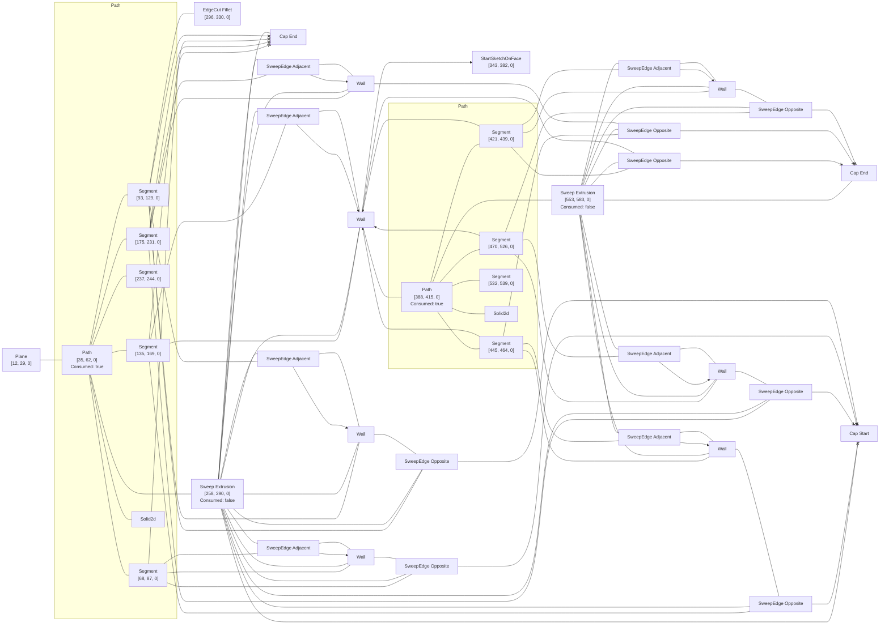

```mermaid
flowchart LR
  subgraph path5 [Path]
    5["Path<br>[35, 62, 0]<br>Consumed: true"]
      %% [ProgramBodyItem { index: 0 }, VariableDeclarationDeclaration, VariableDeclarationInit, PipeBodyItem { index: 1 }]
    15["Segment<br>[68, 87, 0]"]
      %% [ProgramBodyItem { index: 0 }, VariableDeclarationDeclaration, VariableDeclarationInit, PipeBodyItem { index: 2 }]
    16["Segment<br>[93, 129, 0]"]
      %% [ProgramBodyItem { index: 0 }, VariableDeclarationDeclaration, VariableDeclarationInit, PipeBodyItem { index: 3 }]
    8["Segment<br>[135, 169, 0]"]
      %% [ProgramBodyItem { index: 0 }, VariableDeclarationDeclaration, VariableDeclarationInit, PipeBodyItem { index: 4 }]
    9["Segment<br>[175, 231, 0]"]
      %% [ProgramBodyItem { index: 0 }, VariableDeclarationDeclaration, VariableDeclarationInit, PipeBodyItem { index: 5 }]
    10["Segment<br>[237, 244, 0]"]
      %% [ProgramBodyItem { index: 0 }, VariableDeclarationDeclaration, VariableDeclarationInit, PipeBodyItem { index: 6 }]
    17[Solid2d]
  end
  subgraph path6 [Path]
    6["Path<br>[388, 415, 0]<br>Consumed: true"]
      %% [ProgramBodyItem { index: 2 }, VariableDeclarationDeclaration, VariableDeclarationInit, PipeBodyItem { index: 1 }]
    11["Segment<br>[421, 439, 0]"]
      %% [ProgramBodyItem { index: 2 }, VariableDeclarationDeclaration, VariableDeclarationInit, PipeBodyItem { index: 2 }]
    12["Segment<br>[445, 464, 0]"]
      %% [ProgramBodyItem { index: 2 }, VariableDeclarationDeclaration, VariableDeclarationInit, PipeBodyItem { index: 3 }]
    13["Segment<br>[470, 526, 0]"]
      %% [ProgramBodyItem { index: 2 }, VariableDeclarationDeclaration, VariableDeclarationInit, PipeBodyItem { index: 4 }]
    14["Segment<br>[532, 539, 0]"]
      %% [ProgramBodyItem { index: 2 }, VariableDeclarationDeclaration, VariableDeclarationInit, PipeBodyItem { index: 5 }]
    18[Solid2d]
  end
  7["Plane<br>[12, 29, 0]"]
    %% [ProgramBodyItem { index: 0 }, VariableDeclarationDeclaration, VariableDeclarationInit, PipeBodyItem { index: 0 }]
  20["Sweep Extrusion<br>[258, 290, 0]<br>Consumed: false"]
    %% [ProgramBodyItem { index: 1 }, VariableDeclarationDeclaration, VariableDeclarationInit, PipeBodyItem { index: 0 }]
  37[Wall]
    %% face_code_ref=Missing NodePath
  36[Wall]
    %% face_code_ref=[ProgramBodyItem { index: 2 }, VariableDeclarationDeclaration, VariableDeclarationInit, PipeBodyItem { index: 0 }]
  42[Wall]
    %% face_code_ref=Missing NodePath
  41[Wall]
    %% face_code_ref=Missing NodePath
  3["Cap Start"]
    %% face_code_ref=Missing NodePath
  1["Cap End"]
    %% face_code_ref=Missing NodePath
  33["SweepEdge Opposite"]
  23["SweepEdge Adjacent"]
  32["SweepEdge Opposite"]
  22["SweepEdge Adjacent"]
  35["SweepEdge Opposite"]
  28["SweepEdge Adjacent"]
  34["SweepEdge Opposite"]
  27["SweepEdge Adjacent"]
  4["EdgeCut Fillet<br>[296, 330, 0]"]
    %% [ProgramBodyItem { index: 1 }, VariableDeclarationDeclaration, VariableDeclarationInit, PipeBodyItem { index: 1 }]
  21["Sweep Extrusion<br>[553, 583, 0]<br>Consumed: false"]
    %% [ProgramBodyItem { index: 3 }, VariableDeclarationDeclaration, VariableDeclarationInit]
  40[Wall]
    %% face_code_ref=Missing NodePath
  39[Wall]
    %% face_code_ref=Missing NodePath
  38[Wall]
    %% face_code_ref=Missing NodePath
  2["Cap End"]
    %% face_code_ref=Missing NodePath
  31["SweepEdge Opposite"]
  26["SweepEdge Adjacent"]
  30["SweepEdge Opposite"]
  25["SweepEdge Adjacent"]
  29["SweepEdge Opposite"]
  24["SweepEdge Adjacent"]
  19["StartSketchOnFace<br>[343, 382, 0]"]
    %% [ProgramBodyItem { index: 2 }, VariableDeclarationDeclaration, VariableDeclarationInit, PipeBodyItem { index: 0 }]
  8 <--x 1
  9 <--x 1
  15 <--x 1
  16 <--x 1
  20 --- 1
  21 --- 2
  29 <--x 2
  30 <--x 2
  31 <--x 2
  20 --- 3
  32 <--x 3
  33 <--x 3
  34 <--x 3
  35 <--x 3
  16 --- 4
  7 --- 5
  5 --- 8
  5 --- 9
  5 --- 10
  5 --- 15
  5 --- 16
  5 --- 17
  5 ---- 20
  6 --- 11
  6 --- 12
  6 --- 13
  6 --- 14
  6 --- 18
  6 ---- 21
  36 --- 6
  8 --- 22
  8 --- 32
  8 --- 36
  9 --- 23
  9 --- 33
  9 --- 37
  11 --- 24
  11 --- 29
  11 x--> 36
  11 --- 38
  12 --- 25
  12 --- 30
  12 x--> 36
  12 --- 39
  13 --- 26
  13 --- 31
  13 x--> 36
  13 --- 40
  15 --- 27
  15 --- 34
  15 --- 41
  16 --- 28
  16 --- 35
  16 --- 42
  36 x--> 19
  20 --- 22
  20 --- 23
  20 --- 27
  20 --- 28
  20 --- 32
  20 --- 33
  20 --- 34
  20 --- 35
  20 --- 36
  20 --- 37
  20 --- 41
  20 --- 42
  21 --- 24
  21 --- 25
  21 --- 26
  21 --- 29
  21 --- 30
  21 --- 31
  21 --- 38
  21 --- 39
  21 --- 40
  36 --- 22
  22 x--> 36
  37 --- 23
  23 x--> 37
  38 --- 24
  24 x--> 38
  39 --- 25
  25 x--> 39
  40 --- 26
  26 x--> 40
  41 --- 27
  27 x--> 41
  42 --- 28
  28 x--> 42
  36 --- 29
  37 --- 30
  38 --- 31
  39 --- 32
  40 --- 33
  41 --- 34
  42 --- 35
```
