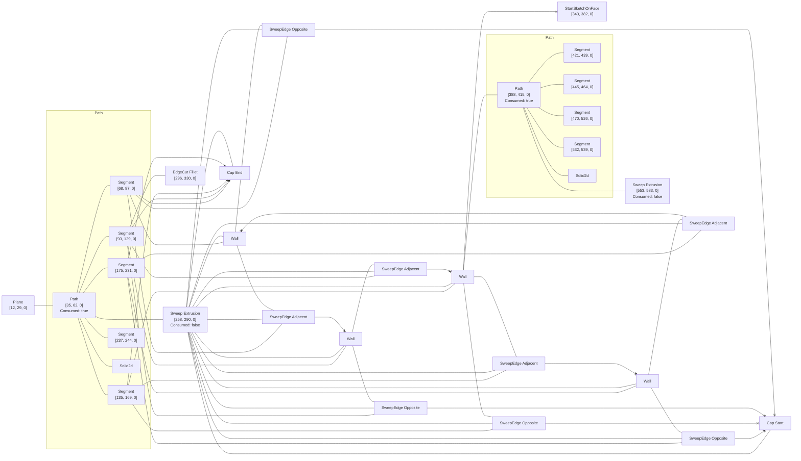

```mermaid
flowchart LR
  subgraph path2 [Path]
    2["Path<br>[35, 62, 0]<br>Consumed: true"]
      %% [ProgramBodyItem { index: 0 }, VariableDeclarationDeclaration, VariableDeclarationInit, PipeBodyItem { index: 1 }]
    3["Segment<br>[68, 87, 0]"]
      %% [ProgramBodyItem { index: 0 }, VariableDeclarationDeclaration, VariableDeclarationInit, PipeBodyItem { index: 2 }]
    4["Segment<br>[93, 129, 0]"]
      %% [ProgramBodyItem { index: 0 }, VariableDeclarationDeclaration, VariableDeclarationInit, PipeBodyItem { index: 3 }]
    5["Segment<br>[135, 169, 0]"]
      %% [ProgramBodyItem { index: 0 }, VariableDeclarationDeclaration, VariableDeclarationInit, PipeBodyItem { index: 4 }]
    6["Segment<br>[175, 231, 0]"]
      %% [ProgramBodyItem { index: 0 }, VariableDeclarationDeclaration, VariableDeclarationInit, PipeBodyItem { index: 5 }]
    7["Segment<br>[237, 244, 0]"]
      %% [ProgramBodyItem { index: 0 }, VariableDeclarationDeclaration, VariableDeclarationInit, PipeBodyItem { index: 6 }]
    8[Solid2d]
  end
  subgraph path25 [Path]
    25["Path<br>[388, 415, 0]<br>Consumed: true"]
      %% [ProgramBodyItem { index: 2 }, VariableDeclarationDeclaration, VariableDeclarationInit, PipeBodyItem { index: 1 }]
    26["Segment<br>[421, 439, 0]"]
      %% [ProgramBodyItem { index: 2 }, VariableDeclarationDeclaration, VariableDeclarationInit, PipeBodyItem { index: 2 }]
    27["Segment<br>[445, 464, 0]"]
      %% [ProgramBodyItem { index: 2 }, VariableDeclarationDeclaration, VariableDeclarationInit, PipeBodyItem { index: 3 }]
    28["Segment<br>[470, 526, 0]"]
      %% [ProgramBodyItem { index: 2 }, VariableDeclarationDeclaration, VariableDeclarationInit, PipeBodyItem { index: 4 }]
    29["Segment<br>[532, 539, 0]"]
      %% [ProgramBodyItem { index: 2 }, VariableDeclarationDeclaration, VariableDeclarationInit, PipeBodyItem { index: 5 }]
    30[Solid2d]
  end
  1["Plane<br>[12, 29, 0]"]
    %% [ProgramBodyItem { index: 0 }, VariableDeclarationDeclaration, VariableDeclarationInit, PipeBodyItem { index: 0 }]
  9["Sweep Extrusion<br>[258, 290, 0]<br>Consumed: false"]
    %% [ProgramBodyItem { index: 1 }, VariableDeclarationDeclaration, VariableDeclarationInit, PipeBodyItem { index: 0 }]
  10[Wall]
    %% face_code_ref=Missing NodePath
  11[Wall]
    %% face_code_ref=[ProgramBodyItem { index: 2 }, VariableDeclarationDeclaration, VariableDeclarationInit, PipeBodyItem { index: 0 }]
  12[Wall]
    %% face_code_ref=Missing NodePath
  13[Wall]
    %% face_code_ref=Missing NodePath
  14["Cap Start"]
    %% face_code_ref=Missing NodePath
  15["Cap End"]
    %% face_code_ref=Missing NodePath
  16["SweepEdge Opposite"]
  17["SweepEdge Adjacent"]
  18["SweepEdge Opposite"]
  19["SweepEdge Adjacent"]
  20["SweepEdge Opposite"]
  21["SweepEdge Adjacent"]
  22["SweepEdge Opposite"]
  23["SweepEdge Adjacent"]
  24["EdgeCut Fillet<br>[296, 330, 0]"]
    %% [ProgramBodyItem { index: 1 }, VariableDeclarationDeclaration, VariableDeclarationInit, PipeBodyItem { index: 1 }]
  31["Sweep Extrusion<br>[553, 583, 0]<br>Consumed: false"]
    %% [ProgramBodyItem { index: 3 }, VariableDeclarationDeclaration, VariableDeclarationInit]
  32["StartSketchOnFace<br>[343, 382, 0]"]
    %% [ProgramBodyItem { index: 2 }, VariableDeclarationDeclaration, VariableDeclarationInit, PipeBodyItem { index: 0 }]
  1 --- 2
  2 --- 3
  2 --- 4
  2 --- 5
  2 --- 6
  2 --- 7
  2 --- 8
  2 ---- 9
  3 --- 13
  3 x--> 15
  3 --- 22
  3 --- 23
  4 --- 12
  4 x--> 15
  4 --- 20
  4 --- 21
  4 --- 24
  5 --- 11
  5 x--> 15
  5 --- 18
  5 --- 19
  6 --- 10
  6 x--> 15
  6 --- 16
  6 --- 17
  9 --- 10
  9 --- 11
  9 --- 12
  9 --- 13
  9 --- 14
  9 --- 15
  9 --- 16
  9 --- 17
  9 --- 18
  9 --- 19
  9 --- 20
  9 --- 21
  9 --- 22
  9 --- 23
  10 --- 16
  10 --- 17
  19 <--x 10
  11 --- 18
  11 --- 19
  21 <--x 11
  11 --- 25
  11 <--x 32
  12 --- 20
  12 --- 21
  23 <--x 12
  17 <--x 13
  13 --- 22
  13 --- 23
  16 <--x 14
  18 <--x 14
  20 <--x 14
  22 <--x 14
  25 --- 26
  25 --- 27
  25 --- 28
  25 --- 29
  25 --- 30
  25 ---- 31
```
