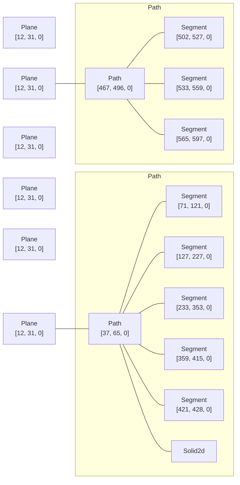

```mermaid
flowchart LR
  subgraph path7 [Path]
    7["Path<br>[37, 65, 0]"]
    8["Segment<br>[71, 121, 0]"]
    9["Segment<br>[127, 227, 0]"]
    10["Segment<br>[233, 353, 0]"]
    11["Segment<br>[359, 415, 0]"]
    12["Segment<br>[421, 428, 0]"]
    13[Solid2d]
  end
  subgraph path14 [Path]
    14["Path<br>[467, 496, 0]"]
    15["Segment<br>[502, 527, 0]"]
    16["Segment<br>[533, 559, 0]"]
    17["Segment<br>[565, 597, 0]"]
  end
  1["Plane<br>[12, 31, 0]"]
  2["Plane<br>[12, 31, 0]"]
  3["Plane<br>[12, 31, 0]"]
  4["Plane<br>[12, 31, 0]"]
  5["Plane<br>[12, 31, 0]"]
  6["Plane<br>[12, 31, 0]"]
  2 --- 7
  6 --- 14
  7 --- 8
  7 --- 9
  7 --- 10
  7 --- 11
  7 --- 12
  7 --- 13
  14 --- 15
  14 --- 16
  14 --- 17
```
