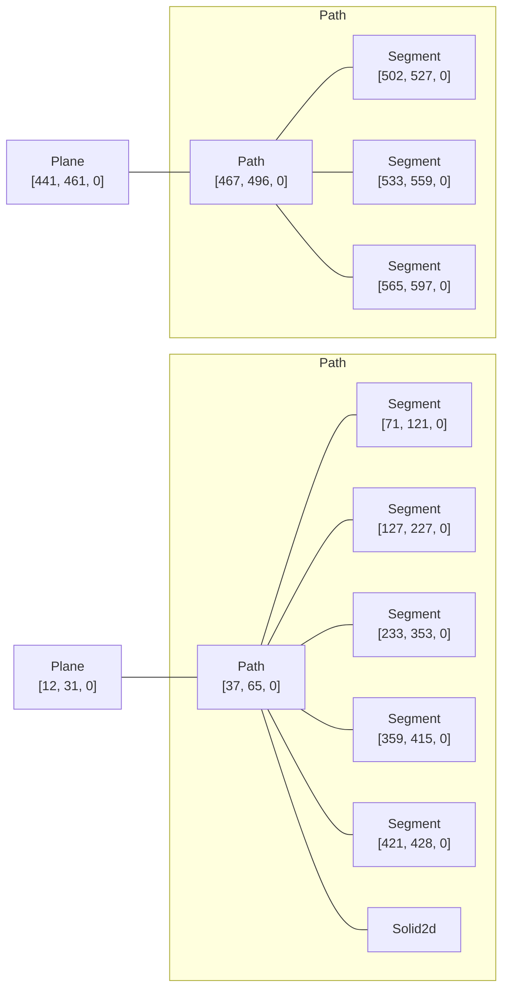

```mermaid
flowchart LR
  subgraph path2 [Path]
    2["Path<br>[37, 65, 0]"]
    3["Segment<br>[71, 121, 0]"]
    4["Segment<br>[127, 227, 0]"]
    5["Segment<br>[233, 353, 0]"]
    6["Segment<br>[359, 415, 0]"]
    7["Segment<br>[421, 428, 0]"]
    8[Solid2d]
  end
  subgraph path10 [Path]
    10["Path<br>[467, 496, 0]"]
    11["Segment<br>[502, 527, 0]"]
    12["Segment<br>[533, 559, 0]"]
    13["Segment<br>[565, 597, 0]"]
  end
  1["Plane<br>[12, 31, 0]"]
  9["Plane<br>[441, 461, 0]"]
  1 --- 2
  2 --- 3
  2 --- 4
  2 --- 5
  2 --- 6
  2 --- 7
  2 --- 8
  9 --- 10
  10 --- 11
  10 --- 12
  10 --- 13
```
