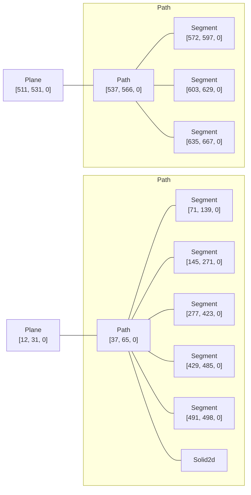

```mermaid
flowchart LR
  subgraph path2 [Path]
    2["Path<br>[37, 65, 0]"]
    3["Segment<br>[71, 139, 0]"]
    4["Segment<br>[145, 271, 0]"]
    5["Segment<br>[277, 423, 0]"]
    6["Segment<br>[429, 485, 0]"]
    7["Segment<br>[491, 498, 0]"]
    8[Solid2d]
  end
  subgraph path10 [Path]
    10["Path<br>[537, 566, 0]"]
    11["Segment<br>[572, 597, 0]"]
    12["Segment<br>[603, 629, 0]"]
    13["Segment<br>[635, 667, 0]"]
  end
  1["Plane<br>[12, 31, 0]"]
  9["Plane<br>[511, 531, 0]"]
  1 --- 2
  2 --- 3
  2 --- 4
  2 --- 5
  2 --- 6
  2 --- 7
  2 --- 8
  9 --- 10
  10 --- 11
  10 --- 12
  10 --- 13
```
