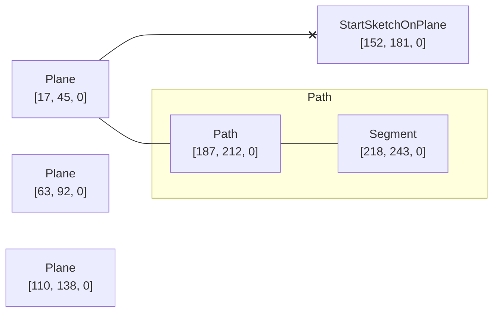

```mermaid
flowchart LR
  subgraph path5 [Path]
    5["Path<br>[187, 212, 0]"]
    6["Segment<br>[218, 243, 0]"]
  end
  1["Plane<br>[17, 45, 0]"]
  2["Plane<br>[63, 92, 0]"]
  3["Plane<br>[110, 138, 0]"]
  4["StartSketchOnPlane<br>[152, 181, 0]"]
  1 <--x 4
  1 --- 5
  5 --- 6
```
