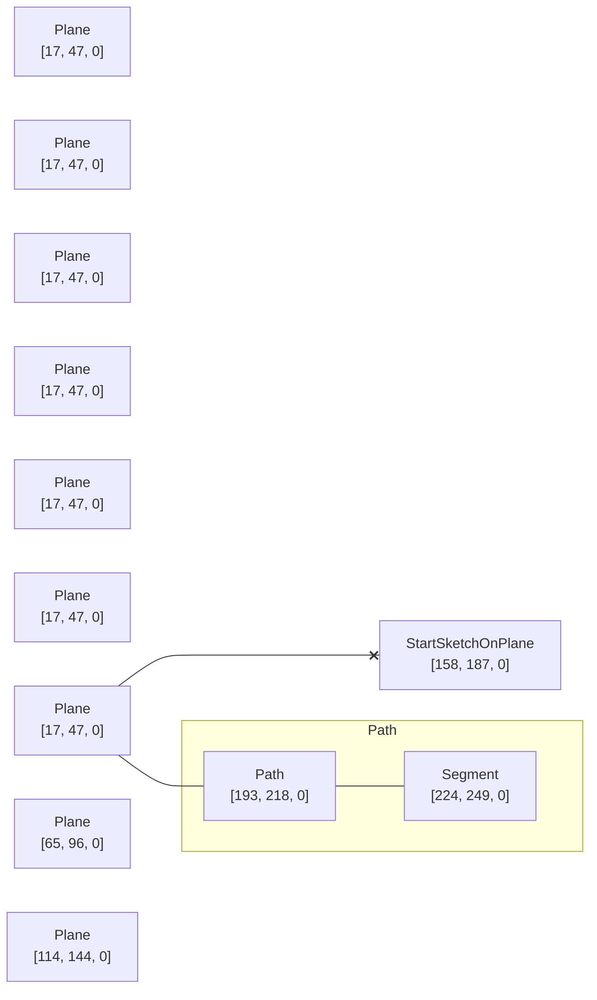

```mermaid
flowchart LR
  subgraph path10 [Path]
    10["Path<br>[193, 218, 0]"]
    11["Segment<br>[224, 249, 0]"]
  end
  1["Plane<br>[17, 47, 0]"]
  2["Plane<br>[17, 47, 0]"]
  3["Plane<br>[17, 47, 0]"]
  4["Plane<br>[17, 47, 0]"]
  5["Plane<br>[17, 47, 0]"]
  6["Plane<br>[17, 47, 0]"]
  7["Plane<br>[17, 47, 0]"]
  8["Plane<br>[65, 96, 0]"]
  9["Plane<br>[114, 144, 0]"]
  12["StartSketchOnPlane<br>[158, 187, 0]"]
  7 --- 10
  10 --- 11
  7 <--x 12
```
