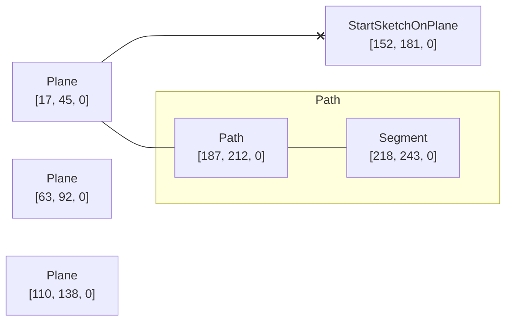

```mermaid
flowchart LR
  subgraph path5 [Path]
    5["Path<br>[187, 212, 0]"]
      %% [ProgramBodyItem { index: 3 }, VariableDeclarationDeclaration, VariableDeclarationInit, PipeBodyItem { index: 1 }]
    6["Segment<br>[218, 243, 0]"]
      %% [ProgramBodyItem { index: 3 }, VariableDeclarationDeclaration, VariableDeclarationInit, PipeBodyItem { index: 2 }]
  end
  1["Plane<br>[17, 45, 0]"]
    %% [ProgramBodyItem { index: 0 }, VariableDeclarationDeclaration, VariableDeclarationInit]
  2["Plane<br>[63, 92, 0]"]
    %% [ProgramBodyItem { index: 1 }, VariableDeclarationDeclaration, VariableDeclarationInit]
  3["Plane<br>[110, 138, 0]"]
    %% [ProgramBodyItem { index: 2 }, VariableDeclarationDeclaration, VariableDeclarationInit]
  4["StartSketchOnPlane<br>[152, 181, 0]"]
    %% Missing NodePath
  1 <--x 4
  1 --- 5
  5 --- 6
```
