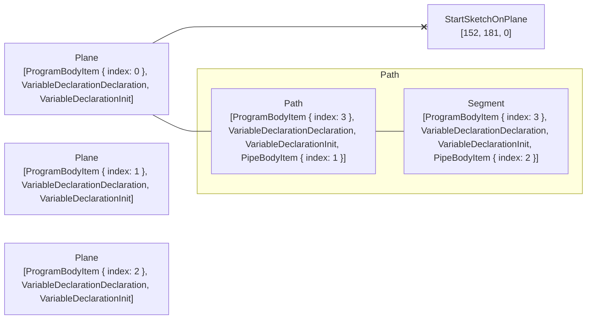

```mermaid
flowchart LR
  subgraph path5 [Path]
    5["Path<br>[ProgramBodyItem { index: 3 }, VariableDeclarationDeclaration, VariableDeclarationInit, PipeBodyItem { index: 1 }]"]
    6["Segment<br>[ProgramBodyItem { index: 3 }, VariableDeclarationDeclaration, VariableDeclarationInit, PipeBodyItem { index: 2 }]"]
  end
  1["Plane<br>[ProgramBodyItem { index: 0 }, VariableDeclarationDeclaration, VariableDeclarationInit]"]
  2["Plane<br>[ProgramBodyItem { index: 1 }, VariableDeclarationDeclaration, VariableDeclarationInit]"]
  3["Plane<br>[ProgramBodyItem { index: 2 }, VariableDeclarationDeclaration, VariableDeclarationInit]"]
  4["StartSketchOnPlane<br>[152, 181, 0]"]
  1 <--x 4
  1 --- 5
  5 --- 6
```
