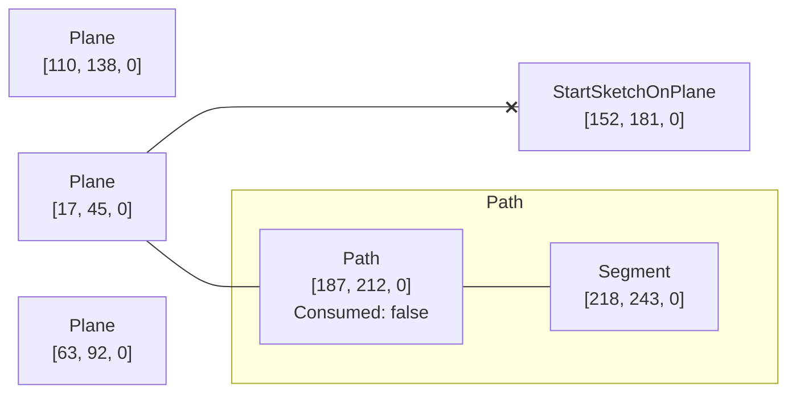

```mermaid
flowchart LR
  subgraph path1 [Path]
    1["Path<br>[187, 212, 0]<br>Consumed: false"]
      %% [ProgramBodyItem { index: 3 }, VariableDeclarationDeclaration, VariableDeclarationInit, PipeBodyItem { index: 1 }]
    5["Segment<br>[218, 243, 0]"]
      %% [ProgramBodyItem { index: 3 }, VariableDeclarationDeclaration, VariableDeclarationInit, PipeBodyItem { index: 2 }]
  end
  2["Plane<br>[110, 138, 0]"]
    %% [ProgramBodyItem { index: 2 }, VariableDeclarationDeclaration, VariableDeclarationInit]
  3["Plane<br>[17, 45, 0]"]
    %% [ProgramBodyItem { index: 0 }, VariableDeclarationDeclaration, VariableDeclarationInit]
  4["Plane<br>[63, 92, 0]"]
    %% [ProgramBodyItem { index: 1 }, VariableDeclarationDeclaration, VariableDeclarationInit]
  6["StartSketchOnPlane<br>[152, 181, 0]"]
    %% [ProgramBodyItem { index: 3 }, VariableDeclarationDeclaration, VariableDeclarationInit, PipeBodyItem { index: 0 }]
  3 --- 1
  1 --- 5
  3 <--x 6
```
