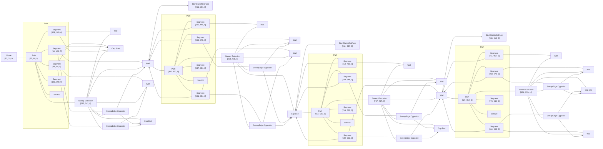

```mermaid
flowchart LR
  subgraph path2 [Path]
    2["Path<br>[35, 60, 0]"]
    3["Segment<br>[66, 84, 0]"]
    4["Segment<br>[90, 123, 0]"]
    5["Segment<br>[129, 185, 0]"]
    6["Segment<br>[191, 198, 0]"]
    7[Solid2d]
  end
  subgraph path16 [Path]
    16["Path<br>[300, 330, 0]"]
    17["Segment<br>[336, 354, 0]"]
    18["Segment<br>[360, 379, 0]"]
    19["Segment<br>[385, 441, 0]"]
    20["Segment<br>[447, 454, 0]"]
    21[Solid2d]
  end
  subgraph path29 [Path]
    29["Path<br>[556, 583, 0]"]
    30["Segment<br>[589, 623, 0]"]
    31["Segment<br>[629, 648, 0]"]
    32["Segment<br>[654, 710, 0]"]
    33["Segment<br>[716, 723, 0]"]
    34[Solid2d]
  end
  subgraph path42 [Path]
    42["Path<br>[825, 852, 0]"]
    43["Segment<br>[858, 878, 0]"]
    44["Segment<br>[884, 905, 0]"]
    45["Segment<br>[911, 967, 0]"]
    46["Segment<br>[973, 980, 0]"]
    47[Solid2d]
  end
  1["Plane<br>[12, 29, 0]"]
  8["Sweep Extrusion<br>[212, 242, 0]"]
  9[Wall]
  10[Wall]
  11[Wall]
  12["Cap Start"]
  13["Cap End"]
  14["SweepEdge Opposite"]
  15["SweepEdge Opposite"]
  22["Sweep Extrusion<br>[468, 498, 0]"]
  23[Wall]
  24[Wall]
  25[Wall]
  26["Cap End"]
  27["SweepEdge Opposite"]
  28["SweepEdge Opposite"]
  35["Sweep Extrusion<br>[737, 767, 0]"]
  36[Wall]
  37[Wall]
  38[Wall]
  39["Cap End"]
  40["SweepEdge Opposite"]
  41["SweepEdge Opposite"]
  48["Sweep Extrusion<br>[994, 1024, 0]"]
  49[Wall]
  50[Wall]
  51[Wall]
  52["Cap End"]
  53["SweepEdge Opposite"]
  54["SweepEdge Opposite"]
  55["StartSketchOnFace<br>[255, 294, 0]"]
  56["StartSketchOnFace<br>[511, 550, 0]"]
  57["StartSketchOnFace<br>[780, 819, 0]"]
  1 --- 2
  2 --- 3
  2 --- 4
  2 --- 5
  2 --- 6
  2 ---- 8
  2 --- 7
  3 --- 11
  3 --- 15
  3 x--> 12
  4 --- 10
  4 --- 14
  4 x--> 12
  5 --- 9
  5 x--> 12
  8 --- 9
  8 --- 10
  8 --- 11
  8 --- 12
  8 --- 13
  8 --- 14
  8 --- 15
  10 --- 16
  14 <--x 10
  14 <--x 13
  15 <--x 11
  15 <--x 13
  16 --- 17
  16 --- 18
  16 --- 19
  16 --- 20
  16 ---- 22
  16 --- 21
  17 --- 25
  17 --- 28
  17 <--x 10
  18 --- 24
  18 --- 27
  18 <--x 10
  19 --- 23
  19 <--x 10
  22 --- 23
  22 --- 24
  22 --- 25
  22 --- 26
  22 --- 27
  22 --- 28
  26 --- 29
  27 <--x 24
  27 <--x 26
  28 <--x 25
  28 <--x 26
  29 --- 30
  29 --- 31
  29 --- 32
  29 --- 33
  29 ---- 35
  29 --- 34
  30 --- 38
  30 --- 41
  30 <--x 26
  31 --- 37
  31 --- 40
  31 <--x 26
  32 --- 36
  32 <--x 26
  35 --- 36
  35 --- 37
  35 --- 38
  35 --- 39
  35 --- 40
  35 --- 41
  38 --- 42
  40 <--x 37
  40 <--x 39
  41 <--x 38
  41 <--x 39
  42 --- 43
  42 --- 44
  42 --- 45
  42 --- 46
  42 ---- 48
  42 --- 47
  43 --- 51
  43 --- 54
  43 <--x 38
  44 --- 50
  44 --- 53
  44 <--x 38
  45 --- 49
  45 <--x 38
  48 --- 49
  48 --- 50
  48 --- 51
  48 --- 52
  48 --- 53
  48 --- 54
  53 <--x 50
  53 <--x 52
  54 <--x 51
  54 <--x 52
  10 <--x 55
  26 <--x 56
  38 <--x 57
```
