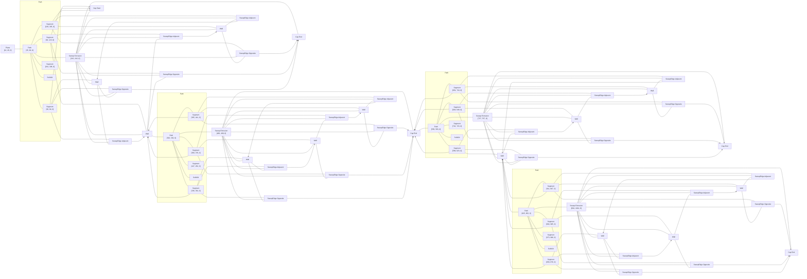

```mermaid
flowchart LR
  subgraph path2 [Path]
    2["Path<br>[35, 60, 0]"]
      %% [ProgramBodyItem { index: 0 }, VariableDeclarationDeclaration, VariableDeclarationInit, PipeBodyItem { index: 1 }]
    3["Segment<br>[66, 84, 0]"]
      %% [ProgramBodyItem { index: 0 }, VariableDeclarationDeclaration, VariableDeclarationInit, PipeBodyItem { index: 2 }]
    4["Segment<br>[90, 123, 0]"]
      %% [ProgramBodyItem { index: 0 }, VariableDeclarationDeclaration, VariableDeclarationInit, PipeBodyItem { index: 3 }]
    5["Segment<br>[129, 185, 0]"]
      %% [ProgramBodyItem { index: 0 }, VariableDeclarationDeclaration, VariableDeclarationInit, PipeBodyItem { index: 4 }]
    6["Segment<br>[191, 198, 0]"]
      %% [ProgramBodyItem { index: 0 }, VariableDeclarationDeclaration, VariableDeclarationInit, PipeBodyItem { index: 5 }]
    7[Solid2d]
  end
  subgraph path20 [Path]
    20["Path<br>[300, 330, 0]"]
      %% [ProgramBodyItem { index: 2 }, VariableDeclarationDeclaration, VariableDeclarationInit, PipeBodyItem { index: 1 }]
    21["Segment<br>[336, 354, 0]"]
      %% [ProgramBodyItem { index: 2 }, VariableDeclarationDeclaration, VariableDeclarationInit, PipeBodyItem { index: 2 }]
    22["Segment<br>[360, 379, 0]"]
      %% [ProgramBodyItem { index: 2 }, VariableDeclarationDeclaration, VariableDeclarationInit, PipeBodyItem { index: 3 }]
    23["Segment<br>[385, 441, 0]"]
      %% [ProgramBodyItem { index: 2 }, VariableDeclarationDeclaration, VariableDeclarationInit, PipeBodyItem { index: 4 }]
    24["Segment<br>[447, 454, 0]"]
      %% [ProgramBodyItem { index: 2 }, VariableDeclarationDeclaration, VariableDeclarationInit, PipeBodyItem { index: 5 }]
    25[Solid2d]
  end
  subgraph path37 [Path]
    37["Path<br>[556, 583, 0]"]
      %% [ProgramBodyItem { index: 4 }, VariableDeclarationDeclaration, VariableDeclarationInit, PipeBodyItem { index: 1 }]
    38["Segment<br>[589, 623, 0]"]
      %% [ProgramBodyItem { index: 4 }, VariableDeclarationDeclaration, VariableDeclarationInit, PipeBodyItem { index: 2 }]
    39["Segment<br>[629, 648, 0]"]
      %% [ProgramBodyItem { index: 4 }, VariableDeclarationDeclaration, VariableDeclarationInit, PipeBodyItem { index: 3 }]
    40["Segment<br>[654, 710, 0]"]
      %% [ProgramBodyItem { index: 4 }, VariableDeclarationDeclaration, VariableDeclarationInit, PipeBodyItem { index: 4 }]
    41["Segment<br>[716, 723, 0]"]
      %% [ProgramBodyItem { index: 4 }, VariableDeclarationDeclaration, VariableDeclarationInit, PipeBodyItem { index: 5 }]
    42[Solid2d]
  end
  subgraph path54 [Path]
    54["Path<br>[825, 852, 0]"]
      %% [ProgramBodyItem { index: 6 }, VariableDeclarationDeclaration, VariableDeclarationInit, PipeBodyItem { index: 1 }]
    55["Segment<br>[858, 878, 0]"]
      %% [ProgramBodyItem { index: 6 }, VariableDeclarationDeclaration, VariableDeclarationInit, PipeBodyItem { index: 2 }]
    56["Segment<br>[884, 905, 0]"]
      %% [ProgramBodyItem { index: 6 }, VariableDeclarationDeclaration, VariableDeclarationInit, PipeBodyItem { index: 3 }]
    57["Segment<br>[911, 967, 0]"]
      %% [ProgramBodyItem { index: 6 }, VariableDeclarationDeclaration, VariableDeclarationInit, PipeBodyItem { index: 4 }]
    58["Segment<br>[973, 980, 0]"]
      %% [ProgramBodyItem { index: 6 }, VariableDeclarationDeclaration, VariableDeclarationInit, PipeBodyItem { index: 5 }]
    59[Solid2d]
  end
  1["Plane<br>[12, 29, 0]"]
    %% [ProgramBodyItem { index: 0 }, VariableDeclarationDeclaration, VariableDeclarationInit, PipeBodyItem { index: 0 }]
  8["Sweep Extrusion<br>[212, 242, 0]"]
    %% [ProgramBodyItem { index: 1 }, VariableDeclarationDeclaration, VariableDeclarationInit]
  9[Wall]
    %% face_code_ref=Missing NodePath
  10[Wall]
    %% face_code_ref=Missing NodePath
  11[Wall]
    %% face_code_ref=Missing NodePath
  12["Cap Start"]
    %% face_code_ref=Missing NodePath
  13["Cap End"]
    %% face_code_ref=Missing NodePath
  14["SweepEdge Opposite"]
  15["SweepEdge Adjacent"]
  16["SweepEdge Opposite"]
  17["SweepEdge Adjacent"]
  18["SweepEdge Opposite"]
  19["SweepEdge Adjacent"]
  26["Sweep Extrusion<br>[468, 498, 0]"]
    %% [ProgramBodyItem { index: 3 }, VariableDeclarationDeclaration, VariableDeclarationInit]
  27[Wall]
    %% face_code_ref=Missing NodePath
  28[Wall]
    %% face_code_ref=Missing NodePath
  29[Wall]
    %% face_code_ref=Missing NodePath
  30["Cap End"]
    %% face_code_ref=Missing NodePath
  31["SweepEdge Opposite"]
  32["SweepEdge Adjacent"]
  33["SweepEdge Opposite"]
  34["SweepEdge Adjacent"]
  35["SweepEdge Opposite"]
  36["SweepEdge Adjacent"]
  43["Sweep Extrusion<br>[737, 767, 0]"]
    %% [ProgramBodyItem { index: 5 }, VariableDeclarationDeclaration, VariableDeclarationInit]
  44[Wall]
    %% face_code_ref=Missing NodePath
  45[Wall]
    %% face_code_ref=Missing NodePath
  46[Wall]
    %% face_code_ref=Missing NodePath
  47["Cap End"]
    %% face_code_ref=Missing NodePath
  48["SweepEdge Opposite"]
  49["SweepEdge Adjacent"]
  50["SweepEdge Opposite"]
  51["SweepEdge Adjacent"]
  52["SweepEdge Opposite"]
  53["SweepEdge Adjacent"]
  60["Sweep Extrusion<br>[994, 1024, 0]"]
    %% [ProgramBodyItem { index: 7 }, VariableDeclarationDeclaration, VariableDeclarationInit]
  61[Wall]
    %% face_code_ref=Missing NodePath
  62[Wall]
    %% face_code_ref=Missing NodePath
  63[Wall]
    %% face_code_ref=Missing NodePath
  64["Cap End"]
    %% face_code_ref=Missing NodePath
  65["SweepEdge Opposite"]
  66["SweepEdge Adjacent"]
  67["SweepEdge Opposite"]
  68["SweepEdge Adjacent"]
  69["SweepEdge Opposite"]
  70["SweepEdge Adjacent"]
  1 --- 2
  2 --- 3
  2 --- 4
  2 --- 5
  2 --- 6
  2 --- 7
  2 ---- 8
  3 --- 11
  3 x--> 12
  3 --- 18
  3 --- 19
  4 --- 10
  4 x--> 12
  4 --- 16
  4 --- 17
  5 --- 9
  5 x--> 12
  5 --- 14
  5 --- 15
  8 --- 9
  8 --- 10
  8 --- 11
  8 --- 12
  8 --- 13
  8 --- 14
  8 --- 15
  8 --- 16
  8 --- 17
  8 --- 18
  8 --- 19
  9 --- 14
  9 --- 15
  17 <--x 9
  10 --- 16
  10 --- 17
  19 <--x 10
  10 --- 20
  21 <--x 10
  22 <--x 10
  23 <--x 10
  15 <--x 11
  11 --- 18
  11 --- 19
  14 <--x 13
  16 <--x 13
  18 <--x 13
  20 --- 21
  20 --- 22
  20 --- 23
  20 --- 24
  20 --- 25
  20 ---- 26
  21 --- 29
  21 --- 35
  21 --- 36
  22 --- 28
  22 --- 33
  22 --- 34
  23 --- 27
  23 --- 31
  23 --- 32
  26 --- 27
  26 --- 28
  26 --- 29
  26 --- 30
  26 --- 31
  26 --- 32
  26 --- 33
  26 --- 34
  26 --- 35
  26 --- 36
  27 --- 31
  27 --- 32
  34 <--x 27
  28 --- 33
  28 --- 34
  36 <--x 28
  32 <--x 29
  29 --- 35
  29 --- 36
  31 <--x 30
  33 <--x 30
  35 <--x 30
  30 --- 37
  38 <--x 30
  39 <--x 30
  40 <--x 30
  37 --- 38
  37 --- 39
  37 --- 40
  37 --- 41
  37 --- 42
  37 ---- 43
  38 --- 46
  38 --- 52
  38 --- 53
  39 --- 45
  39 --- 50
  39 --- 51
  40 --- 44
  40 --- 48
  40 --- 49
  43 --- 44
  43 --- 45
  43 --- 46
  43 --- 47
  43 --- 48
  43 --- 49
  43 --- 50
  43 --- 51
  43 --- 52
  43 --- 53
  44 --- 48
  44 --- 49
  51 <--x 44
  45 --- 50
  45 --- 51
  53 <--x 45
  49 <--x 46
  46 --- 52
  46 --- 53
  46 --- 54
  55 <--x 46
  56 <--x 46
  57 <--x 46
  48 <--x 47
  50 <--x 47
  52 <--x 47
  54 --- 55
  54 --- 56
  54 --- 57
  54 --- 58
  54 --- 59
  54 ---- 60
  55 --- 63
  55 --- 69
  55 --- 70
  56 --- 62
  56 --- 67
  56 --- 68
  57 --- 61
  57 --- 65
  57 --- 66
  60 --- 61
  60 --- 62
  60 --- 63
  60 --- 64
  60 --- 65
  60 --- 66
  60 --- 67
  60 --- 68
  60 --- 69
  60 --- 70
  61 --- 65
  61 --- 66
  68 <--x 61
  62 --- 67
  62 --- 68
  70 <--x 62
  66 <--x 63
  63 --- 69
  63 --- 70
  65 <--x 64
  67 <--x 64
  69 <--x 64
```
