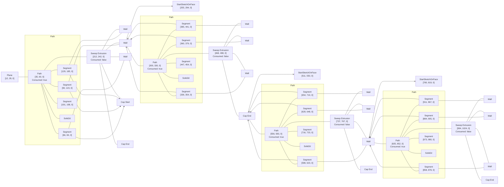

```mermaid
flowchart LR
  subgraph path2 [Path]
    2["Path<br>[35, 60, 0]<br>Consumed: true"]
      %% [ProgramBodyItem { index: 0 }, VariableDeclarationDeclaration, VariableDeclarationInit, PipeBodyItem { index: 1 }]
    3["Segment<br>[66, 84, 0]"]
      %% [ProgramBodyItem { index: 0 }, VariableDeclarationDeclaration, VariableDeclarationInit, PipeBodyItem { index: 2 }]
    4["Segment<br>[90, 123, 0]"]
      %% [ProgramBodyItem { index: 0 }, VariableDeclarationDeclaration, VariableDeclarationInit, PipeBodyItem { index: 3 }]
    5["Segment<br>[129, 185, 0]"]
      %% [ProgramBodyItem { index: 0 }, VariableDeclarationDeclaration, VariableDeclarationInit, PipeBodyItem { index: 4 }]
    6["Segment<br>[191, 198, 0]"]
      %% [ProgramBodyItem { index: 0 }, VariableDeclarationDeclaration, VariableDeclarationInit, PipeBodyItem { index: 5 }]
    7[Solid2d]
  end
  subgraph path14 [Path]
    14["Path<br>[300, 330, 0]<br>Consumed: true"]
      %% [ProgramBodyItem { index: 2 }, VariableDeclarationDeclaration, VariableDeclarationInit, PipeBodyItem { index: 1 }]
    15["Segment<br>[336, 354, 0]"]
      %% [ProgramBodyItem { index: 2 }, VariableDeclarationDeclaration, VariableDeclarationInit, PipeBodyItem { index: 2 }]
    16["Segment<br>[360, 379, 0]"]
      %% [ProgramBodyItem { index: 2 }, VariableDeclarationDeclaration, VariableDeclarationInit, PipeBodyItem { index: 3 }]
    17["Segment<br>[385, 441, 0]"]
      %% [ProgramBodyItem { index: 2 }, VariableDeclarationDeclaration, VariableDeclarationInit, PipeBodyItem { index: 4 }]
    18["Segment<br>[447, 454, 0]"]
      %% [ProgramBodyItem { index: 2 }, VariableDeclarationDeclaration, VariableDeclarationInit, PipeBodyItem { index: 5 }]
    19[Solid2d]
  end
  subgraph path25 [Path]
    25["Path<br>[556, 583, 0]<br>Consumed: true"]
      %% [ProgramBodyItem { index: 4 }, VariableDeclarationDeclaration, VariableDeclarationInit, PipeBodyItem { index: 1 }]
    26["Segment<br>[589, 623, 0]"]
      %% [ProgramBodyItem { index: 4 }, VariableDeclarationDeclaration, VariableDeclarationInit, PipeBodyItem { index: 2 }]
    27["Segment<br>[629, 648, 0]"]
      %% [ProgramBodyItem { index: 4 }, VariableDeclarationDeclaration, VariableDeclarationInit, PipeBodyItem { index: 3 }]
    28["Segment<br>[654, 710, 0]"]
      %% [ProgramBodyItem { index: 4 }, VariableDeclarationDeclaration, VariableDeclarationInit, PipeBodyItem { index: 4 }]
    29["Segment<br>[716, 723, 0]"]
      %% [ProgramBodyItem { index: 4 }, VariableDeclarationDeclaration, VariableDeclarationInit, PipeBodyItem { index: 5 }]
    30[Solid2d]
  end
  subgraph path36 [Path]
    36["Path<br>[825, 852, 0]<br>Consumed: true"]
      %% [ProgramBodyItem { index: 6 }, VariableDeclarationDeclaration, VariableDeclarationInit, PipeBodyItem { index: 1 }]
    37["Segment<br>[858, 878, 0]"]
      %% [ProgramBodyItem { index: 6 }, VariableDeclarationDeclaration, VariableDeclarationInit, PipeBodyItem { index: 2 }]
    38["Segment<br>[884, 905, 0]"]
      %% [ProgramBodyItem { index: 6 }, VariableDeclarationDeclaration, VariableDeclarationInit, PipeBodyItem { index: 3 }]
    39["Segment<br>[911, 967, 0]"]
      %% [ProgramBodyItem { index: 6 }, VariableDeclarationDeclaration, VariableDeclarationInit, PipeBodyItem { index: 4 }]
    40["Segment<br>[973, 980, 0]"]
      %% [ProgramBodyItem { index: 6 }, VariableDeclarationDeclaration, VariableDeclarationInit, PipeBodyItem { index: 5 }]
    41[Solid2d]
  end
  1["Plane<br>[12, 29, 0]"]
    %% [ProgramBodyItem { index: 0 }, VariableDeclarationDeclaration, VariableDeclarationInit, PipeBodyItem { index: 0 }]
  8["Sweep Extrusion<br>[212, 242, 0]<br>Consumed: false"]
    %% [ProgramBodyItem { index: 1 }, VariableDeclarationDeclaration, VariableDeclarationInit]
  9[Wall]
    %% face_code_ref=Missing NodePath
  10[Wall]
    %% face_code_ref=[ProgramBodyItem { index: 2 }, VariableDeclarationDeclaration, VariableDeclarationInit, PipeBodyItem { index: 0 }]
  11[Wall]
    %% face_code_ref=Missing NodePath
  12["Cap Start"]
    %% face_code_ref=Missing NodePath
  13["Cap End"]
    %% face_code_ref=Missing NodePath
  20["Sweep Extrusion<br>[468, 498, 0]<br>Consumed: false"]
    %% [ProgramBodyItem { index: 3 }, VariableDeclarationDeclaration, VariableDeclarationInit]
  21[Wall]
    %% face_code_ref=Missing NodePath
  22[Wall]
    %% face_code_ref=Missing NodePath
  23[Wall]
    %% face_code_ref=Missing NodePath
  24["Cap End"]
    %% face_code_ref=[ProgramBodyItem { index: 4 }, VariableDeclarationDeclaration, VariableDeclarationInit, PipeBodyItem { index: 0 }]
  31["Sweep Extrusion<br>[737, 767, 0]<br>Consumed: false"]
    %% [ProgramBodyItem { index: 5 }, VariableDeclarationDeclaration, VariableDeclarationInit]
  32[Wall]
    %% face_code_ref=Missing NodePath
  33[Wall]
    %% face_code_ref=Missing NodePath
  34[Wall]
    %% face_code_ref=[ProgramBodyItem { index: 6 }, VariableDeclarationDeclaration, VariableDeclarationInit, PipeBodyItem { index: 0 }]
  35["Cap End"]
    %% face_code_ref=Missing NodePath
  42["Sweep Extrusion<br>[994, 1024, 0]<br>Consumed: false"]
    %% [ProgramBodyItem { index: 7 }, VariableDeclarationDeclaration, VariableDeclarationInit]
  43[Wall]
    %% face_code_ref=Missing NodePath
  44[Wall]
    %% face_code_ref=Missing NodePath
  45[Wall]
    %% face_code_ref=Missing NodePath
  46["Cap End"]
    %% face_code_ref=Missing NodePath
  47["StartSketchOnFace<br>[255, 294, 0]"]
    %% [ProgramBodyItem { index: 2 }, VariableDeclarationDeclaration, VariableDeclarationInit, PipeBodyItem { index: 0 }]
  48["StartSketchOnFace<br>[511, 550, 0]"]
    %% [ProgramBodyItem { index: 4 }, VariableDeclarationDeclaration, VariableDeclarationInit, PipeBodyItem { index: 0 }]
  49["StartSketchOnFace<br>[780, 819, 0]"]
    %% [ProgramBodyItem { index: 6 }, VariableDeclarationDeclaration, VariableDeclarationInit, PipeBodyItem { index: 0 }]
  1 --- 2
  2 --- 3
  2 --- 4
  2 --- 5
  2 --- 6
  2 --- 7
  2 ---- 8
  3 --- 11
  3 x--> 12
  4 --- 10
  4 x--> 12
  5 --- 9
  5 x--> 12
  8 --- 9
  8 --- 10
  8 --- 11
  8 --- 12
  8 --- 13
  10 --- 14
  15 <--x 10
  16 <--x 10
  17 <--x 10
  10 <--x 47
  14 --- 15
  14 --- 16
  14 --- 17
  14 --- 18
  14 --- 19
  14 ---- 20
  15 --- 23
  16 --- 22
  17 --- 21
  20 --- 21
  20 --- 22
  20 --- 23
  20 --- 24
  24 --- 25
  26 <--x 24
  27 <--x 24
  28 <--x 24
  24 <--x 48
  25 --- 26
  25 --- 27
  25 --- 28
  25 --- 29
  25 --- 30
  25 ---- 31
  26 --- 34
  27 --- 33
  28 --- 32
  31 --- 32
  31 --- 33
  31 --- 34
  31 --- 35
  34 --- 36
  37 <--x 34
  38 <--x 34
  39 <--x 34
  34 <--x 49
  36 --- 37
  36 --- 38
  36 --- 39
  36 --- 40
  36 --- 41
  36 ---- 42
  37 --- 45
  38 --- 44
  39 --- 43
  42 --- 43
  42 --- 44
  42 --- 45
  42 --- 46
```
