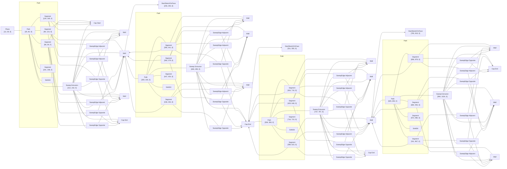

```mermaid
flowchart LR
  subgraph path2 [Path]
    2["Path<br>[35, 60, 0]"]
    3["Segment<br>[66, 84, 0]"]
    4["Segment<br>[90, 123, 0]"]
    5["Segment<br>[129, 185, 0]"]
    6["Segment<br>[191, 198, 0]"]
    7[Solid2d]
  end
  subgraph path20 [Path]
    20["Path<br>[300, 330, 0]"]
    21["Segment<br>[336, 354, 0]"]
    22["Segment<br>[360, 379, 0]"]
    23["Segment<br>[385, 441, 0]"]
    24["Segment<br>[447, 454, 0]"]
    25[Solid2d]
  end
  subgraph path37 [Path]
    37["Path<br>[556, 583, 0]"]
    38["Segment<br>[589, 623, 0]"]
    39["Segment<br>[629, 648, 0]"]
    40["Segment<br>[654, 710, 0]"]
    41["Segment<br>[716, 723, 0]"]
    42[Solid2d]
  end
  subgraph path54 [Path]
    54["Path<br>[825, 852, 0]"]
    55["Segment<br>[858, 878, 0]"]
    56["Segment<br>[884, 905, 0]"]
    57["Segment<br>[911, 967, 0]"]
    58["Segment<br>[973, 980, 0]"]
    59[Solid2d]
  end
  1["Plane<br>[12, 29, 0]"]
  8["Sweep Extrusion<br>[212, 242, 0]"]
  9[Wall]
  10[Wall]
  11[Wall]
  12["Cap Start"]
  13["Cap End"]
  14["SweepEdge Opposite"]
  15["SweepEdge Adjacent"]
  16["SweepEdge Opposite"]
  17["SweepEdge Adjacent"]
  18["SweepEdge Opposite"]
  19["SweepEdge Adjacent"]
  26["Sweep Extrusion<br>[468, 498, 0]"]
  27[Wall]
  28[Wall]
  29[Wall]
  30["Cap End"]
  31["SweepEdge Opposite"]
  32["SweepEdge Adjacent"]
  33["SweepEdge Opposite"]
  34["SweepEdge Adjacent"]
  35["SweepEdge Opposite"]
  36["SweepEdge Adjacent"]
  43["Sweep Extrusion<br>[737, 767, 0]"]
  44[Wall]
  45[Wall]
  46[Wall]
  47["Cap End"]
  48["SweepEdge Opposite"]
  49["SweepEdge Adjacent"]
  50["SweepEdge Opposite"]
  51["SweepEdge Adjacent"]
  52["SweepEdge Opposite"]
  53["SweepEdge Adjacent"]
  60["Sweep Extrusion<br>[994, 1024, 0]"]
  61[Wall]
  62[Wall]
  63[Wall]
  64["Cap End"]
  65["SweepEdge Opposite"]
  66["SweepEdge Adjacent"]
  67["SweepEdge Opposite"]
  68["SweepEdge Adjacent"]
  69["SweepEdge Opposite"]
  70["SweepEdge Adjacent"]
  71["StartSketchOnFace<br>[255, 294, 0]"]
  72["StartSketchOnFace<br>[511, 550, 0]"]
  73["StartSketchOnFace<br>[780, 819, 0]"]
  1 --- 2
  2 --- 3
  2 --- 4
  2 --- 5
  2 --- 6
  2 ---- 8
  2 --- 7
  3 --- 11
  3 --- 18
  3 --- 19
  3 x--> 12
  4 --- 10
  4 --- 16
  4 --- 17
  4 x--> 12
  5 --- 9
  5 --- 14
  5 --- 15
  5 x--> 12
  8 --- 9
  8 --- 10
  8 --- 11
  8 --- 12
  8 --- 13
  8 --- 14
  8 --- 15
  8 --- 16
  8 --- 17
  8 --- 18
  8 --- 19
  10 --- 20
  14 <--x 9
  14 <--x 13
  15 <--x 9
  15 <--x 11
  16 <--x 10
  16 <--x 13
  17 <--x 9
  17 <--x 10
  18 <--x 11
  18 <--x 13
  19 <--x 10
  19 <--x 11
  20 --- 21
  20 --- 22
  20 --- 23
  20 --- 24
  20 ---- 26
  20 --- 25
  21 --- 29
  21 --- 35
  21 --- 36
  21 <--x 10
  22 --- 28
  22 --- 33
  22 --- 34
  22 <--x 10
  23 --- 27
  23 --- 31
  23 --- 32
  23 <--x 10
  26 --- 27
  26 --- 28
  26 --- 29
  26 --- 30
  26 --- 31
  26 --- 32
  26 --- 33
  26 --- 34
  26 --- 35
  26 --- 36
  30 --- 37
  31 <--x 27
  31 <--x 30
  32 <--x 27
  32 <--x 29
  33 <--x 28
  33 <--x 30
  34 <--x 27
  34 <--x 28
  35 <--x 29
  35 <--x 30
  36 <--x 28
  36 <--x 29
  37 --- 38
  37 --- 39
  37 --- 40
  37 --- 41
  37 ---- 43
  37 --- 42
  38 --- 46
  38 --- 52
  38 --- 53
  38 <--x 30
  39 --- 45
  39 --- 50
  39 --- 51
  39 <--x 30
  40 --- 44
  40 --- 48
  40 --- 49
  40 <--x 30
  43 --- 44
  43 --- 45
  43 --- 46
  43 --- 47
  43 --- 48
  43 --- 49
  43 --- 50
  43 --- 51
  43 --- 52
  43 --- 53
  46 --- 54
  48 <--x 44
  48 <--x 47
  49 <--x 44
  49 <--x 46
  50 <--x 45
  50 <--x 47
  51 <--x 44
  51 <--x 45
  52 <--x 46
  52 <--x 47
  53 <--x 45
  53 <--x 46
  54 --- 55
  54 --- 56
  54 --- 57
  54 --- 58
  54 ---- 60
  54 --- 59
  55 --- 63
  55 --- 69
  55 --- 70
  55 <--x 46
  56 --- 62
  56 --- 67
  56 --- 68
  56 <--x 46
  57 --- 61
  57 --- 65
  57 --- 66
  57 <--x 46
  60 --- 61
  60 --- 62
  60 --- 63
  60 --- 64
  60 --- 65
  60 --- 66
  60 --- 67
  60 --- 68
  60 --- 69
  60 --- 70
  65 <--x 61
  65 <--x 64
  66 <--x 61
  66 <--x 63
  67 <--x 62
  67 <--x 64
  68 <--x 61
  68 <--x 62
  69 <--x 63
  69 <--x 64
  70 <--x 62
  70 <--x 63
  10 <--x 71
  30 <--x 72
  46 <--x 73
```
