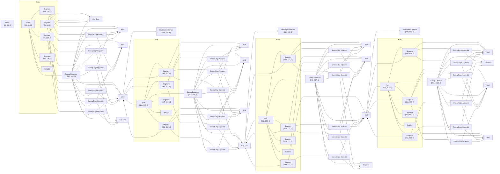

```mermaid
flowchart LR
  subgraph path5 [Path]
    5["Path<br>[35, 60, 0]"]
    9["Segment<br>[66, 84, 0]"]
    10["Segment<br>[90, 123, 0]"]
    11["Segment<br>[129, 185, 0]"]
    12["Segment<br>[191, 198, 0]"]
    27[Solid2d]
  end
  subgraph path6 [Path]
    6["Path<br>[300, 330, 0]"]
    13["Segment<br>[336, 354, 0]"]
    14["Segment<br>[360, 379, 0]"]
    15["Segment<br>[385, 441, 0]"]
    16["Segment<br>[447, 454, 0]"]
    25[Solid2d]
  end
  subgraph path7 [Path]
    7["Path<br>[556, 583, 0]"]
    17["Segment<br>[589, 623, 0]"]
    18["Segment<br>[629, 648, 0]"]
    19["Segment<br>[654, 710, 0]"]
    20["Segment<br>[716, 723, 0]"]
    28[Solid2d]
  end
  subgraph path8 [Path]
    8["Path<br>[825, 852, 0]"]
    21["Segment<br>[858, 878, 0]"]
    22["Segment<br>[884, 905, 0]"]
    23["Segment<br>[911, 967, 0]"]
    24["Segment<br>[973, 980, 0]"]
    26[Solid2d]
  end
  1["Plane<br>[12, 29, 0]"]
  2["StartSketchOnFace<br>[255, 294, 0]"]
  3["StartSketchOnFace<br>[780, 819, 0]"]
  4["StartSketchOnFace<br>[511, 550, 0]"]
  29["Sweep Extrusion<br>[212, 242, 0]"]
  30["Sweep Extrusion<br>[468, 498, 0]"]
  31["Sweep Extrusion<br>[737, 767, 0]"]
  32["Sweep Extrusion<br>[994, 1024, 0]"]
  33[Wall]
  34[Wall]
  35[Wall]
  36[Wall]
  37[Wall]
  38[Wall]
  39[Wall]
  40[Wall]
  41[Wall]
  42[Wall]
  43[Wall]
  44[Wall]
  45["Cap End"]
  46["Cap End"]
  47["Cap Start"]
  48["Cap End"]
  49["Cap End"]
  50["SweepEdge Opposite"]
  51["SweepEdge Adjacent"]
  52["SweepEdge Opposite"]
  53["SweepEdge Adjacent"]
  54["SweepEdge Opposite"]
  55["SweepEdge Adjacent"]
  56["SweepEdge Opposite"]
  57["SweepEdge Adjacent"]
  58["SweepEdge Opposite"]
  59["SweepEdge Adjacent"]
  60["SweepEdge Opposite"]
  61["SweepEdge Adjacent"]
  62["SweepEdge Opposite"]
  63["SweepEdge Adjacent"]
  64["SweepEdge Opposite"]
  65["SweepEdge Adjacent"]
  66["SweepEdge Opposite"]
  67["SweepEdge Adjacent"]
  68["SweepEdge Opposite"]
  69["SweepEdge Adjacent"]
  70["SweepEdge Opposite"]
  71["SweepEdge Adjacent"]
  72["SweepEdge Opposite"]
  73["SweepEdge Adjacent"]
  1 --- 5
  41 x--> 2
  44 x--> 3
  46 x--> 4
  5 --- 9
  5 --- 10
  5 --- 11
  5 --- 12
  5 --- 27
  5 ---- 29
  6 --- 13
  6 --- 14
  6 --- 15
  6 --- 16
  6 --- 25
  6 ---- 30
  41 --- 6
  7 --- 17
  7 --- 18
  7 --- 19
  7 --- 20
  7 --- 28
  7 ---- 31
  46 --- 7
  8 --- 21
  8 --- 22
  8 --- 23
  8 --- 24
  8 --- 26
  8 ---- 32
  44 --- 8
  9 --- 40
  9 x--> 47
  9 --- 66
  9 --- 67
  10 --- 41
  10 x--> 47
  10 --- 64
  10 --- 65
  11 --- 39
  11 x--> 47
  11 --- 62
  11 --- 63
  13 --- 38
  13 x--> 41
  13 --- 60
  13 --- 61
  14 --- 37
  14 x--> 41
  14 --- 58
  14 --- 59
  15 --- 36
  15 x--> 41
  15 --- 56
  15 --- 57
  17 --- 44
  17 x--> 46
  17 --- 70
  17 --- 71
  18 --- 42
  18 x--> 46
  18 --- 68
  18 --- 69
  19 --- 43
  19 x--> 46
  19 --- 72
  19 --- 73
  21 --- 33
  21 x--> 44
  21 --- 50
  21 --- 51
  22 --- 35
  22 x--> 44
  22 --- 54
  22 --- 55
  23 --- 34
  23 x--> 44
  23 --- 52
  23 --- 53
  29 --- 39
  29 --- 40
  29 --- 41
  29 --- 47
  29 --- 48
  29 --- 62
  29 --- 63
  29 --- 64
  29 --- 65
  29 --- 66
  29 --- 67
  30 --- 36
  30 --- 37
  30 --- 38
  30 --- 46
  30 --- 56
  30 --- 57
  30 --- 58
  30 --- 59
  30 --- 60
  30 --- 61
  31 --- 42
  31 --- 43
  31 --- 44
  31 --- 49
  31 --- 68
  31 --- 69
  31 --- 70
  31 --- 71
  31 --- 72
  31 --- 73
  32 --- 33
  32 --- 34
  32 --- 35
  32 --- 45
  32 --- 50
  32 --- 51
  32 --- 52
  32 --- 53
  32 --- 54
  32 --- 55
  50 <--x 33
  51 <--x 33
  53 <--x 33
  52 <--x 34
  53 <--x 34
  55 <--x 34
  51 <--x 35
  54 <--x 35
  55 <--x 35
  56 <--x 36
  57 <--x 36
  59 <--x 36
  58 <--x 37
  59 <--x 37
  61 <--x 37
  57 <--x 38
  60 <--x 38
  61 <--x 38
  62 <--x 39
  63 <--x 39
  65 <--x 39
  63 <--x 40
  66 <--x 40
  67 <--x 40
  64 <--x 41
  65 <--x 41
  67 <--x 41
  68 <--x 42
  69 <--x 42
  71 <--x 42
  69 <--x 43
  72 <--x 43
  73 <--x 43
  70 <--x 44
  71 <--x 44
  73 <--x 44
  50 <--x 45
  52 <--x 45
  54 <--x 45
  56 <--x 46
  58 <--x 46
  60 <--x 46
  62 <--x 48
  64 <--x 48
  66 <--x 48
  68 <--x 49
  70 <--x 49
  72 <--x 49
```
