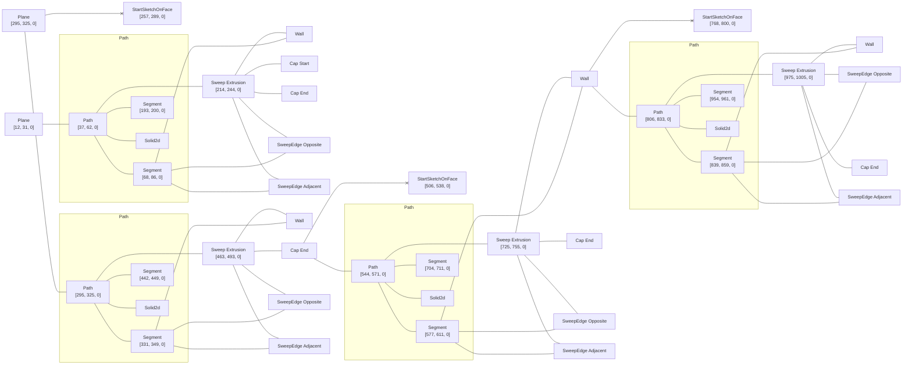

```mermaid
flowchart LR
  subgraph path2 [Path]
    2["Path<br>[37, 62, 0]"]
    3["Segment<br>[68, 86, 0]"]
    4["Segment<br>[193, 200, 0]"]
    5[Solid2d]
  end
  subgraph path13 [Path]
    13["Path<br>[295, 325, 0]"]
    14["Segment<br>[331, 349, 0]"]
    15["Segment<br>[442, 449, 0]"]
    16[Solid2d]
  end
  subgraph path22 [Path]
    22["Path<br>[544, 571, 0]"]
    23["Segment<br>[577, 611, 0]"]
    24["Segment<br>[704, 711, 0]"]
    25[Solid2d]
  end
  subgraph path31 [Path]
    31["Path<br>[806, 833, 0]"]
    32["Segment<br>[839, 859, 0]"]
    33["Segment<br>[954, 961, 0]"]
    34[Solid2d]
  end
  1["Plane<br>[12, 31, 0]"]
  6["Sweep Extrusion<br>[214, 244, 0]"]
  7[Wall]
  8["Cap Start"]
  9["Cap End"]
  10["SweepEdge Opposite"]
  11["SweepEdge Adjacent"]
  12["Plane<br>[295, 325, 0]"]
  17["Sweep Extrusion<br>[463, 493, 0]"]
  18[Wall]
  19["Cap End"]
  20["SweepEdge Opposite"]
  21["SweepEdge Adjacent"]
  26["Sweep Extrusion<br>[725, 755, 0]"]
  27[Wall]
  28["Cap End"]
  29["SweepEdge Opposite"]
  30["SweepEdge Adjacent"]
  35["Sweep Extrusion<br>[975, 1005, 0]"]
  36[Wall]
  37["Cap End"]
  38["SweepEdge Opposite"]
  39["SweepEdge Adjacent"]
  40["StartSketchOnFace<br>[257, 289, 0]"]
  41["StartSketchOnFace<br>[506, 538, 0]"]
  42["StartSketchOnFace<br>[768, 800, 0]"]
  1 --- 2
  2 --- 3
  2 --- 4
  2 ---- 6
  2 --- 5
  3 --- 7
  3 --- 10
  3 --- 11
  6 --- 7
  6 --- 8
  6 --- 9
  6 --- 10
  6 --- 11
  12 --- 13
  13 --- 14
  13 --- 15
  13 ---- 17
  13 --- 16
  14 --- 18
  14 --- 20
  14 --- 21
  17 --- 18
  17 --- 19
  17 --- 20
  17 --- 21
  19 --- 22
  22 --- 23
  22 --- 24
  22 ---- 26
  22 --- 25
  23 --- 27
  23 --- 29
  23 --- 30
  26 --- 27
  26 --- 28
  26 --- 29
  26 --- 30
  27 --- 31
  31 --- 32
  31 --- 33
  31 ---- 35
  31 --- 34
  32 --- 36
  32 --- 38
  32 --- 39
  35 --- 36
  35 --- 37
  35 --- 38
  35 --- 39
  12 <--x 40
  19 <--x 41
  27 <--x 42
```
