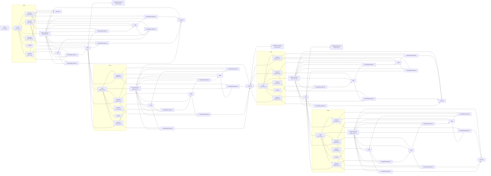

```mermaid
flowchart LR
  subgraph path5 [Path]
    5["Path<br>[35, 60, 0]"]
    9["Segment<br>[66, 84, 0]"]
    10["Segment<br>[90, 123, 0]"]
    11["Segment<br>[129, 185, 0]"]
    12["Segment<br>[191, 198, 0]"]
    25[Solid2d]
  end
  subgraph path6 [Path]
    6["Path<br>[300, 330, 0]"]
    13["Segment<br>[336, 354, 0]"]
    14["Segment<br>[360, 379, 0]"]
    15["Segment<br>[385, 441, 0]"]
    16["Segment<br>[447, 454, 0]"]
    26[Solid2d]
  end
  subgraph path7 [Path]
    7["Path<br>[556, 583, 0]"]
    17["Segment<br>[589, 623, 0]"]
    18["Segment<br>[629, 648, 0]"]
    19["Segment<br>[654, 710, 0]"]
    20["Segment<br>[716, 723, 0]"]
    28[Solid2d]
  end
  subgraph path8 [Path]
    8["Path<br>[825, 852, 0]"]
    21["Segment<br>[858, 878, 0]"]
    22["Segment<br>[884, 905, 0]"]
    23["Segment<br>[911, 967, 0]"]
    24["Segment<br>[973, 980, 0]"]
    27[Solid2d]
  end
  1["Plane<br>[12, 29, 0]"]
  2["StartSketchOnFace<br>[255, 294, 0]"]
  3["StartSketchOnFace<br>[511, 550, 0]"]
  4["StartSketchOnFace<br>[780, 819, 0]"]
  29["Sweep Extrusion<br>[212, 242, 0]"]
  30["Sweep Extrusion<br>[468, 498, 0]"]
  31["Sweep Extrusion<br>[737, 767, 0]"]
  32["Sweep Extrusion<br>[994, 1024, 0]"]
  33[Wall]
  34[Wall]
  35[Wall]
  36[Wall]
  37[Wall]
  38[Wall]
  39[Wall]
  40[Wall]
  41[Wall]
  42[Wall]
  43[Wall]
  44[Wall]
  45["Cap Start"]
  46["Cap End"]
  47["Cap End"]
  48["Cap End"]
  49["Cap End"]
  50["SweepEdge Opposite"]
  51["SweepEdge Opposite"]
  52["SweepEdge Opposite"]
  53["SweepEdge Opposite"]
  54["SweepEdge Opposite"]
  55["SweepEdge Opposite"]
  56["SweepEdge Opposite"]
  57["SweepEdge Opposite"]
  58["SweepEdge Opposite"]
  59["SweepEdge Opposite"]
  60["SweepEdge Opposite"]
  61["SweepEdge Opposite"]
  62["SweepEdge Adjacent"]
  63["SweepEdge Adjacent"]
  64["SweepEdge Adjacent"]
  65["SweepEdge Adjacent"]
  66["SweepEdge Adjacent"]
  67["SweepEdge Adjacent"]
  68["SweepEdge Adjacent"]
  69["SweepEdge Adjacent"]
  70["SweepEdge Adjacent"]
  71["SweepEdge Adjacent"]
  72["SweepEdge Adjacent"]
  73["SweepEdge Adjacent"]
  1 --- 5
  35 x--> 2
  46 x--> 3
  44 x--> 4
  5 --- 9
  5 --- 10
  5 --- 11
  5 --- 12
  5 --- 25
  5 ---- 29
  6 --- 13
  6 --- 14
  6 --- 15
  6 --- 16
  6 --- 26
  6 ---- 30
  35 --- 6
  7 --- 17
  7 --- 18
  7 --- 19
  7 --- 20
  7 --- 28
  7 ---- 31
  46 --- 7
  8 --- 21
  8 --- 22
  8 --- 23
  8 --- 24
  8 --- 27
  8 ---- 32
  44 --- 8
  9 --- 34
  9 x--> 45
  9 --- 52
  9 --- 64
  10 --- 35
  10 x--> 45
  10 --- 51
  10 --- 63
  11 --- 33
  11 x--> 45
  11 --- 50
  11 --- 62
  13 x--> 35
  13 --- 37
  13 --- 55
  13 --- 67
  14 x--> 35
  14 --- 36
  14 --- 54
  14 --- 66
  15 x--> 35
  15 --- 38
  15 --- 53
  15 --- 65
  17 --- 44
  17 x--> 46
  17 --- 61
  17 --- 73
  18 --- 42
  18 x--> 46
  18 --- 60
  18 --- 72
  19 --- 43
  19 x--> 46
  19 --- 59
  19 --- 71
  21 --- 41
  21 x--> 44
  21 --- 58
  21 --- 70
  22 --- 40
  22 x--> 44
  22 --- 57
  22 --- 69
  23 --- 39
  23 x--> 44
  23 --- 56
  23 --- 68
  29 --- 33
  29 --- 34
  29 --- 35
  29 --- 45
  29 --- 49
  29 --- 50
  29 --- 51
  29 --- 52
  29 --- 62
  29 --- 63
  29 --- 64
  30 --- 36
  30 --- 37
  30 --- 38
  30 --- 46
  30 --- 53
  30 --- 54
  30 --- 55
  30 --- 65
  30 --- 66
  30 --- 67
  31 --- 42
  31 --- 43
  31 --- 44
  31 --- 47
  31 --- 59
  31 --- 60
  31 --- 61
  31 --- 71
  31 --- 72
  31 --- 73
  32 --- 39
  32 --- 40
  32 --- 41
  32 --- 48
  32 --- 56
  32 --- 57
  32 --- 58
  32 --- 68
  32 --- 69
  32 --- 70
  33 --- 50
  33 --- 62
  63 <--x 33
  34 --- 52
  62 <--x 34
  34 --- 64
  35 --- 51
  35 --- 63
  64 <--x 35
  36 --- 54
  36 --- 66
  67 <--x 36
  37 --- 55
  65 <--x 37
  37 --- 67
  38 --- 53
  38 --- 65
  66 <--x 38
  39 --- 56
  39 --- 68
  69 <--x 39
  40 --- 57
  40 --- 69
  70 <--x 40
  41 --- 58
  68 <--x 41
  41 --- 70
  42 --- 60
  42 --- 72
  73 <--x 42
  43 --- 59
  43 --- 71
  72 <--x 43
  44 --- 61
  71 <--x 44
  44 --- 73
  53 <--x 46
  54 <--x 46
  55 <--x 46
  59 <--x 47
  60 <--x 47
  61 <--x 47
  56 <--x 48
  57 <--x 48
  58 <--x 48
  50 <--x 49
  51 <--x 49
  52 <--x 49
```
