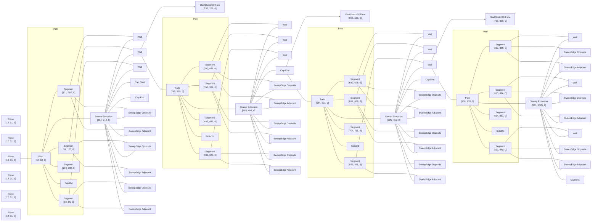

```mermaid
flowchart LR
  subgraph path7 [Path]
    7["Path<br>[37, 62, 0]"]
    8["Segment<br>[68, 86, 0]"]
    9["Segment<br>[92, 125, 0]"]
    10["Segment<br>[131, 187, 0]"]
    11["Segment<br>[193, 200, 0]"]
    12[Solid2d]
  end
  subgraph path25 [Path]
    25["Path<br>[295, 325, 0]"]
    26["Segment<br>[331, 349, 0]"]
    27["Segment<br>[355, 374, 0]"]
    28["Segment<br>[380, 436, 0]"]
    29["Segment<br>[442, 449, 0]"]
    30[Solid2d]
  end
  subgraph path42 [Path]
    42["Path<br>[544, 571, 0]"]
    43["Segment<br>[577, 611, 0]"]
    44["Segment<br>[617, 636, 0]"]
    45["Segment<br>[642, 698, 0]"]
    46["Segment<br>[704, 711, 0]"]
    47[Solid2d]
  end
  subgraph path59 [Path]
    59["Path<br>[806, 833, 0]"]
    60["Segment<br>[839, 859, 0]"]
    61["Segment<br>[865, 886, 0]"]
    62["Segment<br>[892, 948, 0]"]
    63["Segment<br>[954, 961, 0]"]
    64[Solid2d]
  end
  1["Plane<br>[12, 31, 0]"]
  2["Plane<br>[12, 31, 0]"]
  3["Plane<br>[12, 31, 0]"]
  4["Plane<br>[12, 31, 0]"]
  5["Plane<br>[12, 31, 0]"]
  6["Plane<br>[12, 31, 0]"]
  13["Sweep Extrusion<br>[214, 244, 0]"]
  14[Wall]
  15[Wall]
  16[Wall]
  17["Cap Start"]
  18["Cap End"]
  19["SweepEdge Opposite"]
  20["SweepEdge Adjacent"]
  21["SweepEdge Opposite"]
  22["SweepEdge Adjacent"]
  23["SweepEdge Opposite"]
  24["SweepEdge Adjacent"]
  31["Sweep Extrusion<br>[463, 493, 0]"]
  32[Wall]
  33[Wall]
  34[Wall]
  35["Cap End"]
  36["SweepEdge Opposite"]
  37["SweepEdge Adjacent"]
  38["SweepEdge Opposite"]
  39["SweepEdge Adjacent"]
  40["SweepEdge Opposite"]
  41["SweepEdge Adjacent"]
  48["Sweep Extrusion<br>[725, 755, 0]"]
  49[Wall]
  50[Wall]
  51[Wall]
  52["Cap End"]
  53["SweepEdge Opposite"]
  54["SweepEdge Adjacent"]
  55["SweepEdge Opposite"]
  56["SweepEdge Adjacent"]
  57["SweepEdge Opposite"]
  58["SweepEdge Adjacent"]
  65["Sweep Extrusion<br>[975, 1005, 0]"]
  66[Wall]
  67[Wall]
  68[Wall]
  69["Cap End"]
  70["SweepEdge Opposite"]
  71["SweepEdge Adjacent"]
  72["SweepEdge Opposite"]
  73["SweepEdge Adjacent"]
  74["SweepEdge Opposite"]
  75["SweepEdge Adjacent"]
  76["StartSketchOnFace<br>[257, 289, 0]"]
  77["StartSketchOnFace<br>[506, 538, 0]"]
  78["StartSketchOnFace<br>[768, 800, 0]"]
  3 --- 7
  7 --- 8
  7 --- 9
  7 --- 10
  7 --- 11
  7 ---- 13
  7 --- 12
  8 --- 16
  8 --- 23
  8 --- 24
  9 --- 15
  9 --- 21
  9 --- 22
  10 --- 14
  10 --- 19
  10 --- 20
  13 --- 14
  13 --- 15
  13 --- 16
  13 --- 17
  13 --- 18
  13 --- 19
  13 --- 20
  13 --- 21
  13 --- 22
  13 --- 23
  13 --- 24
  15 --- 25
  25 --- 26
  25 --- 27
  25 --- 28
  25 --- 29
  25 ---- 31
  25 --- 30
  26 --- 34
  26 --- 40
  26 --- 41
  27 --- 33
  27 --- 38
  27 --- 39
  28 --- 32
  28 --- 36
  28 --- 37
  31 --- 32
  31 --- 33
  31 --- 34
  31 --- 35
  31 --- 36
  31 --- 37
  31 --- 38
  31 --- 39
  31 --- 40
  31 --- 41
  35 --- 42
  42 --- 43
  42 --- 44
  42 --- 45
  42 --- 46
  42 ---- 48
  42 --- 47
  43 --- 51
  43 --- 57
  43 --- 58
  44 --- 50
  44 --- 55
  44 --- 56
  45 --- 49
  45 --- 53
  45 --- 54
  48 --- 49
  48 --- 50
  48 --- 51
  48 --- 52
  48 --- 53
  48 --- 54
  48 --- 55
  48 --- 56
  48 --- 57
  48 --- 58
  51 --- 59
  59 --- 60
  59 --- 61
  59 --- 62
  59 --- 63
  59 ---- 65
  59 --- 64
  60 --- 68
  60 --- 74
  60 --- 75
  61 --- 67
  61 --- 72
  61 --- 73
  62 --- 66
  62 --- 70
  62 --- 71
  65 --- 66
  65 --- 67
  65 --- 68
  65 --- 69
  65 --- 70
  65 --- 71
  65 --- 72
  65 --- 73
  65 --- 74
  65 --- 75
  15 <--x 76
  35 <--x 77
  51 <--x 78
```
