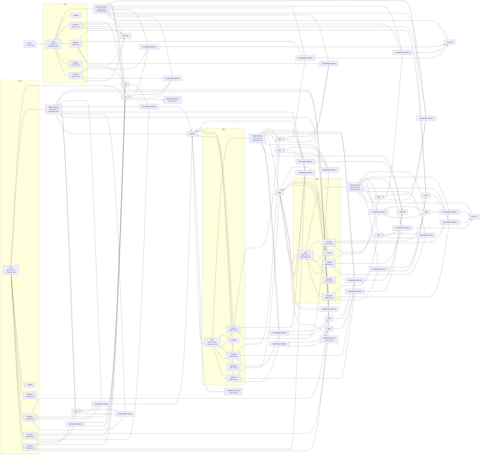

```mermaid
flowchart LR
  subgraph path7 [Path]
    7["Path<br>[35, 60, 0]<br>Consumed: true"]
      %% [ProgramBodyItem { index: 0 }, VariableDeclarationDeclaration, VariableDeclarationInit, PipeBodyItem { index: 1 }]
    20["Segment<br>[66, 84, 0]"]
      %% [ProgramBodyItem { index: 0 }, VariableDeclarationDeclaration, VariableDeclarationInit, PipeBodyItem { index: 2 }]
    24["Segment<br>[90, 123, 0]"]
      %% [ProgramBodyItem { index: 0 }, VariableDeclarationDeclaration, VariableDeclarationInit, PipeBodyItem { index: 3 }]
    11["Segment<br>[129, 185, 0]"]
      %% [ProgramBodyItem { index: 0 }, VariableDeclarationDeclaration, VariableDeclarationInit, PipeBodyItem { index: 4 }]
    12["Segment<br>[191, 198, 0]"]
      %% [ProgramBodyItem { index: 0 }, VariableDeclarationDeclaration, VariableDeclarationInit, PipeBodyItem { index: 5 }]
    28[Solid2d]
  end
  subgraph path6 [Path]
    6["Path<br>[300, 330, 0]<br>Consumed: true"]
      %% [ProgramBodyItem { index: 2 }, VariableDeclarationDeclaration, VariableDeclarationInit, PipeBodyItem { index: 1 }]
    13["Segment<br>[336, 354, 0]"]
      %% [ProgramBodyItem { index: 2 }, VariableDeclarationDeclaration, VariableDeclarationInit, PipeBodyItem { index: 2 }]
    14["Segment<br>[360, 379, 0]"]
      %% [ProgramBodyItem { index: 2 }, VariableDeclarationDeclaration, VariableDeclarationInit, PipeBodyItem { index: 3 }]
    15["Segment<br>[385, 441, 0]"]
      %% [ProgramBodyItem { index: 2 }, VariableDeclarationDeclaration, VariableDeclarationInit, PipeBodyItem { index: 4 }]
    16["Segment<br>[447, 454, 0]"]
      %% [ProgramBodyItem { index: 2 }, VariableDeclarationDeclaration, VariableDeclarationInit, PipeBodyItem { index: 5 }]
    27[Solid2d]
  end
  subgraph path8 [Path]
    8["Path<br>[556, 583, 0]<br>Consumed: true"]
      %% [ProgramBodyItem { index: 4 }, VariableDeclarationDeclaration, VariableDeclarationInit, PipeBodyItem { index: 1 }]
    17["Segment<br>[589, 623, 0]"]
      %% [ProgramBodyItem { index: 4 }, VariableDeclarationDeclaration, VariableDeclarationInit, PipeBodyItem { index: 2 }]
    18["Segment<br>[629, 648, 0]"]
      %% [ProgramBodyItem { index: 4 }, VariableDeclarationDeclaration, VariableDeclarationInit, PipeBodyItem { index: 3 }]
    19["Segment<br>[654, 710, 0]"]
      %% [ProgramBodyItem { index: 4 }, VariableDeclarationDeclaration, VariableDeclarationInit, PipeBodyItem { index: 4 }]
    21["Segment<br>[716, 723, 0]"]
      %% [ProgramBodyItem { index: 4 }, VariableDeclarationDeclaration, VariableDeclarationInit, PipeBodyItem { index: 5 }]
    29[Solid2d]
  end
  subgraph path9 [Path]
    9["Path<br>[825, 852, 0]<br>Consumed: true"]
      %% [ProgramBodyItem { index: 6 }, VariableDeclarationDeclaration, VariableDeclarationInit, PipeBodyItem { index: 1 }]
    22["Segment<br>[858, 878, 0]"]
      %% [ProgramBodyItem { index: 6 }, VariableDeclarationDeclaration, VariableDeclarationInit, PipeBodyItem { index: 2 }]
    23["Segment<br>[884, 905, 0]"]
      %% [ProgramBodyItem { index: 6 }, VariableDeclarationDeclaration, VariableDeclarationInit, PipeBodyItem { index: 3 }]
    25["Segment<br>[911, 967, 0]"]
      %% [ProgramBodyItem { index: 6 }, VariableDeclarationDeclaration, VariableDeclarationInit, PipeBodyItem { index: 4 }]
    26["Segment<br>[973, 980, 0]"]
      %% [ProgramBodyItem { index: 6 }, VariableDeclarationDeclaration, VariableDeclarationInit, PipeBodyItem { index: 5 }]
    30[Solid2d]
  end
  10["Plane<br>[12, 29, 0]"]
    %% [ProgramBodyItem { index: 0 }, VariableDeclarationDeclaration, VariableDeclarationInit, PipeBodyItem { index: 0 }]
  34["Sweep Extrusion<br>[212, 242, 0]<br>Consumed: false"]
    %% [ProgramBodyItem { index: 1 }, VariableDeclarationDeclaration, VariableDeclarationInit]
  64[Wall]
    %% face_code_ref=Missing NodePath
  62[Wall]
    %% face_code_ref=[ProgramBodyItem { index: 2 }, VariableDeclarationDeclaration, VariableDeclarationInit, PipeBodyItem { index: 0 }]
  70[Wall]
    %% face_code_ref=Missing NodePath
  5["Cap Start"]
    %% face_code_ref=Missing NodePath
  2["Cap End"]
    %% face_code_ref=Missing NodePath
  50["SweepEdge Opposite"]
  38["SweepEdge Adjacent"]
  60["SweepEdge Opposite"]
  48["SweepEdge Adjacent"]
  57["SweepEdge Opposite"]
  45["SweepEdge Adjacent"]
  35["Sweep Extrusion<br>[468, 498, 0]<br>Consumed: false"]
    %% [ProgramBodyItem { index: 3 }, VariableDeclarationDeclaration, VariableDeclarationInit]
  67[Wall]
    %% face_code_ref=Missing NodePath
  66[Wall]
    %% face_code_ref=Missing NodePath
  65[Wall]
    %% face_code_ref=Missing NodePath
  1["Cap End"]
    %% face_code_ref=[ProgramBodyItem { index: 4 }, VariableDeclarationDeclaration, VariableDeclarationInit, PipeBodyItem { index: 0 }]
  53["SweepEdge Opposite"]
  41["SweepEdge Adjacent"]
  52["SweepEdge Opposite"]
  40["SweepEdge Adjacent"]
  51["SweepEdge Opposite"]
  39["SweepEdge Adjacent"]
  36["Sweep Extrusion<br>[737, 767, 0]<br>Consumed: false"]
    %% [ProgramBodyItem { index: 5 }, VariableDeclarationDeclaration, VariableDeclarationInit]
  69[Wall]
    %% face_code_ref=Missing NodePath
  68[Wall]
    %% face_code_ref=Missing NodePath
  63[Wall]
    %% face_code_ref=[ProgramBodyItem { index: 6 }, VariableDeclarationDeclaration, VariableDeclarationInit, PipeBodyItem { index: 0 }]
  3["Cap End"]
    %% face_code_ref=Missing NodePath
  56["SweepEdge Opposite"]
  44["SweepEdge Adjacent"]
  55["SweepEdge Opposite"]
  43["SweepEdge Adjacent"]
  54["SweepEdge Opposite"]
  42["SweepEdge Adjacent"]
  37["Sweep Extrusion<br>[994, 1024, 0]<br>Consumed: false"]
    %% [ProgramBodyItem { index: 7 }, VariableDeclarationDeclaration, VariableDeclarationInit]
  73[Wall]
    %% face_code_ref=Missing NodePath
  72[Wall]
    %% face_code_ref=Missing NodePath
  71[Wall]
    %% face_code_ref=Missing NodePath
  4["Cap End"]
    %% face_code_ref=Missing NodePath
  61["SweepEdge Opposite"]
  49["SweepEdge Adjacent"]
  59["SweepEdge Opposite"]
  47["SweepEdge Adjacent"]
  58["SweepEdge Opposite"]
  46["SweepEdge Adjacent"]
  31["StartSketchOnFace<br>[255, 294, 0]"]
    %% [ProgramBodyItem { index: 2 }, VariableDeclarationDeclaration, VariableDeclarationInit, PipeBodyItem { index: 0 }]
  32["StartSketchOnFace<br>[511, 550, 0]"]
    %% [ProgramBodyItem { index: 4 }, VariableDeclarationDeclaration, VariableDeclarationInit, PipeBodyItem { index: 0 }]
  33["StartSketchOnFace<br>[780, 819, 0]"]
    %% [ProgramBodyItem { index: 6 }, VariableDeclarationDeclaration, VariableDeclarationInit, PipeBodyItem { index: 0 }]
  1 --- 8
  17 <--x 1
  18 <--x 1
  19 <--x 1
  1 <--x 32
  35 --- 1
  51 <--x 1
  52 <--x 1
  53 <--x 1
  34 --- 2
  50 <--x 2
  57 <--x 2
  60 <--x 2
  36 --- 3
  54 <--x 3
  55 <--x 3
  56 <--x 3
  37 --- 4
  58 <--x 4
  59 <--x 4
  61 <--x 4
  11 <--x 5
  20 <--x 5
  24 <--x 5
  34 --- 5
  6 --- 13
  6 --- 14
  6 --- 15
  6 --- 16
  6 --- 27
  6 ---- 35
  62 --- 6
  10 --- 7
  7 --- 11
  7 --- 12
  7 --- 20
  7 --- 24
  7 --- 28
  7 ---- 34
  8 --- 17
  8 --- 18
  8 --- 19
  8 --- 21
  8 --- 29
  8 ---- 36
  9 --- 22
  9 --- 23
  9 --- 25
  9 --- 26
  9 --- 30
  9 ---- 37
  63 --- 9
  11 --- 38
  11 --- 50
  11 --- 64
  13 --- 39
  13 --- 51
  13 x--> 62
  13 --- 65
  14 --- 40
  14 --- 52
  14 x--> 62
  14 --- 66
  15 --- 41
  15 --- 53
  15 x--> 62
  15 --- 67
  17 --- 42
  17 --- 54
  17 --- 63
  18 --- 43
  18 --- 55
  18 --- 68
  19 --- 44
  19 --- 56
  19 --- 69
  20 --- 45
  20 --- 57
  20 --- 70
  22 --- 46
  22 --- 58
  22 x--> 63
  22 --- 71
  23 --- 47
  23 --- 59
  23 x--> 63
  23 --- 72
  24 --- 48
  24 --- 60
  24 --- 62
  25 --- 49
  25 --- 61
  25 x--> 63
  25 --- 73
  62 x--> 31
  63 x--> 33
  34 --- 38
  34 --- 45
  34 --- 48
  34 --- 50
  34 --- 57
  34 --- 60
  34 --- 62
  34 --- 64
  34 --- 70
  35 --- 39
  35 --- 40
  35 --- 41
  35 --- 51
  35 --- 52
  35 --- 53
  35 --- 65
  35 --- 66
  35 --- 67
  36 --- 42
  36 --- 43
  36 --- 44
  36 --- 54
  36 --- 55
  36 --- 56
  36 --- 63
  36 --- 68
  36 --- 69
  37 --- 46
  37 --- 47
  37 --- 49
  37 --- 58
  37 --- 59
  37 --- 61
  37 --- 71
  37 --- 72
  37 --- 73
  62 --- 38
  38 x--> 62
  63 --- 39
  39 x--> 63
  64 --- 40
  40 x--> 64
  65 --- 41
  41 x--> 65
  66 --- 42
  42 x--> 66
  67 --- 43
  43 x--> 67
  68 --- 44
  44 x--> 68
  69 --- 45
  45 x--> 69
  70 --- 46
  46 x--> 70
  71 --- 47
  47 x--> 71
  72 --- 48
  48 x--> 72
  73 --- 49
  49 x--> 73
  62 --- 50
  63 --- 51
  64 --- 52
  65 --- 53
  66 --- 54
  67 --- 55
  68 --- 56
  69 --- 57
  70 --- 58
  71 --- 59
  72 --- 60
  73 --- 61
```
