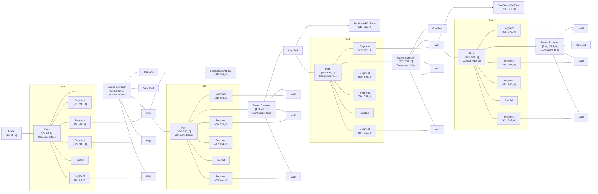

```mermaid
flowchart LR
  subgraph path6 [Path]
    6["Path<br>[300, 330, 0]<br>Consumed: true"]
      %% [ProgramBodyItem { index: 2 }, VariableDeclarationDeclaration, VariableDeclarationInit, PipeBodyItem { index: 1 }]
    13["Segment<br>[336, 354, 0]"]
      %% [ProgramBodyItem { index: 2 }, VariableDeclarationDeclaration, VariableDeclarationInit, PipeBodyItem { index: 2 }]
    14["Segment<br>[360, 379, 0]"]
      %% [ProgramBodyItem { index: 2 }, VariableDeclarationDeclaration, VariableDeclarationInit, PipeBodyItem { index: 3 }]
    15["Segment<br>[385, 441, 0]"]
      %% [ProgramBodyItem { index: 2 }, VariableDeclarationDeclaration, VariableDeclarationInit, PipeBodyItem { index: 4 }]
    16["Segment<br>[447, 454, 0]"]
      %% [ProgramBodyItem { index: 2 }, VariableDeclarationDeclaration, VariableDeclarationInit, PipeBodyItem { index: 5 }]
    27[Solid2d]
  end
  subgraph path7 [Path]
    7["Path<br>[35, 60, 0]<br>Consumed: true"]
      %% [ProgramBodyItem { index: 0 }, VariableDeclarationDeclaration, VariableDeclarationInit, PipeBodyItem { index: 1 }]
    11["Segment<br>[129, 185, 0]"]
      %% [ProgramBodyItem { index: 0 }, VariableDeclarationDeclaration, VariableDeclarationInit, PipeBodyItem { index: 4 }]
    12["Segment<br>[191, 198, 0]"]
      %% [ProgramBodyItem { index: 0 }, VariableDeclarationDeclaration, VariableDeclarationInit, PipeBodyItem { index: 5 }]
    20["Segment<br>[66, 84, 0]"]
      %% [ProgramBodyItem { index: 0 }, VariableDeclarationDeclaration, VariableDeclarationInit, PipeBodyItem { index: 2 }]
    24["Segment<br>[90, 123, 0]"]
      %% [ProgramBodyItem { index: 0 }, VariableDeclarationDeclaration, VariableDeclarationInit, PipeBodyItem { index: 3 }]
    28[Solid2d]
  end
  subgraph path8 [Path]
    8["Path<br>[556, 583, 0]<br>Consumed: true"]
      %% [ProgramBodyItem { index: 4 }, VariableDeclarationDeclaration, VariableDeclarationInit, PipeBodyItem { index: 1 }]
    17["Segment<br>[589, 623, 0]"]
      %% [ProgramBodyItem { index: 4 }, VariableDeclarationDeclaration, VariableDeclarationInit, PipeBodyItem { index: 2 }]
    18["Segment<br>[629, 648, 0]"]
      %% [ProgramBodyItem { index: 4 }, VariableDeclarationDeclaration, VariableDeclarationInit, PipeBodyItem { index: 3 }]
    19["Segment<br>[654, 710, 0]"]
      %% [ProgramBodyItem { index: 4 }, VariableDeclarationDeclaration, VariableDeclarationInit, PipeBodyItem { index: 4 }]
    21["Segment<br>[716, 723, 0]"]
      %% [ProgramBodyItem { index: 4 }, VariableDeclarationDeclaration, VariableDeclarationInit, PipeBodyItem { index: 5 }]
    29[Solid2d]
  end
  subgraph path9 [Path]
    9["Path<br>[825, 852, 0]<br>Consumed: true"]
      %% [ProgramBodyItem { index: 6 }, VariableDeclarationDeclaration, VariableDeclarationInit, PipeBodyItem { index: 1 }]
    22["Segment<br>[858, 878, 0]"]
      %% [ProgramBodyItem { index: 6 }, VariableDeclarationDeclaration, VariableDeclarationInit, PipeBodyItem { index: 2 }]
    23["Segment<br>[884, 905, 0]"]
      %% [ProgramBodyItem { index: 6 }, VariableDeclarationDeclaration, VariableDeclarationInit, PipeBodyItem { index: 3 }]
    25["Segment<br>[911, 967, 0]"]
      %% [ProgramBodyItem { index: 6 }, VariableDeclarationDeclaration, VariableDeclarationInit, PipeBodyItem { index: 4 }]
    26["Segment<br>[973, 980, 0]"]
      %% [ProgramBodyItem { index: 6 }, VariableDeclarationDeclaration, VariableDeclarationInit, PipeBodyItem { index: 5 }]
    30[Solid2d]
  end
  1["Cap End"]
    %% face_code_ref=[ProgramBodyItem { index: 4 }, VariableDeclarationDeclaration, VariableDeclarationInit, PipeBodyItem { index: 0 }]
  2["Cap End"]
    %% face_code_ref=Missing NodePath
  3["Cap End"]
    %% face_code_ref=Missing NodePath
  4["Cap End"]
    %% face_code_ref=Missing NodePath
  5["Cap Start"]
    %% face_code_ref=Missing NodePath
  10["Plane<br>[12, 29, 0]"]
    %% [ProgramBodyItem { index: 0 }, VariableDeclarationDeclaration, VariableDeclarationInit, PipeBodyItem { index: 0 }]
  31["StartSketchOnFace<br>[255, 294, 0]"]
    %% [ProgramBodyItem { index: 2 }, VariableDeclarationDeclaration, VariableDeclarationInit, PipeBodyItem { index: 0 }]
  32["StartSketchOnFace<br>[511, 550, 0]"]
    %% [ProgramBodyItem { index: 4 }, VariableDeclarationDeclaration, VariableDeclarationInit, PipeBodyItem { index: 0 }]
  33["StartSketchOnFace<br>[780, 819, 0]"]
    %% [ProgramBodyItem { index: 6 }, VariableDeclarationDeclaration, VariableDeclarationInit, PipeBodyItem { index: 0 }]
  34["Sweep Extrusion<br>[212, 242, 0]<br>Consumed: false"]
    %% [ProgramBodyItem { index: 1 }, VariableDeclarationDeclaration, VariableDeclarationInit]
  35["Sweep Extrusion<br>[468, 498, 0]<br>Consumed: false"]
    %% [ProgramBodyItem { index: 3 }, VariableDeclarationDeclaration, VariableDeclarationInit]
  36["Sweep Extrusion<br>[737, 767, 0]<br>Consumed: false"]
    %% [ProgramBodyItem { index: 5 }, VariableDeclarationDeclaration, VariableDeclarationInit]
  37["Sweep Extrusion<br>[994, 1024, 0]<br>Consumed: false"]
    %% [ProgramBodyItem { index: 7 }, VariableDeclarationDeclaration, VariableDeclarationInit]
  38[Wall]
    %% face_code_ref=[ProgramBodyItem { index: 2 }, VariableDeclarationDeclaration, VariableDeclarationInit, PipeBodyItem { index: 0 }]
  39[Wall]
    %% face_code_ref=[ProgramBodyItem { index: 6 }, VariableDeclarationDeclaration, VariableDeclarationInit, PipeBodyItem { index: 0 }]
  40[Wall]
    %% face_code_ref=Missing NodePath
  41[Wall]
    %% face_code_ref=Missing NodePath
  42[Wall]
    %% face_code_ref=Missing NodePath
  43[Wall]
    %% face_code_ref=Missing NodePath
  44[Wall]
    %% face_code_ref=Missing NodePath
  45[Wall]
    %% face_code_ref=Missing NodePath
  46[Wall]
    %% face_code_ref=Missing NodePath
  47[Wall]
    %% face_code_ref=Missing NodePath
  48[Wall]
    %% face_code_ref=Missing NodePath
  49[Wall]
    %% face_code_ref=Missing NodePath
  1 --- 8
  1 <--x 32
  35 --- 1
  34 --- 2
  36 --- 3
  37 --- 4
  34 --- 5
  6 --- 13
  6 --- 14
  6 --- 15
  6 --- 16
  6 --- 27
  6 ---- 35
  38 --- 6
  10 --- 7
  7 --- 11
  7 --- 12
  7 --- 20
  7 --- 24
  7 --- 28
  7 ---- 34
  8 --- 17
  8 --- 18
  8 --- 19
  8 --- 21
  8 --- 29
  8 ---- 36
  9 --- 22
  9 --- 23
  9 --- 25
  9 --- 26
  9 --- 30
  9 ---- 37
  39 --- 9
  11 --- 40
  13 --- 41
  14 --- 42
  15 --- 43
  17 --- 39
  18 --- 44
  19 --- 45
  20 --- 46
  22 --- 47
  23 --- 48
  24 --- 38
  25 --- 49
  38 x--> 31
  39 x--> 33
  34 --- 38
  34 --- 40
  34 --- 46
  35 --- 41
  35 --- 42
  35 --- 43
  36 --- 39
  36 --- 44
  36 --- 45
  37 --- 47
  37 --- 48
  37 --- 49
```
