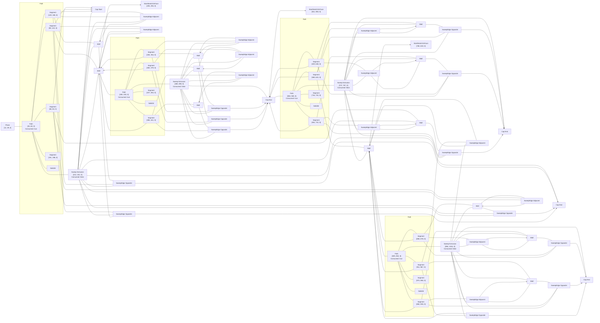

```mermaid
flowchart LR
  subgraph path16 [Path]
    16["Path<br>[35, 60, 0]<br>Consumed: true"]
      %% [ProgramBodyItem { index: 0 }, VariableDeclarationDeclaration, VariableDeclarationInit, PipeBodyItem { index: 1 }]
    17["Segment<br>[66, 84, 0]"]
      %% [ProgramBodyItem { index: 0 }, VariableDeclarationDeclaration, VariableDeclarationInit, PipeBodyItem { index: 2 }]
    18["Segment<br>[90, 123, 0]"]
      %% [ProgramBodyItem { index: 0 }, VariableDeclarationDeclaration, VariableDeclarationInit, PipeBodyItem { index: 3 }]
    19["Segment<br>[129, 185, 0]"]
      %% [ProgramBodyItem { index: 0 }, VariableDeclarationDeclaration, VariableDeclarationInit, PipeBodyItem { index: 4 }]
    20["Segment<br>[191, 198, 0]"]
      %% [ProgramBodyItem { index: 0 }, VariableDeclarationDeclaration, VariableDeclarationInit, PipeBodyItem { index: 5 }]
    47[Solid2d]
  end
  subgraph path24 [Path]
    24["Path<br>[300, 330, 0]<br>Consumed: true"]
      %% [ProgramBodyItem { index: 2 }, VariableDeclarationDeclaration, VariableDeclarationInit, PipeBodyItem { index: 1 }]
    25["Segment<br>[336, 354, 0]"]
      %% [ProgramBodyItem { index: 2 }, VariableDeclarationDeclaration, VariableDeclarationInit, PipeBodyItem { index: 2 }]
    26["Segment<br>[360, 379, 0]"]
      %% [ProgramBodyItem { index: 2 }, VariableDeclarationDeclaration, VariableDeclarationInit, PipeBodyItem { index: 3 }]
    27["Segment<br>[385, 441, 0]"]
      %% [ProgramBodyItem { index: 2 }, VariableDeclarationDeclaration, VariableDeclarationInit, PipeBodyItem { index: 4 }]
    28["Segment<br>[447, 454, 0]"]
      %% [ProgramBodyItem { index: 2 }, VariableDeclarationDeclaration, VariableDeclarationInit, PipeBodyItem { index: 5 }]
    46[Solid2d]
  end
  subgraph path32 [Path]
    32["Path<br>[556, 583, 0]<br>Consumed: true"]
      %% [ProgramBodyItem { index: 4 }, VariableDeclarationDeclaration, VariableDeclarationInit, PipeBodyItem { index: 1 }]
    33["Segment<br>[589, 623, 0]"]
      %% [ProgramBodyItem { index: 4 }, VariableDeclarationDeclaration, VariableDeclarationInit, PipeBodyItem { index: 2 }]
    34["Segment<br>[629, 648, 0]"]
      %% [ProgramBodyItem { index: 4 }, VariableDeclarationDeclaration, VariableDeclarationInit, PipeBodyItem { index: 3 }]
    35["Segment<br>[654, 710, 0]"]
      %% [ProgramBodyItem { index: 4 }, VariableDeclarationDeclaration, VariableDeclarationInit, PipeBodyItem { index: 4 }]
    36["Segment<br>[716, 723, 0]"]
      %% [ProgramBodyItem { index: 4 }, VariableDeclarationDeclaration, VariableDeclarationInit, PipeBodyItem { index: 5 }]
    48[Solid2d]
  end
  subgraph path40 [Path]
    40["Path<br>[825, 852, 0]<br>Consumed: true"]
      %% [ProgramBodyItem { index: 6 }, VariableDeclarationDeclaration, VariableDeclarationInit, PipeBodyItem { index: 1 }]
    41["Segment<br>[858, 878, 0]"]
      %% [ProgramBodyItem { index: 6 }, VariableDeclarationDeclaration, VariableDeclarationInit, PipeBodyItem { index: 2 }]
    42["Segment<br>[884, 905, 0]"]
      %% [ProgramBodyItem { index: 6 }, VariableDeclarationDeclaration, VariableDeclarationInit, PipeBodyItem { index: 3 }]
    43["Segment<br>[911, 967, 0]"]
      %% [ProgramBodyItem { index: 6 }, VariableDeclarationDeclaration, VariableDeclarationInit, PipeBodyItem { index: 4 }]
    44["Segment<br>[973, 980, 0]"]
      %% [ProgramBodyItem { index: 6 }, VariableDeclarationDeclaration, VariableDeclarationInit, PipeBodyItem { index: 5 }]
    49[Solid2d]
  end
  1["Cap End"]
    %% face_code_ref=Missing NodePath
  2["Cap End"]
    %% face_code_ref=Missing NodePath
  3["Cap End"]
    %% face_code_ref=Missing NodePath
  4["Cap Start"]
    %% face_code_ref=Missing NodePath
  5[Wall]
    %% face_code_ref=Missing NodePath
  6[Wall]
    %% face_code_ref=Missing NodePath
  7[Wall]
    %% face_code_ref=Missing NodePath
  8[Wall]
    %% face_code_ref=Missing NodePath
  9[Wall]
    %% face_code_ref=Missing NodePath
  10[Wall]
    %% face_code_ref=Missing NodePath
  11[Wall]
    %% face_code_ref=Missing NodePath
  12[Wall]
    %% face_code_ref=Missing NodePath
  13[Wall]
    %% face_code_ref=Missing NodePath
  14[Wall]
    %% face_code_ref=Missing NodePath
  15["Plane<br>[12, 29, 0]"]
    %% [ProgramBodyItem { index: 0 }, VariableDeclarationDeclaration, VariableDeclarationInit, PipeBodyItem { index: 0 }]
  21["Sweep Extrusion<br>[212, 242, 0]<br>Consumed: false"]
    %% [ProgramBodyItem { index: 1 }, VariableDeclarationDeclaration, VariableDeclarationInit]
  22["StartSketchOnFace<br>[255, 294, 0]"]
    %% [ProgramBodyItem { index: 2 }, VariableDeclarationDeclaration, VariableDeclarationInit, PipeBodyItem { index: 0 }]
  23[Wall]
    %% face_code_ref=[ProgramBodyItem { index: 2 }, VariableDeclarationDeclaration, VariableDeclarationInit, PipeBodyItem { index: 0 }]
  29["Sweep Extrusion<br>[468, 498, 0]<br>Consumed: false"]
    %% [ProgramBodyItem { index: 3 }, VariableDeclarationDeclaration, VariableDeclarationInit]
  30["Cap End"]
    %% face_code_ref=[ProgramBodyItem { index: 4 }, VariableDeclarationDeclaration, VariableDeclarationInit, PipeBodyItem { index: 0 }]
  31["StartSketchOnFace<br>[511, 550, 0]"]
    %% [ProgramBodyItem { index: 4 }, VariableDeclarationDeclaration, VariableDeclarationInit, PipeBodyItem { index: 0 }]
  37["Sweep Extrusion<br>[737, 767, 0]<br>Consumed: false"]
    %% [ProgramBodyItem { index: 5 }, VariableDeclarationDeclaration, VariableDeclarationInit]
  38["StartSketchOnFace<br>[780, 819, 0]"]
    %% [ProgramBodyItem { index: 6 }, VariableDeclarationDeclaration, VariableDeclarationInit, PipeBodyItem { index: 0 }]
  39[Wall]
    %% face_code_ref=[ProgramBodyItem { index: 6 }, VariableDeclarationDeclaration, VariableDeclarationInit, PipeBodyItem { index: 0 }]
  45["Sweep Extrusion<br>[994, 1024, 0]<br>Consumed: false"]
    %% [ProgramBodyItem { index: 7 }, VariableDeclarationDeclaration, VariableDeclarationInit]
  50["SweepEdge Adjacent"]
  51["SweepEdge Adjacent"]
  52["SweepEdge Adjacent"]
  53["SweepEdge Adjacent"]
  54["SweepEdge Adjacent"]
  55["SweepEdge Adjacent"]
  56["SweepEdge Adjacent"]
  57["SweepEdge Adjacent"]
  58["SweepEdge Adjacent"]
  59["SweepEdge Adjacent"]
  60["SweepEdge Adjacent"]
  61["SweepEdge Adjacent"]
  62["SweepEdge Opposite"]
  63["SweepEdge Opposite"]
  64["SweepEdge Opposite"]
  65["SweepEdge Opposite"]
  66["SweepEdge Opposite"]
  67["SweepEdge Opposite"]
  68["SweepEdge Opposite"]
  69["SweepEdge Opposite"]
  70["SweepEdge Opposite"]
  71["SweepEdge Opposite"]
  72["SweepEdge Opposite"]
  73["SweepEdge Opposite"]
  21 --- 1
  62 <--x 1
  69 <--x 1
  72 <--x 1
  37 --- 2
  66 <--x 2
  67 <--x 2
  68 <--x 2
  45 --- 3
  70 <--x 3
  71 <--x 3
  73 <--x 3
  17 <--x 4
  18 <--x 4
  19 <--x 4
  21 --- 4
  19 --- 5
  21 --- 5
  5 --- 50
  50 <--x 5
  5 --- 62
  25 --- 6
  29 --- 6
  6 --- 51
  51 <--x 6
  6 --- 63
  26 --- 7
  29 --- 7
  7 --- 52
  52 <--x 7
  7 --- 64
  27 --- 8
  29 --- 8
  8 --- 53
  53 <--x 8
  8 --- 65
  34 --- 9
  37 --- 9
  9 --- 54
  54 <--x 9
  9 --- 66
  35 --- 10
  37 --- 10
  10 --- 55
  55 <--x 10
  10 --- 67
  17 --- 11
  21 --- 11
  11 --- 56
  56 <--x 11
  11 --- 68
  41 --- 12
  45 --- 12
  12 --- 57
  57 <--x 12
  12 --- 69
  42 --- 13
  45 --- 13
  13 --- 58
  58 <--x 13
  13 --- 70
  43 --- 14
  45 --- 14
  14 --- 59
  59 <--x 14
  14 --- 71
  15 --- 16
  16 --- 17
  16 --- 18
  16 --- 19
  16 --- 20
  16 ---- 21
  16 --- 47
  17 --- 57
  17 --- 69
  18 --- 23
  18 --- 60
  18 --- 72
  19 --- 50
  19 --- 62
  21 --- 23
  21 --- 50
  21 --- 57
  21 --- 60
  21 --- 62
  21 --- 69
  21 --- 72
  23 x--> 22
  23 --- 24
  25 <--x 23
  26 <--x 23
  27 <--x 23
  23 --- 60
  60 <--x 23
  23 --- 72
  24 --- 25
  24 --- 26
  24 --- 27
  24 --- 28
  24 ---- 29
  24 --- 46
  25 --- 51
  25 --- 63
  26 --- 52
  26 --- 64
  27 --- 53
  27 --- 65
  29 --- 30
  29 --- 51
  29 --- 52
  29 --- 53
  29 --- 63
  29 --- 64
  29 --- 65
  30 <--x 31
  30 --- 32
  33 <--x 30
  34 <--x 30
  35 <--x 30
  63 <--x 30
  64 <--x 30
  65 <--x 30
  32 --- 33
  32 --- 34
  32 --- 35
  32 --- 36
  32 ---- 37
  32 --- 48
  33 --- 39
  33 --- 54
  33 --- 66
  34 --- 55
  34 --- 67
  35 --- 56
  35 --- 68
  37 --- 39
  37 --- 54
  37 --- 55
  37 --- 56
  37 --- 66
  37 --- 67
  37 --- 68
  39 x--> 38
  39 --- 40
  41 <--x 39
  42 <--x 39
  43 <--x 39
  39 --- 61
  61 <--x 39
  39 --- 73
  40 --- 41
  40 --- 42
  40 --- 43
  40 --- 44
  40 ---- 45
  40 --- 49
  41 --- 58
  41 --- 70
  42 --- 59
  42 --- 71
  43 --- 61
  43 --- 73
  45 --- 58
  45 --- 59
  45 --- 61
  45 --- 70
  45 --- 71
  45 --- 73
```
