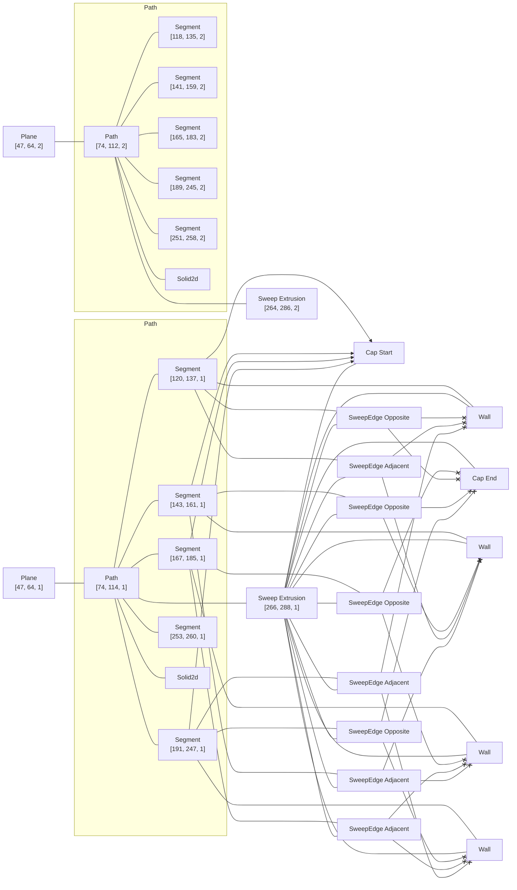

```mermaid
flowchart LR
  subgraph path3 [Path]
    3["Path<br>[74, 114, 1]"]
    5["Segment<br>[120, 137, 1]"]
    6["Segment<br>[143, 161, 1]"]
    7["Segment<br>[167, 185, 1]"]
    8["Segment<br>[191, 247, 1]"]
    9["Segment<br>[253, 260, 1]"]
    15[Solid2d]
  end
  subgraph path4 [Path]
    4["Path<br>[74, 112, 2]"]
    10["Segment<br>[118, 135, 2]"]
    11["Segment<br>[141, 159, 2]"]
    12["Segment<br>[165, 183, 2]"]
    13["Segment<br>[189, 245, 2]"]
    14["Segment<br>[251, 258, 2]"]
    16[Solid2d]
  end
  1["Plane<br>[47, 64, 1]"]
  2["Plane<br>[47, 64, 2]"]
  17["Sweep Extrusion<br>[266, 288, 1]"]
  18["Sweep Extrusion<br>[264, 286, 2]"]
  19[Wall]
  20[Wall]
  21[Wall]
  22[Wall]
  23["Cap Start"]
  24["Cap End"]
  25["SweepEdge Opposite"]
  26["SweepEdge Opposite"]
  27["SweepEdge Opposite"]
  28["SweepEdge Opposite"]
  29["SweepEdge Adjacent"]
  30["SweepEdge Adjacent"]
  31["SweepEdge Adjacent"]
  32["SweepEdge Adjacent"]
  1 --- 3
  2 --- 4
  3 --- 5
  3 --- 6
  3 --- 7
  3 --- 8
  3 --- 9
  3 --- 15
  3 ---- 17
  4 --- 10
  4 --- 11
  4 --- 12
  4 --- 13
  4 --- 14
  4 --- 16
  4 ---- 18
  5 --- 21
  5 x--> 23
  5 --- 26
  5 --- 29
  6 --- 20
  6 x--> 23
  6 --- 27
  6 --- 31
  7 --- 19
  7 x--> 23
  7 --- 25
  7 --- 30
  8 --- 22
  8 x--> 23
  8 --- 28
  8 --- 32
  17 --- 19
  17 --- 20
  17 --- 21
  17 --- 22
  17 --- 23
  17 --- 24
  17 --- 25
  17 --- 26
  17 --- 27
  17 --- 28
  17 --- 29
  17 --- 30
  17 --- 31
  17 --- 32
  25 <--x 19
  30 <--x 19
  31 <--x 19
  27 <--x 20
  29 <--x 20
  31 <--x 20
  26 <--x 21
  29 <--x 21
  32 <--x 21
  28 <--x 22
  30 <--x 22
  32 <--x 22
  25 <--x 24
  26 <--x 24
  27 <--x 24
  28 <--x 24
```
