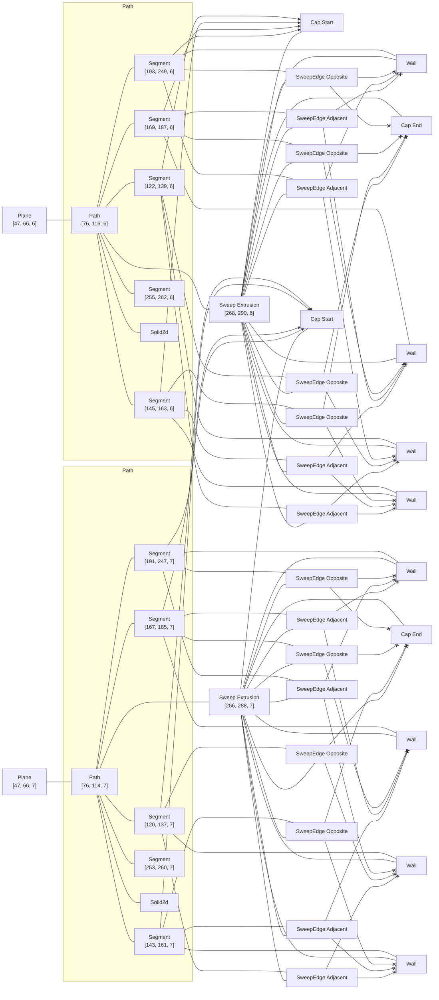

```mermaid
flowchart LR
  subgraph path2 [Path]
    2["Path<br>[76, 116, 6]"]
    3["Segment<br>[122, 139, 6]"]
    4["Segment<br>[145, 163, 6]"]
    5["Segment<br>[169, 187, 6]"]
    6["Segment<br>[193, 249, 6]"]
    7["Segment<br>[255, 262, 6]"]
    8[Solid2d]
  end
  subgraph path25 [Path]
    25["Path<br>[76, 114, 7]"]
    26["Segment<br>[120, 137, 7]"]
    27["Segment<br>[143, 161, 7]"]
    28["Segment<br>[167, 185, 7]"]
    29["Segment<br>[191, 247, 7]"]
    30["Segment<br>[253, 260, 7]"]
    31[Solid2d]
  end
  1["Plane<br>[47, 66, 6]"]
  9["Sweep Extrusion<br>[268, 290, 6]"]
  10[Wall]
  11[Wall]
  12[Wall]
  13[Wall]
  14["Cap Start"]
  15["Cap End"]
  16["SweepEdge Opposite"]
  17["SweepEdge Adjacent"]
  18["SweepEdge Opposite"]
  19["SweepEdge Adjacent"]
  20["SweepEdge Opposite"]
  21["SweepEdge Adjacent"]
  22["SweepEdge Opposite"]
  23["SweepEdge Adjacent"]
  24["Plane<br>[47, 66, 7]"]
  32["Sweep Extrusion<br>[266, 288, 7]"]
  33[Wall]
  34[Wall]
  35[Wall]
  36[Wall]
  37["Cap Start"]
  38["Cap End"]
  39["SweepEdge Opposite"]
  40["SweepEdge Adjacent"]
  41["SweepEdge Opposite"]
  42["SweepEdge Adjacent"]
  43["SweepEdge Opposite"]
  44["SweepEdge Adjacent"]
  45["SweepEdge Opposite"]
  46["SweepEdge Adjacent"]
  1 --- 2
  2 --- 3
  2 --- 4
  2 --- 5
  2 --- 6
  2 --- 7
  2 ---- 9
  2 --- 8
  3 --- 13
  3 --- 22
  3 --- 23
  3 x--> 14
  4 --- 12
  4 --- 20
  4 --- 21
  4 x--> 14
  5 --- 11
  5 --- 18
  5 --- 19
  5 x--> 14
  6 --- 10
  6 --- 16
  6 --- 17
  6 x--> 14
  9 --- 10
  9 --- 11
  9 --- 12
  9 --- 13
  9 --- 14
  9 --- 15
  9 --- 16
  9 --- 17
  9 --- 18
  9 --- 19
  9 --- 20
  9 --- 21
  9 --- 22
  9 --- 23
  16 <--x 10
  16 <--x 15
  17 <--x 10
  17 <--x 13
  18 <--x 11
  18 <--x 15
  19 <--x 10
  19 <--x 11
  20 <--x 12
  20 <--x 15
  21 <--x 11
  21 <--x 12
  22 <--x 13
  22 <--x 15
  23 <--x 12
  23 <--x 13
  24 --- 25
  25 --- 26
  25 --- 27
  25 --- 28
  25 --- 29
  25 --- 30
  25 ---- 32
  25 --- 31
  26 --- 36
  26 --- 45
  26 --- 46
  26 x--> 37
  27 --- 35
  27 --- 43
  27 --- 44
  27 x--> 37
  28 --- 34
  28 --- 41
  28 --- 42
  28 x--> 37
  29 --- 33
  29 --- 39
  29 --- 40
  29 x--> 37
  32 --- 33
  32 --- 34
  32 --- 35
  32 --- 36
  32 --- 37
  32 --- 38
  32 --- 39
  32 --- 40
  32 --- 41
  32 --- 42
  32 --- 43
  32 --- 44
  32 --- 45
  32 --- 46
  39 <--x 33
  39 <--x 38
  40 <--x 33
  40 <--x 36
  41 <--x 34
  41 <--x 38
  42 <--x 33
  42 <--x 34
  43 <--x 35
  43 <--x 38
  44 <--x 34
  44 <--x 35
  45 <--x 36
  45 <--x 38
  46 <--x 35
  46 <--x 36
```
