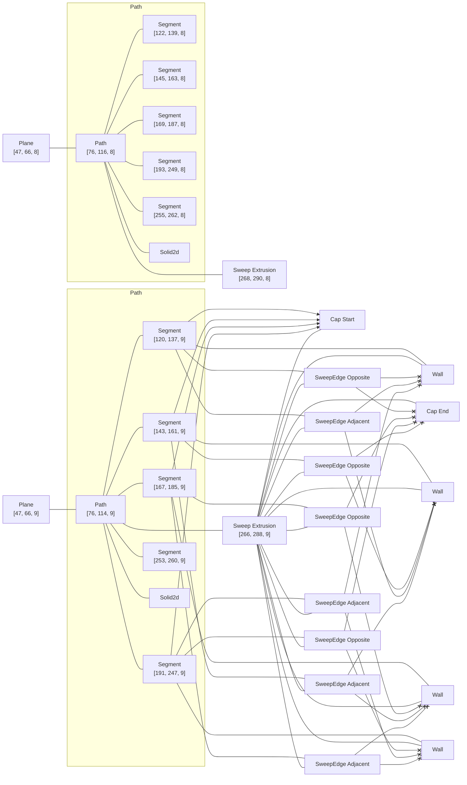

```mermaid
flowchart LR
  subgraph path3 [Path]
    3["Path<br>[76, 116, 8]"]
    5["Segment<br>[122, 139, 8]"]
    6["Segment<br>[145, 163, 8]"]
    7["Segment<br>[169, 187, 8]"]
    8["Segment<br>[193, 249, 8]"]
    9["Segment<br>[255, 262, 8]"]
    15[Solid2d]
  end
  subgraph path4 [Path]
    4["Path<br>[76, 114, 9]"]
    10["Segment<br>[120, 137, 9]"]
    11["Segment<br>[143, 161, 9]"]
    12["Segment<br>[167, 185, 9]"]
    13["Segment<br>[191, 247, 9]"]
    14["Segment<br>[253, 260, 9]"]
    16[Solid2d]
  end
  1["Plane<br>[47, 66, 8]"]
  2["Plane<br>[47, 66, 9]"]
  17["Sweep Extrusion<br>[268, 290, 8]"]
  18["Sweep Extrusion<br>[266, 288, 9]"]
  19[Wall]
  20[Wall]
  21[Wall]
  22[Wall]
  23["Cap Start"]
  24["Cap End"]
  25["SweepEdge Opposite"]
  26["SweepEdge Opposite"]
  27["SweepEdge Opposite"]
  28["SweepEdge Opposite"]
  29["SweepEdge Adjacent"]
  30["SweepEdge Adjacent"]
  31["SweepEdge Adjacent"]
  32["SweepEdge Adjacent"]
  1 --- 3
  2 --- 4
  3 --- 5
  3 --- 6
  3 --- 7
  3 --- 8
  3 --- 9
  3 --- 15
  3 ---- 17
  4 --- 10
  4 --- 11
  4 --- 12
  4 --- 13
  4 --- 14
  4 --- 16
  4 ---- 18
  10 --- 19
  10 x--> 23
  10 --- 25
  10 --- 29
  11 --- 22
  11 x--> 23
  11 --- 28
  11 --- 31
  12 --- 21
  12 x--> 23
  12 --- 26
  12 --- 32
  13 --- 20
  13 x--> 23
  13 --- 27
  13 --- 30
  18 --- 19
  18 --- 20
  18 --- 21
  18 --- 22
  18 --- 23
  18 --- 24
  18 --- 25
  18 --- 26
  18 --- 27
  18 --- 28
  18 --- 29
  18 --- 30
  18 --- 31
  18 --- 32
  25 <--x 19
  29 <--x 19
  30 <--x 19
  27 <--x 20
  30 <--x 20
  32 <--x 20
  26 <--x 21
  31 <--x 21
  32 <--x 21
  28 <--x 22
  29 <--x 22
  31 <--x 22
  25 <--x 24
  26 <--x 24
  27 <--x 24
  28 <--x 24
```
